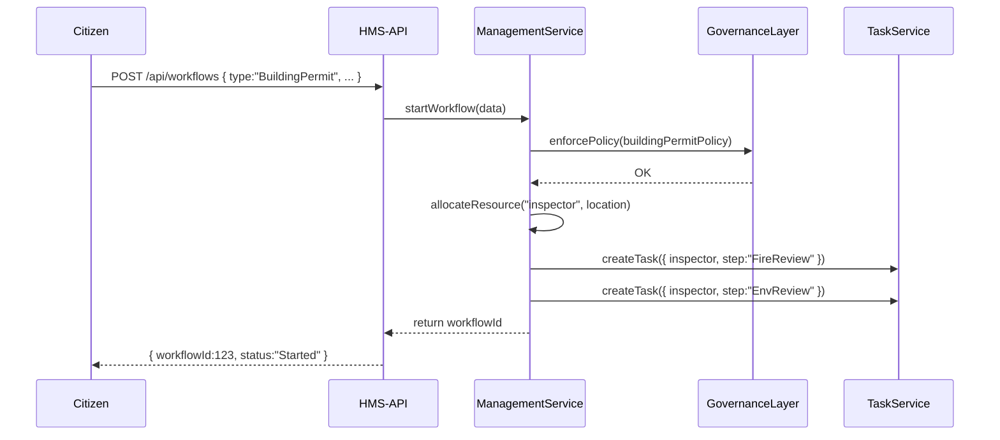

# Chapter 10: Management Layer

Welcome back! In [Chapter 9: Governance Layer](09_governance_layer_.md) we saw how policies get reviewed, logged, and stored. Now we’ll explore the **Management Layer**—the “city hall” of HMS-AGX that turns high-level plans and rules into real work orders, schedules inspectors, allocates budgets, and keeps everything moving.

---

## 1. Why the Management Layer?

Imagine a citizen applies for a new building permit. That request must go through zoning, fire safety, and environmental reviews, each with its own forms, inspectors, and budgets. The **Management Layer** coordinates all these steps:

- **Workflows**: Kick off a multi-step process (zoning → fire → environment).  
- **Resource Allocation**: Assign the right number of inspectors or budget slots.  
- **Policy Enforcement**: Make sure each step obeys rules from the [Governance Layer](09_governance_layer_.md).

**Central Use Case**  
Alice submits a “Building Permit” application. The Management Layer:

1. Checks permit rules via the Governance Layer.  
2. Finds an available fire inspector in her district.  
3. Creates tasks in the Fire Safety and Environmental microservices.  
4. Notifies Alice of her workflow ID and next steps.

---

## 2. Key Concepts

1. Workflow  
   A defined sequence of tasks across departments.  

2. Task  
   A single actionable item (e.g., “Inspect foundation”).  

3. Resource  
   People or budget slots allocated to tasks (e.g., inspectors, vehicles).  

4. Orchestration  
   The logic that orders tasks, waits for their completion, and retries failures.  

5. Policy Hook  
   A call to the Governance Layer to verify each new workflow or stage against approved rules.

---

## 3. Using the Management API

Below is a tiny Express route to start any workflow by type.  
It returns a `workflowId` you can track.

```js
// src/routes/managementRoutes.js
const express = require('express');
const { startWorkflow } = require('../services/managementService');
const router = express.Router();

router.post('/workflows', async (req, res) => {
  // body: { type: "BuildingPermit", applicant: "Alice", location: "District 7" }
  const workflowId = await startWorkflow(req.body);
  res.json({ workflowId, status: 'Started' });
});

module.exports = router;
```

Explanation:  
- Call `POST /api/workflows` with your request details.  
- You get back a new `workflowId` and a “Started” status.

---

## 4. Under the Hood: Sequence Diagram

Here’s what happens when Alice clicks “Submit”:



1. The API route calls `startWorkflow()`.  
2. We enforce policy through the Governance Layer.  
3. We allocate an available inspector.  
4. We call a Task Service to schedule each review step.  
5. We return the workflow ID to the citizen.

---

## 5. Internal Implementation

### 5.1 managementService.js

```js
// src/services/managementService.js
const governance = require('./governanceLayer');
const { allocateInspector } = require('./resourceService');
const { createTask } = require('./taskService');

async function startWorkflow({ type, applicant, location }) {
  // 1. Load policy for this workflow type
  const policy = { id: type, /* ... */ };
  await governance.enforcePolicy(policy);

  // 2. Reserve an inspector
  const inspector = await allocateInspector(location);

  // 3. Kick off each task in order
  const steps = ["ZoningReview", "FireReview", "EnvReview"];
  for (const step of steps) {
    await createTask({ workflowType: type, step, inspector, applicant });
  }

  // 4. Return a new workflow ID (simplified)
  return Date.now();
}

module.exports = { startWorkflow };
```

Explanation:  
- We call `enforcePolicy()` from the Governance Layer.  
- We allocate a resource (an inspector) for the location.  
- We loop through each required step and ask the Task Service to schedule it.

### 5.2 resourceService.js

```js
// src/services/resourceService.js
// In-memory example of available inspectors
const inspectors = [{ id:1, region:"District 7" }];

async function allocateInspector(region) {
  // Find any inspector in the same region
  return inspectors.find(i => i.region === region) || inspectors[0];
}

module.exports = { allocateInspector };
```

Explanation:  
- A very simple lookup for an available inspector.  
- In real life you’d query a database or scheduling system.

### 5.3 taskService.js

```js
// src/services/taskService.js
async function createTask({ workflowType, step, inspector, applicant }) {
  // Pretend we call another microservice here
  console.log(`Creating ${step} task for ${applicant} assigned to inspector ${inspector.id}`);
  // In reality, POST to HMS-SVC or a queue
}

module.exports = { createTask };
```

Explanation:  
- Each call would normally send an HTTP request or push a message to a queue.  
- Here we just log for simplicity.

---

## 6. Why This Matters

- **Single Coordination Point:** All workflows—permits, inspections, budgets—go through one layer.  
- **Consistent Policy Checks:** Every new workflow step is automatically validated by the [Governance Layer](09_governance_layer_.md).  
- **Dynamic Resource Use:** Inspectors, vehicles, and budget slots are reserved on demand.  
- **Clear Audit Trail:** You can log every workflow start, task creation, and resource allocation for reports.

---

## Conclusion

You’ve learned how the **Management Layer** orchestrates multi-step workflows, allocates resources like inspectors, and enforces policies from the [Governance Layer](09_governance_layer_.md). This “city hall” keeps public-sector processes running smoothly.  

Up next, we’ll look at how these pieces fit into a broader [Microservices Architecture](11_microservices_architecture_.md).

---

Generated by [AI Codebase Knowledge Builder](https://github.com/The-Pocket/Tutorial-Codebase-Knowledge)