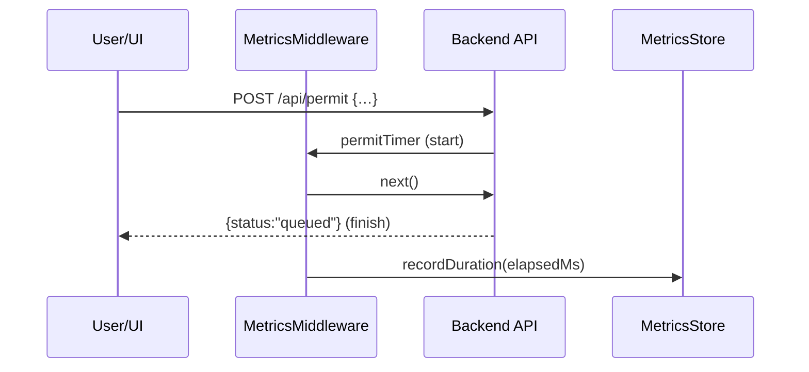
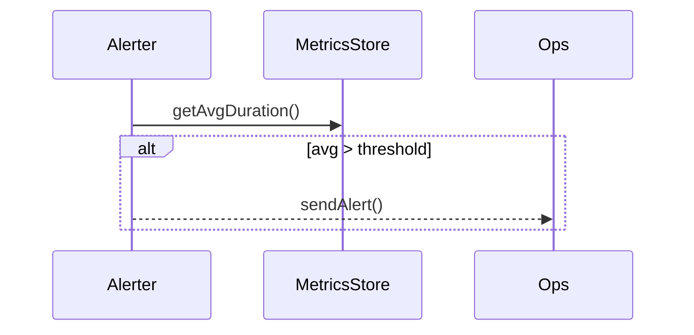

# Chapter 10: Metrics & Monitoring

Continuing from [Chapter 9: Audit & Compliance Framework](09_audit___compliance_framework_.md), we now build our “operations center”—real‐time dashboards and alerts that keep HMS-CUR running smoothly.

---

## 10.1 Motivation: Why Metrics & Monitoring?

Imagine the Department of Homeland Security collects customs violation reports through HMS-CUR. Leadership needs to know, at a glance:

- How many new reports arrived in the last hour  
- Where workflows are stuck (e.g., “intake review” taking too long)  
- Whether citizens are satisfied with response times  

Without a real‐time view, slowdowns go unnoticed until complaints flood in. A **Metrics & Monitoring** system is like a homeland security operations center for your workflows: it tracks key indicators, surfaces bottlenecks on a dashboard, and fires alerts when thresholds are crossed—so you can intervene or let the AI agents auto-scale and self-heal.

---

## 10.2 Key Concepts

1. **Metric Collector**  
   Gathers raw data points (e.g., request durations, success counts).

2. **Registry / Store**  
   Holds aggregated values (counters, gauges, histograms) for quick lookup.

3. **Dashboard**  
   UI or endpoint showing trends (charts, tables).

4. **Alerting Rules**  
   Conditions (e.g., “avg processing time > 2s”) that trigger notifications.

5. **Exporter**  
   Optional adapter to push metrics to external systems (Prometheus, CloudWatch).

---

## 10.3 Using Metrics & Monitoring

We’ll instrument our Backend API to measure the time each `/api/permit` request takes, expose a `/metrics` endpoint, and fire a simple alert when average latency is too high.

### 10.3.1 Create a Metrics Store

File: `src/metrics/metricsStore.js`
```js
// Very simple in‐memory store
const metrics = {
  permitDurations: []  // will hold millisecond values
};
function recordDuration(ms) {
  metrics.permitDurations.push(ms);
}
function getAvgDuration() {
  const arr = metrics.permitDurations;
  return arr.length
    ? arr.reduce((a,b)=>a+b,0)/arr.length
    : 0;
}
module.exports = { recordDuration, getAvgDuration };
```
This module records each duration and computes an average on demand.

### 10.3.2 Middleware to Measure Requests

File: `src/metrics/metricsMiddleware.js`
```js
const { recordDuration } = require('./metricsStore');

function permitTimer(req, res, next) {
  if (req.path === '/api/permit') {
    const start = Date.now();
    res.on('finish', () => {
      recordDuration(Date.now() - start);
    });
  }
  next();
}

module.exports = permitTimer;
```
Attach this to measure any call to `/api/permit`.

### 10.3.3 Expose Metrics Endpoint

In your Backend API server (`src/backend_api/index.js`), add:
```js
const express = require('express');
const permitTimer = require('../metrics/metricsMiddleware');
const { getAvgDuration } = require('../metrics/metricsStore');

const app = express();
app.use(express.json());
app.use(permitTimer);

// Your existing routes...
app.post('/api/permit', (req,res) => {
  // …process permit…
  res.json({ status: 'queued' });
});

// Dashboard endpoint
app.get('/metrics', (req,res) => {
  res.json({
    averagePermitLatencyMs: getAvgDuration()
  });
});

app.listen(4000, ()=> console.log('API + Metrics on 4000'));
```
Now hitting `GET /metrics` returns the current average processing time.

### 10.3.4 Simple Alerting

Add this snippet (e.g., in `src/metrics/alerter.js`):
```js
const { getAvgDuration } = require('./metricsStore');

setInterval(() => {
  if (getAvgDuration() > 2000) {
    console.warn('ALERT: Permit processing too slow!');
    // Here you could email ops, post to Slack, etc.
  }
}, 60000); // check every minute
```
This checks the metric and warns if average latency exceeds 2 seconds.

---

## 10.4 Under the Hood

When a request hits `/api/permit`, here’s what happens:


1. **Middleware** notes the start time.  
2. After the handler finishes, `res.on('finish')` records the elapsed time in the **MetricsStore**.

Meanwhile, the **alerter** runs on a timer:



---

## 10.5 Internal Implementation Details

### 10.5.1 Modular Design

- **metricsStore.js**: holds data and aggregation logic.  
- **metricsMiddleware.js**: measures outgoing requests.  
- **alerter.js**: runs alert checks.  

You can replace the in-memory store with Prometheus by swapping `recordDuration` calls with `prom-client` histograms and exposing its `/metrics`.

### 10.5.2 Scaling Up

- For distributed services, push metrics to a shared time-series DB (e.g., Prometheus).  
- Define richer **Alerting Rules** (error rates, queue depths).  
- Build a frontend dashboard reading from `/metrics` or your TSDB.

---

## 10.6 What We Learned

- We instrumented our API with a **MetricsMiddleware** to track request durations.  
- We exposed `/metrics` for dashboards or external systems.  
- We wrote a simple **alerter** to fire warnings when KPIs cross thresholds.  

Next up, we’ll look at the higher-level orchestration of roles, teams, and resource management in [Chapter 11: Management Layer](11_management_layer_.md).

---

Generated by [AI Codebase Knowledge Builder](https://github.com/The-Pocket/Tutorial-Codebase-Knowledge)