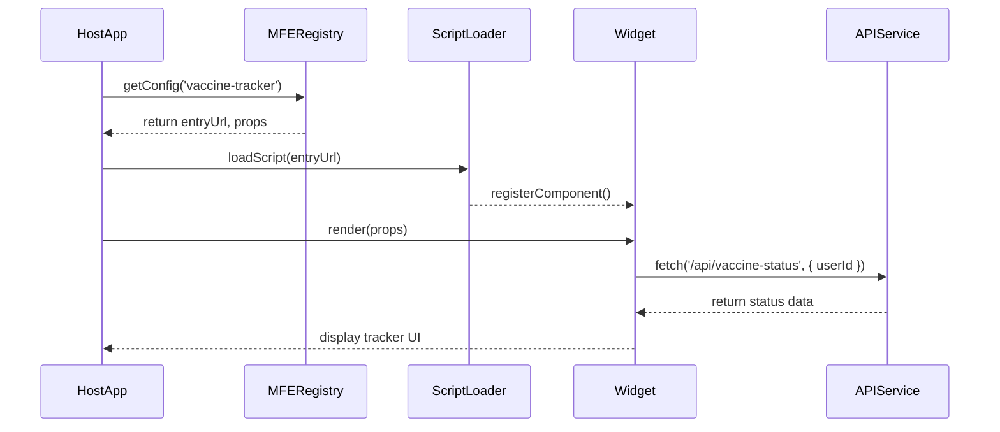

# Chapter 10: Micro-Frontend Components (HMS-MFE)

In [Chapter 9: Market Portal (HMS-MKT)](09_market_portal__hms_mkt__.md), you learned how citizens browse programs and enroll in services. Now let’s break down your user interface into **Micro-Frontend Components**—self-contained UI widgets you can drop into any portal without rewriting the wheel.

---

## 10.1 Why Micro-Frontends? A Real-World Analogy

Imagine a government fair with different modular exhibits:

- A **health tracker** booth that shows vaccination status.
- A **budget calculator** kiosk for personal finance planning.
- A **timetable board** displaying public transit schedules.

Each exhibit is built and maintained independently but can be plugged anywhere on the fairground floor. In HMS-CDF, **Micro-Frontends (HMS-MFE)** work the same way: you publish a widget once, then embed it into the Admin Portal, Market Portal, or any custom dashboard.

**Use Case:**  
Your city wants to embed a **COVID Vaccine Tracker** (showing doses received, next appointment) inside both the citizen portal and the county health dashboard. A Micro-Frontend lets you build that tracker one time and reuse it everywhere.

---

## 10.2 Key Concepts of HMS-MFE

1. **id**  
   Unique name for your widget (e.g., `vaccine-tracker`).

2. **name & version**  
   Human labels and versioning (e.g., `v1.0.2`).

3. **entryUrl**  
   The URL hosting your compiled widget bundle.

4. **mountPoint**  
   CSS selector or container where the widget attaches.

5. **props**  
   Data parameters passed in (e.g., `{ userId: 'abc123' }`).

6. **Isolation**  
   Each widget runs in its own scope—styles and scripts won’t collide with the host.

---

## 10.3 Defining and Registering a Micro-Frontend

Below is a minimal example. We define a **Vaccine Tracker** widget and register it with HMS-CDF.

```js
// File: mfe/microFrontend.js
import { MicroFrontend } from 'hms-cdf/mfe/microFrontend';

const vaccineTracker = new MicroFrontend({
  id: 'vaccine-tracker',
  name: 'COVID Vaccine Tracker',
  version: '1.0.0',
  entryUrl: 'https://cdn.city.gov/mfe/vaccine-tracker.js',
  defaultProps: { theme: 'light' }
});

vaccineTracker.initialize();
// → Saves metadata and makes it discoverable by loaders
```

Explanation:  
- We import `MicroFrontend` and give it an `id`, `entryUrl`, and default props.  
- Calling `initialize()` registers the widget in HMS-CDF so hosts can find and load it.

---

## 10.4 Embedding in a Host Application

Once registered, any front-end can mount the widget at runtime:

```js
// In your citizen portal page script
import { MfeLoader } from 'hms-cdf/mfe/loader';

async function mountTracker() {
  // 1) Load the widget bundle
  await MfeLoader.load('vaccine-tracker');
  // 2) Mount into a container with props
  MfeLoader.mount('vaccine-tracker', '#tracker-container', {
    userId: 'user-456',
    showDetails: true
  });
}

mountTracker();
```

Explanation:  
- `MfeLoader.load()` fetches and executes the widget script.  
- `MfeLoader.mount()` attaches the component into a DOM element, passing in live data.

---

## 10.5 Runtime Flow

Here’s what happens when the host app mounts a widget:



1. Host asks the registry for widget metadata.  
2. The loader injects the script into the page.  
3. The widget registers itself and renders into the host container.  
4. It calls APIs (e.g., health records) and updates the UI.

---

## 10.6 Under the Hood

### 10.6.1 How `MicroFrontend` Is Implemented

```ts
// File: mfe/microFrontend.ts
export class MicroFrontend {
  constructor(private cfg) {}
  initialize() {
    // 1) Persist widget config
    Database.save('microFrontends', this.cfg);
    // 2) Expose registry endpoint
    ApiRouter.get(
      `/mfe/${this.cfg.id}/config`,
      (req, res) => res.send(this.cfg)
    );
  }
}
```

- `initialize()` saves your config (id, entryUrl, props) and exposes `/mfe/:id/config` so loaders can discover it.

### 10.6.2 The Loader’s Core Logic

```ts
// File: mfe/loader.ts
export class MfeLoader {
  static async load(id) {
    // 1) Fetch config
    const cfg = await fetch(`/api/mfe/${id}/config`).then(r => r.json());
    // 2) Inject script
    return new Promise(resolve => {
      const s = document.createElement('script');
      s.src = cfg.entryUrl; s.onload = resolve;
      document.head.appendChild(s);
    });
  }

  static mount(id, selector, props) {
    // Each widget exposes window.MFE_REGISTERED[id]
    const component = window.MFE_REGISTERED[id];
    component.mount(document.querySelector(selector), { ...component.props, ...props });
  }
}
```

- `load()` fetches widget metadata, then injects the remote script.  
- The script registers itself on `window.MFE_REGISTERED`.  
- `mount()` finds that component and calls its `mount()` method with DOM and props.

---

## 10.7 Recap & Next Steps

You’ve learned how to:

- Define a **Micro-Frontend** (id, entryUrl, props) and register it with `initialize()`.  
- Load and mount widgets in any host via `MfeLoader`.  
- Understand the runtime flow from fetching config to displaying the UI.  
- Peek under the hood at how the registry and loader work.

Next, we’ll empower these components with autonomous decision-making inside your portals in [Chapter 11: AI Representative Agent](11_ai_representative_agent_.md).

---

Generated by [AI Codebase Knowledge Builder](https://github.com/The-Pocket/Tutorial-Codebase-Knowledge)