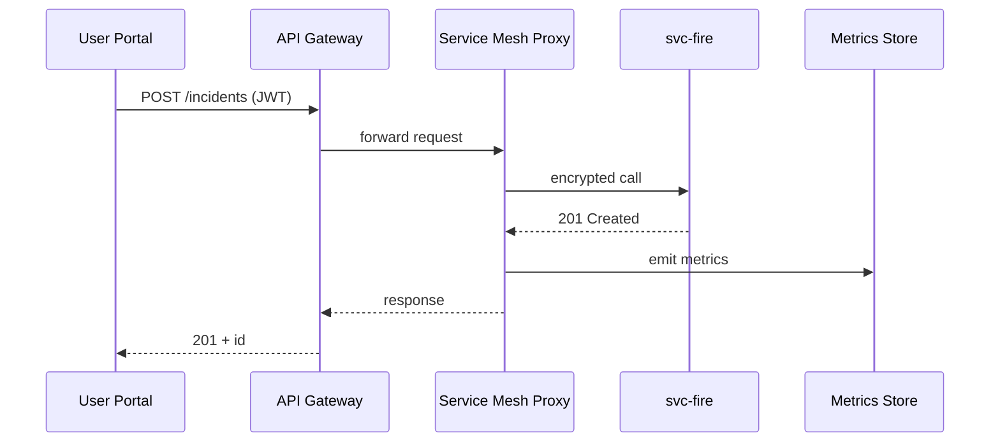

# Chapter 10: Microservices Architecture Mesh
*(part of the HMS-CUR tutorial series)*  

[⬅ Back to Chapter 9: Backend API Gateway (HMS-API / HMS-SVC)](09_backend_api_gateway__hms_api___hms_svc__.md)

---

## 0. Why Split the “Big City Hall” Into Food-Trucks?

Picture a new federal partner, the **U.S. Fire Administration (USFA)**, asking HMS to collect *incident-report forms* from every county.  
We could:

1. **(Bad)** jam the entire workflow into the existing monolith—risking spaghetti code.  
2. **(Good)** launch a tiny, self-contained **Incident-Reporter** service that:

   * owns only fire-report logic,  
   * can be upgraded or rolled back without touching permits or grants,  
   * still speaks the same sidewalks (APIs), shares the same power grid (service mesh), and is watched by the same health inspectors (observability).

Option 2 is exactly what the **Microservices Architecture Mesh** enables.

---

## 1. Key Concepts (Neighborhood Analogy)

| Neighborhood Analogy | Mesh Term | 1-Line Beginner Explanation |
|----------------------|-----------|-----------------------------|
| Individual food truck | **Microservice** | Small app doing one job—here, *incident reports*. |
| Shared sidewalk | **API Contract** | REST/GraphQL spec every truck follows to talk to others. |
| Extension cord to city grid | **Service Mesh Sidecar** | Tiny proxy container that handles traffic, retries, TLS. |
| Street map | **Service Discovery** | Auto-registry that knows “Where is the burger truck now?” |
| Health inspector | **Observability Stack** | Metrics, logs, traces for every request. |

Keep these five in your pocket; the rest is plumbing.

---

## 2. Building & Wiring a New Microservice in 10 Minutes

We’ll:

1. Code a *very* small **incident-reporter** (`svc-fire`).  
2. Register it in the mesh (we’ll use Envoy-style sidecars).  
3. Call it from the portal and watch metrics flow.

### 2.1 The Microservice (18 lines)

```js
// incident.js  – Node/Express, <20 lines
import express from "express";
const app = express();
app.use(express.json());

let db = [];                         // in-memory demo

// POST /incidents
app.post("/incidents", (req, res) => {
  const id = db.length + 1;
  db.push({ id, ...req.body });
  res.status(201).json({ id });
});

// GET /incidents/:id
app.get("/incidents/:id", (req, res) => {
  const row = db.find(r => r.id == req.params.id);
  row ? res.json(row) : res.sendStatus(404);
});

app.listen(7000);
```

**What it does**  
• Stores a new fire incident and fetches it back.  
• No auth/telemetry inside—those are off-loaded to the mesh.

### 2.2 Dockerfile (11 lines)

```dockerfile
FROM node:18
WORKDIR /app
COPY incident.js package.json .
RUN npm install express
EXPOSE 7000
CMD ["node", "incident.js"]
```

### 2.3 Sidecar Declaration (Envoy YAML – 12 lines)

```yaml
# envoy-sidecar.yaml  (attached automatically by mesh)
static_resources:
  listeners:
  - name: http
    address: { socket_address: { address: 0.0.0.0, port_value: 15001 } }
    filter_chains: [{ filters: [{ name: envoy.filters.network.http_connection_manager }] }]
  clusters:
  - name: svc-fire
    connect_timeout: 2s
    load_assignment:
      endpoints: [{ lb_endpoints: [{ endpoint: { address: { socket_address:
        { address: 127.0.0.1, port_value: 7000 }}}]}] ]
```

**Why sidecar?**  
All inbound/outbound traffic gets automatic TLS, retries, metrics without modifying `incident.js`.

### 2.4 Kubernetes-Lite Deployment (18 lines)

```yaml
apiVersion: apps/v1
kind: Deployment
metadata: { name: svc-fire }
spec:
  replicas: 2
  selector: { matchLabels: { app: svc-fire } }
  template:
    metadata: { labels: { app: svc-fire } }
    spec:
      containers:
      - name: service
        image: registry.example.com/svc-fire:v1
        ports: [{ containerPort: 7000 }]
      - name: sidecar
        image: envoyproxy/envoy:v1.27
        args: ["-c", "/etc/envoy/envoy-sidecar.yaml"]
        volumeMounts: [{ mountPath: /etc/envoy, name: cfg }]
      volumes:
      - name: cfg
        configMap: { name: envoy-sidecar }
```

Deploy this and the mesh auto-registers `svc-fire` under DNS name `svc-fire.mesh`.

---

## 3. Calling the Service via the Mesh

```bash
curl -X POST https://api.gov.example/incidents \
     -H "Authorization: Bearer <clerk_jwt>" \
     -H "Content-Type: application/json" \
     -d '{"county":"Jackson","type":"Wildland","injuries":0}'
```

What happens, step-by-step:

1. **Gateway** (Chapter 9) authenticates + normalizes.  
2. **Smart Router** forwards `/incidents` to `svc-fire.mesh`.  
3. The **sidecar proxy** adds TLS and circuit-breaker retries.  
4. `incident.js` stores the record.  
5. Sidecar emits *metrics* (`2xx`, latency) to Prometheus.  
6. HMS returns `{"id": 42}` to the caller.

No extra code inside the microservice!

---

## 4. What’s Under the Hood?



Five actors—simple to follow.

---

## 5. Folder Snapshot

```
services/
 └─ svc-fire/
     ├─ incident.js
     ├─ Dockerfile
     ├─ envoy-sidecar.yaml
     └─ k8s-deploy.yaml
mesh/
 ├─ discovery/          # keeps DNS map   (auto-generated)
 └─ telemetry/          # Prometheus + Grafana
```

---

## 6. Observability in Two Clicks

After deployment open  

```
http://grafana.gov.example/d/svc-fire/request-duration
```

You’ll instantly see:

* Request rate  
* P95 latency  
* Error %  

All produced by the sidecar—`incident.js` stayed clean.

---

## 7. Common Pitfalls & FAQ

**Q: Do I have to learn Envoy/Kubernetes first?**  
Start local: run two Docker containers (`service` + `sidecar`) and link them via `docker network`. The concepts remain identical.

**Q: How do microservices find each other?**  
The mesh injects DNS names like `svc-fire.mesh` + auto-loads mTLS certs. No IP hard-coding.

**Q: Can I roll back just one service?**  
Yes. Tag and deploy `svc-fire:v0.9`, traffic shifts instantly while permits, payments, etc., stay untouched.

**Q: What if a service crashes?**  
Sidecar’s circuit breaker trips after 3 failures → Gateway returns `503` → Metrics trigger an alert. No cascading outage.

---

## 8. Recap

You learned how the **Microservices Architecture Mesh**:

✓ Lets you add a new agency domain (USFA incident reports) with one tiny service.  
✓ Provides out-of-the-box TLS, retries, metrics via sidecar proxies.  
✓ Handles discovery so services know *where* each other live without magic strings.  
✓ Keeps each microservice clean—business logic only, no boiler-plate security or telemetry.  

Your food-truck neighborhood is thriving! Next we’ll connect these trucks to **outside supermarkets**—syncing with legacy mainframes and partner databases—inside [External System Sync Adapter](11_external_system_sync_adapter_.md).

---

[Next: External System Sync Adapter ➡](11_external_system_sync_adapter_.md)

---

Generated by [AI Codebase Knowledge Builder](https://github.com/The-Pocket/Tutorial-Codebase-Knowledge)