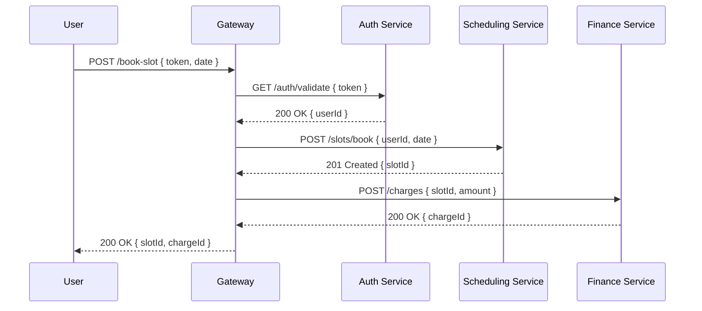

# Chapter 10: Microservices Architecture

In [Chapter 9: Financial Systems (HMS-ACH)](09_financial_systems__hms_ach__.md) we handled payments and ledgers. Now we’ll break our HMS-NFO platform into **microservices**—small, specialized “city departments” that talk over APIs. This lets us develop, scale, and deploy each piece independently. If the scheduling team has an outage, citizens can still log in and pay fees.

---

## 1. Why Microservices?

Imagine a government portal that:

- Authenticates users (Authentication Service)  
- Books FOIA interview slots (Scheduling Service)  
- Handles payments for expedited processing (Finance Service)

With a **monolith**, one bug can crash the whole site. With microservices, each department runs in its own container:

- They speak only through well-defined APIs.  
- You can update the Finance Service without touching Scheduling.  
- An outage in one doesn’t bring down the others.

---

## 2. Key Concepts

1. **Service Boundary**  
   Each microservice owns one capability (e.g., `/auth`, `/slots`, `/charges`).

2. **API Communication**  
   Services communicate over HTTP/REST or messaging.

3. **Independent Deployment**  
   Each service has its own code repo, CI/CD, and runtime.

4. **Scaling & Fault Isolation**  
   You can scale busy services (e.g., `/slots`) without over-provisioning others.

5. **API Gateway**  
   A single entry point that routes requests to the right service and handles auth, rate limits, CORS.

---

## 3. Solving the FOIA Scheduling Use Case

Here’s how booking an interview slot works end-to-end:



1. The **API Gateway** authenticates the token.  
2. It calls the **Scheduling Service** to reserve a slot.  
3. It calls the **Finance Service** to charge the user.  
4. Finally, it returns slot and charge info to the citizen.

---

## 4. Under the Hood: What Happens Step-by-Step

1. **User Request**  
   Citizen sends `POST /book-slot` to the Gateway with a JWT token and desired date.

2. **Authentication**  
   Gateway forwards to `/auth/validate`. Auth Service checks the token and returns `userId`.

3. **Booking**  
   Gateway sends `{ userId, date }` to Scheduling Service at `/slots/book`. Service writes to its database.

4. **Charging**  
   Gateway sends `{ slotId, amount }` to Finance Service at `/charges`. Service processes payment.

5. **Response**  
   Gateway aggregates results (`slotId`, `chargeId`) and sends `200 OK` back to the user.

---

## 5. Building Our First Microservices

Below are minimal examples to get you started. Each runs on its own port and only speaks HTTP.

### 5.1 Authentication Service

File: `services/auth/index.js`  
```js
const express = require('express');
const app = express();

app.get('/auth/validate', (req, res) => {
  const token = req.headers.authorization?.split(' ')[1];
  // (pretend to decode token)
  res.json({ userId: 'user-123' });
});

app.listen(4000, () => console.log('Auth svc on 4000'));
```

This service validates tokens and returns a `userId`.

### 5.2 Scheduling Service

File: `services/scheduling/index.js`  
```js
const express = require('express');
const app = express();
app.use(express.json());

app.post('/slots/book', (req, res) => {
  const { userId, date } = req.body;
  // (pretend to save in DB)
  res.status(201).json({ slotId: `SLOT-${Date.now()}` });
});

app.listen(4001, () => console.log('Scheduling svc on 4001'));
```

It accepts booking requests and returns a new `slotId`.

### 5.3 Finance Service

File: `services/finance/index.js`  
```js
const express = require('express');
const app = express();
app.use(express.json());

app.post('/charges', (req, res) => {
  const { slotId, amount } = req.body;
  // (pretend to process payment)
  res.json({ chargeId: `CHG-${Date.now()}`, status: 'completed' });
});

app.listen(4002, () => console.log('Finance svc on 4002'));
```

It processes a charge and returns a `chargeId`.

### 5.4 API Gateway

File: `api-gateway/index.js`  
```js
const express = require('express');
const { createProxyMiddleware } = require('http-proxy-middleware');
const app = express();

app.use('/auth', createProxyMiddleware({ target: 'http://localhost:4000', changeOrigin: true }));
app.use('/slots', createProxyMiddleware({ target: 'http://localhost:4001', changeOrigin: true }));
app.use('/charges', createProxyMiddleware({ target: 'http://localhost:4002', changeOrigin: true }));

app.post('/book-slot', express.json(), async (req, res) => {
  // 1) Validate token
  const auth = await fetch('http://localhost:4000/auth/validate', {
    headers: { Authorization: req.headers.authorization }
  }).then(r => r.json());
  // 2) Book slot
  const slot = await fetch('http://localhost:4001/slots/book', {
    method:'POST', headers:{'Content-Type':'application/json'},
    body: JSON.stringify({ userId: auth.userId, date: req.body.date })
  }).then(r=>r.json());
  // 3) Charge fee
  const charge = await fetch('http://localhost:4002/charges', {
    method:'POST', headers:{'Content-Type':'application/json'},
    body: JSON.stringify({ slotId: slot.slotId, amount:10 })
  }).then(r=>r.json());
  res.json({ slotId: slot.slotId, chargeId: charge.chargeId });
});

app.listen(3000, () => console.log('API Gateway on 3000'));
```

This single entry point handles the full flow.

---

## 6. Containerizing a Service

Each microservice can be packaged in Docker. Example for **Auth Service**:

File: `services/auth/Dockerfile`  
```dockerfile
FROM node:18-alpine
WORKDIR /app
COPY package*.json ./
RUN npm install
COPY . .
CMD ["node", "index.js"]
```

Build and run independently:
```
docker build -t hms-auth services/auth
docker run -p 4000:4000 hms-auth
```

---

## 7. What We’ve Learned

- **Microservices** split your platform into small, focused services.  
- An **API Gateway** routes and orchestrates calls.  
- Each service can be **developed, deployed, and scaled** on its own.  
- Faults in one service (e.g., bad scheduling code) won’t crash finance or auth.

Next, we’ll look at shared backend libraries and common utilities in [Chapter 11: Backend Services (HMS-SVC)](11_backend_services__hms_svc__.md).

---

Generated by [AI Codebase Knowledge Builder](https://github.com/The-Pocket/Tutorial-Codebase-Knowledge)