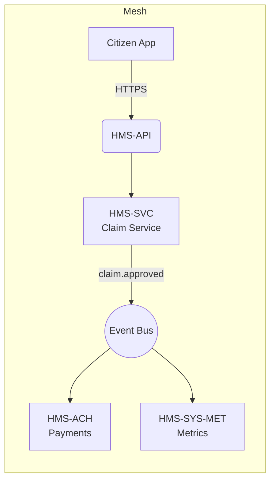
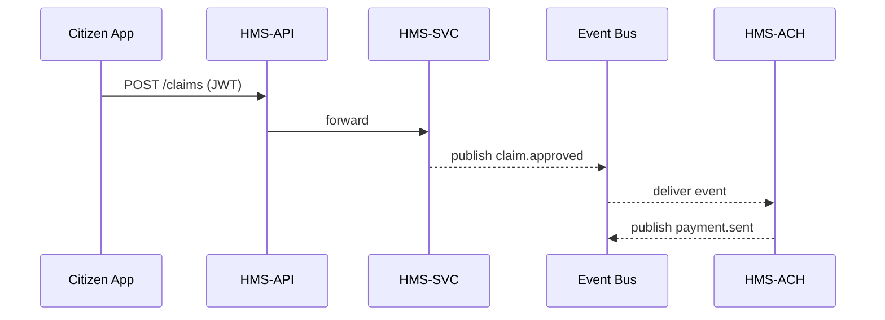

# Chapter 10: Microservices Mesh (HMS-SYS, HMS-SVC, HMS-ACH, etc.)

*(just stepped through the single doorway in  
[Backend API Gateway (HMS-API / HMS-MKT)](09_backend_api_gateway__hms_api___hms_mkt__.md))*  


---

## 1 Why a “mesh” at all?

Central use-case – **Fast Unemployment Payout**

1. **Citizen Diego** submits an unemployment claim online.  
2. The rule engine (HMS-SVC) approves it.  
3. The payments service (HMS-ACH) wires \$600.  
4. The metrics service (HMS-SYS-MET) records the payout time for auditors.

If all this lived in one giant database + codebase we would have:

* Slow deploys (a typo in payments code would force a full-system restart).  
* Security nightmares (finance tables visible to rule drafters).  
* Zero fault isolation (one bad SQL query = nationwide outage).

Instead HMS-GOV splits work into **independent services** that talk over a **shared event bus** and **common security model**—a *microservices mesh*.


---

## 2 Key concepts (plain English)

| Term | Beginner Analogy | Why you care |
|------|------------------|--------------|
| Service | A mini-agency office | Owns its data & code. |
| Contract | Memorandum of understanding | JSON schema every message must follow. |
| Event Bus | Inter-office mail cart | Carries messages asynchronously. |
| Topic | Folder on the cart | e.g., `claim.approved`. |
| Mesh Registry | Phone book | Lets services discover each other. |
| Circuit Breaker | Surge protector | Stops cascading failures when one office is on fire. |


---

## 3 A 30-second aerial view



* UI only knows the **Gateway**.  
* Services **never** call each other directly—only pass events through **BUS**.  
* Each rectangle can deploy, crash, or scale **without** touching the others.


---

## 4 Getting your first service on the bus

> Goal: when HMS-SVC approves a claim it emits `claim.approved`; HMS-ACH listens and pays.

### 4.1 Publishing (HMS-SVC)

```js
// svc/publishClaim.js   (18 lines)
import bus from '../lib/bus.js'           // ① tiny wrapper around NATS

export async function approveClaim(claim){
  // 1. save to SVC database (code skipped)
  // 2. tell the world
  await bus.publish('claim.approved', {        // Topic + payload
    claimId : claim.id,
    citizen : claim.citizenId,
    amount  : 600
  })
}
```

Explanation  
1. We import a **bus helper** (one line config—see below).  
2. Call `publish(topic, payload)`; the function returns a promise once the message is queued.

### 4.2 Subscribing (HMS-ACH)

```js
// ach/onClaimApproved.js  (15 lines)
import bus from '../lib/bus.js'
bus.subscribe('claim.approved', async msg => {
  const { claimId, citizen, amount } = msg
  await pay(citizen, amount)             // wires money (stub)
  await bus.publish('payment.sent', { claimId, amount })
})
```

Explanation  
* `subscribe(topic, handler)` delivers every message to the callback.  
* After wiring funds, ACH emits `payment.sent` for metrics.


---

## 5 Walking the flow (under the hood)



Only **two synchronous hops** (UI→API→SVC). Everything else is *fire-and-forget*, making the whole chain resilient and fast.


---

## 6 What is inside `lib/bus.js`?

```js
// lib/bus.js  (17 lines)
import { connect, StringCodec } from 'nats'

const ncPromise = connect({ servers:'nats://mesh-bus:4222' })
const sc = StringCodec()

export default {
  publish: async (topic, data) => {
    const nc = await ncPromise
    nc.publish(topic, sc.encode(JSON.stringify(data)))
  },
  subscribe: async (topic, cb) => {
    const nc = await ncPromise
    const sub = nc.subscribe(topic)
    for await (const m of sub){
      cb(JSON.parse(sc.decode(m.data)))
    }
  }
}
```

*One helper works for every service*—no copy-paste boilerplate.


---

## 7 Health check & circuit breaker (optional but tiny)

```js
// lib/guard.js  (12 lines)
export async function withBreaker(fn){
  let failures = 0
  return async (...args) => {
    if (failures > 3) throw new Error('Circuit OPEN')
    try {
      return await fn(...args)
    } catch(err){
      failures++
      setTimeout(()=> failures = 0, 10000)  // reset after 10 s
      throw err
    }
  }
}
```

Wrap risky calls (like `pay`) → if three failures in a row, the function trips and returns fast errors instead of hanging the mesh.


---

## 8 Keeping contracts honest

Add a **JSON schema** right next to the code and check before publishing.

```js
// contracts/claim.approved.json  (snippet)
{
  "type": "object",
  "required": ["claimId", "citizen", "amount"],
  "properties": {
    "claimId": { "type": "string" },
    "citizen": { "type": "string" },
    "amount":  { "type": "number", "minimum": 1 }
  }
}
```

`bus.publish()` can run a 3-line Ajv validation to reject bad payloads **before** they leak into the mesh.


---

## 9 Where does security fit?

* JWT / API-Key is checked once at the **Gateway** (see Chapter 9).  
* Inside the mesh, services trust the Gateway and exchange **service tokens** issued by **HMS-SYS-AUTH**—no user PII floating around.  
* Each database lives **inside** its service’s Docker container; other services cannot connect.


---

## 10 Mini exercise 🏋️‍♂️

1. In HMS-SVC emit a new event `claim.denied`.  
2. Create a tiny “Notifier” service that subscribes to it and logs  
   `console.log("Email sent to citizen", citizenId)`.  
3. Verify by posting a denied claim through the demo UI—watch the log pop.


---

## 11 What you learned

You now know:

* Why HMS-GOV splits work across many **specialized services**.  
* How they **publish/subscribe** through a lightweight **event bus**.  
* How **contracts**, **circuit breakers**, and **service-owned data** keep the mesh safe and fast.

Ready to see how this internal mesh syncs with *external* legacy systems (state databases, federal registries, vendor CRMs)?  
Jump to [External System Synchronization Layer](11_external_system_synchronization_layer_.md).

Happy meshing!

---

Generated by [AI Codebase Knowledge Builder](https://github.com/The-Pocket/Tutorial-Codebase-Knowledge)