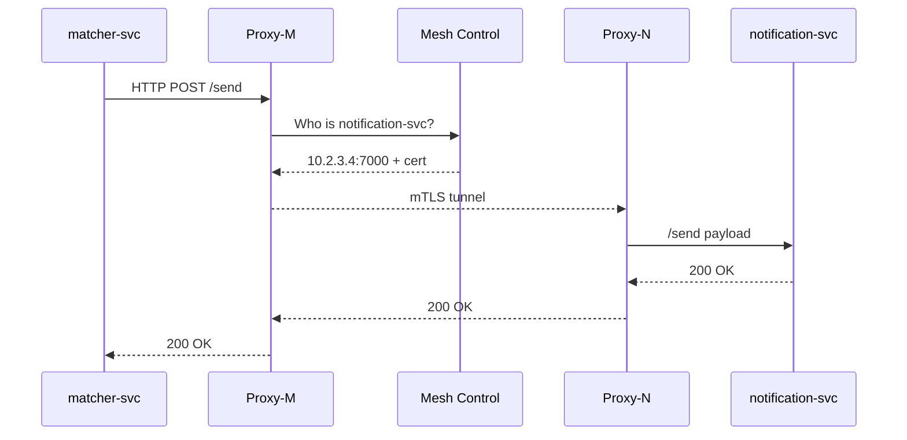

# Chapter 10: Microservices Mesh (HMS-SYS)

*A friendly sequel to* [Data Privacy & Compliance Layer](09_data_privacy___compliance_layer_.md)  

---

## 1. Why Do We Need an “Interstate Highway System” for Services?

Imagine the **Fulbright Program** wants to launch a new *Grant Recommendation* feature:

1. A **matching** service scores applicants.  
2. A **notification** service emails winners.  
3. A **budget** service checks against the remaining funds.  
4. A **compliance** service logs every action for future GAO audits.

All four are tiny, separately deployed micro-services.  
If each one hard-codes IP addresses, TLS certificates, and retry rules, the first network glitch will bring your launch night to a halt.

**HMS-SYS (Microservices Mesh)** lays asphalt between those services so data packets cruise like cars on an interstate:

* Automatic **service discovery** (no IP hunting).  
* Built-in **mTLS** (every car shows its license plate before entering).  
* **Circuit breaking & retries** (detours when a lane is closed).  

Think of it as the *I-95* of government APIs.

---

## 2. Key Concepts (Plain-English)

| Term | Everyday Explanation |
|------|----------------------|
| **Sidecar Proxy** | A tiny helper container that rides “side-by-side” with your app and handles all networking smarts. |
| **Service Registry** | A phonebook where every service posts its name and current address. |
| **mTLS** | “Mutual TLS” — both caller *and* callee show valid IDs before talking. |
| **Circuit Breaker** | A fuse that flips when too many calls fail, preventing a domino outage. |
| **Control Plane** | The traffic ministry: updates phonebooks, hands out certs, enforces rules. |

---

## 3. A 5-Minute Walk-Through: Email Winners Without Hard-Coding Endpoints

### 3.1 Declare Your Service (YAML, 11 lines)

```yaml
# file: manifests/notification.yaml
service:
  name: notification-svc
  port: 7000
mesh:
  retries: 3
  circuit_breaker:
    max_failures: 5
    reset_seconds: 30
  policy:
    mTLS: required
```

Run:

```bash
hms sys apply manifests/notification.yaml
```

Output:

```
✓ Service “notification-svc” registered
✓ mTLS cert issued (expires in 90 days)
```

### 3.2 Call the Service From “matcher-svc” (Python, 15 lines)

```python
import requests  # no TLS code needed!
from hms_sys import discover

def email_winner(email, grant):
    url = discover("notification-svc") + "/send"
    payload = {"to": email, "subject": "Congrats!", "grant": grant}
    r = requests.post(url, json=payload, timeout=2)  # proxy adds mTLS
    r.raise_for_status()
```

Explanation  
1. `discover()` returns `http://notification-svc.mesh:7000` from the Registry.  
2. Sidecar proxies on **both** ends auto-encrypt with mTLS.  
3. If five failures occur, the circuit breaker pauses calls for 30 sec.

### 3.3 What If `notification-svc` Moves?

*You do nothing.*  
It re-registers its new IP in the phonebook; all callers get the update within one second.

---

## 4. Under the Hood: A Mini Road-Trip



Five actors keep it beginner-friendly.

---

## 5. Tiny Taste of Sidecar Code

### 5.1 Auto-Registration (Go, 14 lines)

```go
func register(name string, port int) {
  body := fmt.Sprintf(`{"name":"%s","port":%d}`, name, port)
  http.Post("http://mesh-control:9090/register",
            "application/json",
            strings.NewReader(body))
}
```

Called once at container startup.

### 5.2 Circuit Breaker Wrapper (Node.js, 17 lines)

```js
export async function callWithBreaker(url, opts) {
  const cb = breakerMap[url] ??= {fails:0, open:false};
  if (cb.open) throw new Error('Circuit open');

  try {
    const res = await fetch(url, opts);
    cb.fails = 0;               // success resets counter
    return res;
  } catch (e) {
    if (++cb.fails >= 5) {
      cb.open = true;
      setTimeout(()=> cb.open = false, 30000); // 30 sec reset
    }
    throw e;
  }
}
```

Each proxy wraps outbound calls with this helper.

---

## 6. Where HMS-SYS Touches Other Layers

| Layer | Interaction Example |
|-------|---------------------|
| [Governance Layer](03_governance_layer__hms_gov__.md) | Policies can forbid calls to non-encrypted endpoints; Mesh enforces mTLS. |
| [Observability & Metrics Pipeline](13_observability___metrics_pipeline_.md) | Every proxy emits `latency` and `5xx` counts. |
| [Backend API Gateway](07_backend_api_gateway_.md) | Gateway is the *edge* entry; inside, services talk over the mesh. |
| [Data Privacy & Compliance Layer](09_data_privacy___compliance_layer_.md) | Mesh headers tag data class (e.g., FERPA) so downstream services know sensitivity. |

---

## 7. Quick-Start Checklist

1. Add a **sidecar container** (`hms-proxy`) to your service’s Docker/K8s spec.  
2. Write a tiny YAML manifest ✍️ and run `hms sys apply`.  
3. Replace hard-coded URLs with `discover("svc-name")`.  
4. Watch traffic & circuit metrics in the Observability dashboard.  
5. Rotate mTLS certs automatically every 90 days (mesh does it for you).

You’ve just joined the federal digital interstate!

---

## 8. Beginner FAQ

**Q: Do I need to learn TLS certificates?**  
No. The sidecar fetches and renews them.

**Q: What happens during a circuit break?**  
Your call fails fast with `503 Service Unavailable`, letting you handle the error rather than hanging.

**Q: Can two different agencies share one mesh?**  
Yes—namespaces keep services separate, and Governance policies decide if cross-namespace calls are allowed.

**Q: Does the mesh replace the Backend API Gateway?**  
No. Gateway secures *incoming* traffic from the outside world; Mesh handles *internal* service-to-service traffic.

---

## 9. Summary & Next Steps

In this chapter you learned:

• HMS-SYS is the “highway system” that lets hundreds of micro-services find each other, talk securely, and stay resilient.  
• You registered a service, called it without IPs, and saw how mTLS and circuit breaking happen for free.  
• Tiny sidecar code snippets showed the simplicity behind the magic.  
• The Mesh dovetails with Governance, Observability, and all prior layers.

Ready to explore specialized building blocks (grants, housing, intelligence, etc.) that ride on top of this highway?  
Head over to [Domain-Specific Modules](11_domain_specific_modules_.md).

---

Generated by [AI Codebase Knowledge Builder](https://github.com/The-Pocket/Tutorial-Codebase-Knowledge)