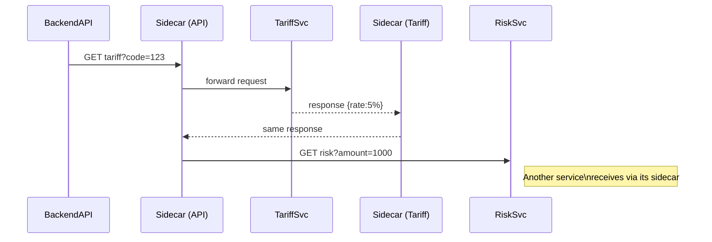
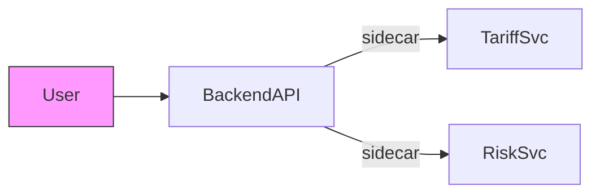

# Chapter 10: Microservices Mesh

Welcome back! In [Chapter 9: Backend API Service](09_backend_api_service_.md), we saw how a single service exposes HTTP endpoints and routes requests. Now we’ll explore how all of our services talk to each other reliably in a **Microservices Mesh**.

---

## Why a Microservices Mesh?

Imagine a swarm of drones building a relief shelter after a natural disaster. Each drone has a special task—one carries bricks, another mixes cement, a third lays wiring. They need a common air‐traffic system so they can find each other, avoid collisions, and report status. A **Microservices Mesh** does the same for our services:

- They discover each other dynamically (no hard-coded URLs).  
- Traffic is load-balanced and retried automatically.  
- Security policies (e.g., encryption, auth) apply to every call.  
- Tracing lets us follow a request across many services.

In a customs processing use case, our services for **tariff lookup**, **risk scoring**, **document validation**, and **notification dispatch** all run separately. A mesh weaves them together so they behave like a single, coordinated platform.

---

## Key Concepts

1. **Service Registry & Discovery**  
   A central directory where services “register” themselves and look up others by name, not IP.

2. **Sidecar Proxy**  
   A small helper process deployed alongside each service that intercepts all inbound/outbound calls.

3. **Load Balancing & Retries**  
   The mesh distributes calls across healthy instances and retries failures automatically.

4. **Security Policies**  
   Mutual TLS, access controls, and encryption are enforced in the mesh layer.

5. **Observability**  
   Distributed tracing and metrics show how a request flows through multiple services.

---

## How It Works: A High-Level Sequence



1. **BackendAPI** calls `tariff` by name.  
2. Its **SidecarA** handles service lookup and routing to a healthy TariffSvc instance.  
3. After receiving the tariff, BackendAPI’s sidecar sends a risk scoring request to **RiskSvc**.

---

## Using the Mesh in Your Code

Instead of calling fixed URLs, you target logical service names. For example, in Node.js:

```js
// src/api/tariffClient.js
const fetch = require('node-fetch');

async function getTariff(code) {
  // mesh sidecar listens on localhost:15001 and routes "tariff-svc"
  const res = await fetch('http://tariff-svc/tariff?code=' + code);
  return res.json();
}

module.exports = { getTariff };
```

Explanation:
- We call `tariff-svc` instead of `http://10.0.1.5:8080`.
- Sidecar proxy intercepts and routes to an available instance.

---

## Inside the Mesh: What Happens Under the Hood

1. On startup, each service connects to the **Service Registry** and announces its address.  
2. A **Sidecar Proxy** (e.g., Envoy) runs alongside every service in the same pod or host.  
3. When your code does `http://tariff-svc/...`, the sidecar:
   - Queries the registry for healthy tariff-svc instances.  
   - Picks one, applies TLS and headers, and forwards the call.  
4. The destination sidecar decrypts the request and passes it to TariffSvc.  
5. Metrics and traces are recorded at every hop.

---

## A Simple Sidecar Configuration Example

Below is a minimal YAML for a sidecar proxy that routes traffic for `tariff-svc`:

```yaml
static_resources:
  listeners:
    - name: listener_0
      address:
        socket_address: { address: 0.0.0.0, port_value: 15001 }
      filter_chains:
        - filters:
            - name: envoy.filters.network.http_connection_manager
              typed_config:
                http_filters: [{ name: envoy.filters.http.router }]
                route_config:
                  virtual_hosts:
                    - name: tariff
                      domains: ["tariff-svc"]
                      routes:
                        - match: { prefix: "/" }
                          route: { cluster: "tariff_cluster" }
  clusters:
    - name: tariff_cluster
      connect_timeout: 0.25s
      type: strict_dns
      load_assignment:
        cluster_name: tariff_cluster
        endpoints:
          - lb_endpoints:
              - endpoint:
                  address:
                    socket_address:
                      address: tariff-svc.default.svc.cluster.local
                      port_value: 8080
```

Explanation:
- **Listener** on port 15001 catches all HTTP calls.  
- **Cluster** defines how to reach `tariff-svc`.  
- Sidecar automatically load-balances and retries within this cluster.

---

## Observability: Tracing a Request

With tracing enabled, you can see each hop:



Each arrow represents a traced segment. In dashboards like Jaeger, you see durations and errors per service.

---

## Summary

In this chapter you learned:

- Why a **Microservices Mesh** is like a coordinated drone swarm—service discovery, load balancing, security, and tracing.  
- Key concepts: **Service Registry**, **Sidecar Proxy**, **Observability**.  
- How to call services by name (`http://tariff-svc/...`) and let sidecars handle routing.  
- A minimal sidecar config that forwards requests to all instances of `tariff-svc`.

Up next, we’ll learn how to synchronize our data with outside systems in [Chapter 11: External System Synchronization](11_external_system_synchronization_.md).

---

Generated by [AI Codebase Knowledge Builder](https://github.com/The-Pocket/Tutorial-Codebase-Knowledge)