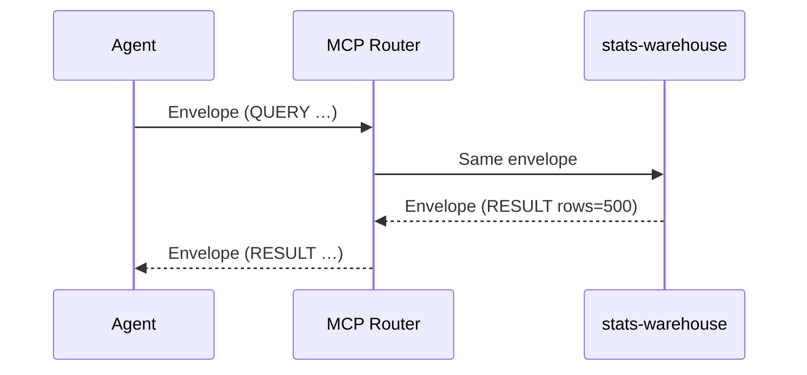

# Chapter 10: Model Context Protocol (HMS-MCP)

[← Back to Chapter 9: Agent Activity Orchestrator (HMS-ACT)](09_agent_activity_orchestrator__hms_act__.md)

---

## 0. Why Do We Need Yet *Another* Protocol?

Picture the **Federal Committee on Statistical Methodology (FCSM)** releasing 500 new labor-statistics tables every night at 01:00 UTC.  
A citizen asks the all-of-government chat:

> “Show me yesterday’s FCSM employment tables, then e-mail them to my city-council account.”

Inside the platform, three totally different tools must light up:

1. `stats-warehouse` – a dusty FORTRAN service that stores the raw tables.  
2. `convert-to-xlsx` – a shiny Python micro-service.  
3. `secure-mailer` – an SMTP gateway protected by [Governance Gateway (HMS-GOV)](04_governance_gateway__hms_gov__.md).

Until now each tool expected its **own** special prompt (“TABLE_DATE=2024-05-08” vs “date=yesterday”).  
Agents wrote brittle, one-off glue code.

**Model Context Protocol (HMS-MCP)** fixes this by giving every agent and every tool a *shared grammar*—like Parliament agreeing on one set of rules for debate.  
Write a request once, let *any* tool—mainframe or micro-service—understand it.


---

## 1. Key Concepts (Plain English)

| MCP Term          | Friendly Analogy                            | One-line meaning                                              |
|-------------------|---------------------------------------------|--------------------------------------------------------------|
| Directive         | Parliamentary motion (“I move to…”)         | `QUERY`, `INVOKE`, `TRANSFORM`, etc.                         |
| Tool ID           | Committee name                              | Unique handle of the target tool (`stats-warehouse`).        |
| Args              | Supporting documents                        | Key/value pairs the tool needs (`date: "yesterday"`).        |
| Capability Manifest | Committee charter                         | YAML a tool publishes to list which directives & args it accepts. |
| Envelope          | Sealed letter                               | JSON object that carries **one** directive + args.           |
| Turn              | One speaker’s floor time                    | Every envelope is logged in [HMS-DTA](06_data___telemetry_hub__hms_dta__.md) as a “turn.” |

---

## 2. Your First MCP Message in 12 Lines

Below is the exact string sent from the agent to the tool.

```yaml
#> MCP v1
directive: QUERY
tool: stats-warehouse
args:
  dataset: "FCSM Employment"
  date: "yesterday"
reply_to: grantsHelperAgent       # optional
```

Human translation: “Hey, stats-warehouse, fetch yesterday’s FCSM Employment dataset.”


---

## 3. Using MCP Inside an Agent (≤ 18 Lines)

```js
// fcsmFetchSkill.js
import { mcp } from '@hms/mcp-sdk'

export async function fetchYesterday() {
  const env = mcp.build({
    directive: 'QUERY',
    tool: 'stats-warehouse',
    args: { dataset: 'FCSM Employment', date: 'yesterday' }
  })

  const res = await mcp.send(env)          // routed by MCP Bus
  return res.payload                       // CSV rows
}
```

Explanation  
1. `mcp.build` serializes the envelope → text.  
2. `mcp.send` hands it to the **MCP Router**.  
3. The tool’s reply (also an envelope) is parsed back into `res.payload`.


---

## 4. What Happens Step-by-Step?



1. Agent sends **one** envelope.  
2. Router just relays; no business logic.  
3. Tool replies with `directive: RESULT`.  
4. Both envelopes are logged as turns in [HMS-DTA](06_data___telemetry_hub__hms_dta__.md).


---

## 5. A Peek Under the Hood

### 5.1 Tiny Envelope Serializer (16 Lines)

```js
// lib/serializer.js
export function build(obj) {
  return [
    '#> MCP v1',
    `directive: ${obj.directive}`,
    `tool: ${obj.tool}`,
    'args:',
    ...Object.entries(obj.args).map(([k,v])=>`  ${k}: "${v}"`),
    obj.reply_to ? `reply_to: ${obj.reply_to}` : ''
  ].filter(Boolean).join('\n')
}

export function parse(text) {
  const [, ...lines] = text.split('\n')
  const out = { args:{} }
  for (const l of lines)
    if (l.startsWith('  ')) {
      const [k,v]=l.trim().split(': ')
      out.args[k]=v.replace(/"/g,'')
    } else if (l) {
      const [k,v]=l.split(': ')
      out[k]=v
    }
  return out
}
```

Beginners’ notes  
• Simple string ops—no heavy YAML library needed.  
• Guarantees the first line is always `#> MCP v1`, making version bumps easy.

### 5.2 Capability Manifest Example (≤ 14 Lines)

```yaml
# stats-warehouse.cap.yaml
id: stats-warehouse
accepts:
  - directive: QUERY
    args:
      required: [dataset, date]
      optional: [format]     # e.g., "CSV" | "XLSX"
produces:
  directive: RESULT
  payload: rows[]
```

Tools publish this file on `/capabilities`; agents can auto-discover allowed fields.


---

## 6. Common “Uh-oh” Moments & Quick Fixes

| Symptom                                    | Likely Cause & Fix                                           |
|--------------------------------------------|--------------------------------------------------------------|
| Tool responds: `ERROR unknown directive`   | Mis-typed `QUERY` / `INVOKE`; spell exactly as manifest.    |
| `args.date` arrives as `undefined`         | Forget quotes around `yesterday`; parser stops at space.     |
| Agent times out (no reply)                 | Tool offline or wrong `tool` ID; list active IDs via `mcp.tools()`. |
| Version mismatch (`#> MCP v0…`)            | Update SDK; MCP v1 is the current stable grammar.            |


---

## 7. Where MCP Sits in the Big Picture

```mermaid
flowchart LR
   AGT(Agents - HMS-AGT) --> |envelope| MCPBus[MCP Router]
   MCPBus --> Tools[Tools & Services<br/>(HMS-SVC, legacy, etc.)]
   MCPBus --> DTA[HMS-DTA<br/>Turn Log]
```

MCP is the **slim waist**—everything above speaks agent-ish, everything below can be anything (COBOL, Python, Bash) as long as it understands the envelope.


---

## 8. Quick Reference Cheat-Sheet

```
directives:
  QUERY      ask for data
  INVOKE     run an action (e.g., "pay")
  TRANSFORM  change format
  RESULT     tool’s success reply
  ERROR      tool’s failure reply

reserved keys:
  tool       target tool ID
  args       dict of parameters
  reply_to   optional agent ID
  mcp_id     auto-filled UUID
```

Stick this next to your monitor—you’re now fluent in MCP!


---

## 9. Recap & What’s Next

* MCP is the **common grammar** that lets any agent talk to any tool—no bespoke glue.  
* You built and sent an envelope in < 20 lines of code.  
* You saw how manifests keep requests safe & predictable.  
* You debugged the four most common hiccups.

Every envelope still passes through a “lawyer” before it reaches the citizen.  
In the next chapter that lawyer gets a name:  
[Compliance & Legal Reasoner (HMS-ESQ)](11_compliance___legal_reasoner__hms_esq__.md)

---

---

Generated by [AI Codebase Knowledge Builder](https://github.com/The-Pocket/Tutorial-Codebase-Knowledge)