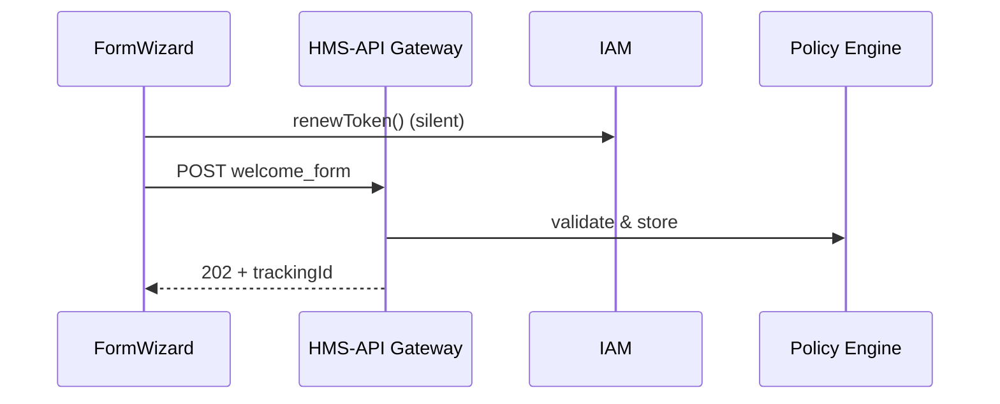

# Chapter 10: Modular Front-End Library (HMS-MFE)  

*(continuing from [Chapter 9: Data Governance & Privacy Vault](09_data_governance___privacy_vault_.md))*  

---

## 1. Why Another Library?  
Picture the **Office of Refugee Resettlement (ORR)** launching a new **“Welcome Benefit”** portal.  
They have just two weeks to ship:

1. A mobile-friendly form in eight languages.  
2. A staff console that shows real-time status.  
3. Color-blind–safe charts for Congressional reports.  

Doing this from scratch would scatter CSS files, half-baked buttons, and inaccessible widgets across projects.

**HMS-MFE** is our **box of LEGO bricks**—buttons, charts, wizards, tables—already styled, accessible, and wired to HMS services.  
Change the color in one brick → every portal, kiosk, and mobile app across agencies updates overnight.

---

## 2. Key Concepts (One Brick at a Time)

| Brick | Plain-English Meaning |
|-------|-----------------------|
| Component | One LEGO piece—Button, Card, Chart |
| Theme | Paint & stickers—colors, fonts, logos |
| Data Adapter | Tiny plug that feeds a component from [HMS-API](05_api_gateway___policy_endpoints__hms_api__.md) |
| Wizard | Pre-built multi-step flow (e.g., 3-page application) |
| Accessibility Guard | QC robot that yells if you break WCAG 2.1 |

Keep these five in mind; everything else is just combining LEGO.

---

## 3. Running Example: Build ORR’s “Welcome Benefit” Form in 8 Minutes

### 3.1 Install the Library

```bash
npm install @hms-emr/mfe
```

*One command grabs every brick.*

### 3.2 Create a Quick Page (React, < 20 lines)

```jsx
// pages/WelcomeForm.jsx
import { FormWizard, useTheme } from "@hms-emr/mfe";

export default function WelcomeForm() {
  const { applyTheme } = useTheme();

  // 1. brand portal with ORR colors
  applyTheme("orr-classic");

  return (
    <FormWizard
      schemaURL="/schemas/welcome_benefit.json"
      submitURL="/v1/benefits/welcome"
      i18n={["en", "es", "uk", "ps", "ar", "fr", "ru", "sw"]}
      onSuccess={(id) => alert(`📨 Application ID: ${id}`)}
    />
  );
}
```

Beginner notes:  
• `<FormWizard>` auto-renders inputs from a JSON schema.  
• `applyTheme("orr-classic")` paints everything with agency branding.  
• No `fetch()` or validation code—built-in.

### 3.3 What Happens When Users Click “Submit”?



Five actors—familiar faces from earlier chapters.

---

## 4. Digging Deeper: How a Button Works

### 4.1 The Button Component (< 15 lines)

```tsx
// src/components/HmsButton.tsx
export function HmsButton({ children, onClick, kind="primary" }) {
  return (
    <button
      className={`hms-btn hms-btn-${kind}`}
      onClick={onClick}
      aria-label={typeof children === "string" ? children : "button"}
    >
      {children}
    </button>
  );
}
```

Explanation  
• `hms-btn` classes come from the shared CSS theme.  
• An `aria-label` is always set—accessibility guard passes automatically.

### 4.2 Theme Token Example (SCSS, 8 lines)

```scss
// themes/orr-classic.scss
$primary:   #0057B8;   // ORR blue
$accent:    #F5A623;   // orange
$font-base: "Noto Sans", sans-serif;

.hms-btn-primary {
  background: $primary;
  color: white;
}
```

Swap those variables → every primary button changes everywhere.

---

## 5. Connecting Components to Live Data

Want a real-time chart of applications per hour?

```jsx
import { LiveLineChart } from "@hms-emr/mfe";

<LiveLineChart
  query="SELECT hour, count(*) FROM kpi WHERE program='WELCOME'"
  refreshMs={30000}          // auto-refresh every 30 s
/>
```

Under the hood the component:

1. Signs the SQL with the user’s JWT (via [IAM](06_identity___access_management__iam__.md)).  
2. Sends it through [HMS-API](05_api_gateway___policy_endpoints__hms_api__.md).  
3. Streams data points over WebSocket.  
4. Re-renders with accessible color palettes.

---

## 6. Accessibility Guard (“a11y-bot”)

Run during development:

```bash
npx mfe lint-a11y
```

Sample output:

```
✗ Text contrast low in HmsCard (ratio 2.5:1, needs 4.5:1)
✓ FormWizard labels OK
```

Fix issues before CI fails—no surprises at launch.

---

## 7. Internal Layout—What Lives Where?

```
mfe/
├─ components/        # Buttons, Cards, Charts…
├─ hooks/             # useTheme, useSession
├─ themes/            # orr-classic, usda-green
├─ guards/            # a11y-bot, policyTags
└─ adapters/          # apiFetch, wsStream
```

Small pieces, easy to reason about.

---

## 8. Under-the-Hood Call Flow (Step-By-Step)

1. Component calls `apiFetch("/v1/benefits/welcome")`.  
2. `apiFetch` grabs the user’s JWT from `useSession()`.  
3. Request passes through the **API Gateway** → **Policy Engine**.  
4. Responses hit `i18nAdapter` for auto-translation if needed.  
5. Errors funnel to `ErrorToast`—consistent look across apps.

---

### 8.1 `apiFetch` Helper (< 18 lines)

```js
// adapters/apiFetch.js
export async function apiFetch(url, opts={}) {
  const token = sessionStorage.getItem("jwt");
  const res = await fetch(url, {
    ...opts,
    headers: { ...opts.headers, Authorization: `Bearer ${token}` }
  });

  if (!res.ok) throw await res.json(); // bubble up
  return res.json();
}
```

Tiny wrapper, giant time-saver.

---

## 9. Frequently Asked Beginner Questions

**Q: Do I need React?**  
A: Recommended, but MFE also exports Web Components—drop them into any HTML page.

**Q: How do I add a new language?**  
Run `mfe i18n add hi` → upload translations → done.

**Q: Can I override just one color?**  
Yes: `applyTheme({ primary: "#006400" })` merges with the base.

**Q: What about mobile apps?**  
Use the same components via React Native or Capacitor—styles and a11y guards still apply.

---

## 10. Recap & Next Steps

You now know:

• **HMS-MFE** gives you pre-built, accessible UI bricks.  
• One theme or policy change ripples across every portal.  
• Components already speak with IAM, the API Gateway, and other HMS layers—no plumbing required.

Ready to let users jump between forms, dashboards, and chatbots with a single click?  
Continue to [Chapter 11: Intent-Driven Navigation Engine](11_intent_driven_navigation_engine_.md).

---

---

Generated by [AI Codebase Knowledge Builder](https://github.com/The-Pocket/Tutorial-Codebase-Knowledge)