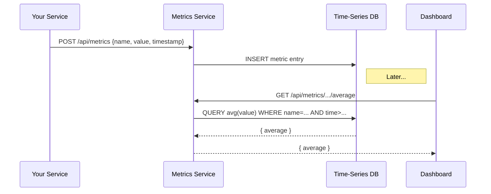

# Chapter 10: Monitoring & Metrics Service

In the previous chapter, we saw how the [Management Layer](09_management_layer_.md) orchestrates events across services. Now it’s time to make sure everything is running smoothly and to measure the impact of our changes. Welcome to the **Monitoring & Metrics Service**!

---

## Why Do We Need Monitoring & Metrics?

Imagine the Department of Building Safety rolled out an AI‐powered triage for citizen repair requests. They want to know:

- Are requests being handled faster?
- Are errors spiking?
- Are citizens happier after the AI change?

Just like a building’s sensor network reports temperature or security alerts, our Monitoring & Metrics Service keeps an eye on system health and tracks key performance indicators (KPIs). For example, we can compare the **average resolution time** before and after the AI update to prove efficiency gains.

---

## Key Concepts

1. **Metrics Collector**  
   A tiny library you add to any service to **record** events (latency, errors, satisfaction scores).

2. **Metrics API**  
   An HTTP endpoint that **ingests** collected metrics and stores them in a time-series database.

3. **Aggregation & Queries**  
   Tools to **aggregate** raw data (e.g., compute averages, percentiles) and **query** them over time ranges.

4. **Alerts & Dashboards**  
   Visual dashboards and alert rules (e.g., send email if error rate > 5% in 5 minutes).

5. **Storage Layer**  
   A simple data store (e.g., InfluxDB or a relational table) to keep timestamped metric entries.

---

## How to Use This Service

### 1. Record a Metric from a Microservice

In your service’s request handler, import a small client to record latency:

```js
// File: src/handlers/reportHandler.js
import metricsClient from '../metricsClient';

export async function handleReport(req, res) {
  const start = Date.now();
  // ... process the report ...
  const duration = Date.now() - start;
  // Record resolution time in milliseconds
  await metricsClient.record('report_resolution_time', duration);
  res.send({ status: 'ok' });
}
```

Explanation:
- We capture the time before and after processing.
- We call `metricsClient.record(metricName, value)` to send data to our Monitoring Service.

### 2. Expose Aggregated Metrics

A simple dashboard can fetch the **average resolution time** over the past day:

```js
// File: src/dashboard.js
import React, { useEffect, useState } from 'react';
import axios from 'axios';

export function MetricsDashboard() {
  const [avgTime, setAvgTime] = useState(null);

  useEffect(() => {
    axios
      .get('/api/metrics/report_resolution_time/average?window=24h')
      .then(res => setAvgTime(res.data.average));
  }, []);

  return (
    <div>
      <h3>Avg Resolution Time (last 24h):</h3>
      {avgTime !== null ? <p>{avgTime} ms</p> : <p>Loading...</p>}
    </div>
  );
}
```

Explanation:
- We GET `/api/metrics/{metric}/average?window=24h`.
- The service returns `{ average: 1234 }`, which we display.

---

## What Happens Under the Hood



1. Your service **POSTs** metric data to the Monitoring Service.  
2. The Monitoring Service **stores** each entry.  
3. Dashboards or alert rules **query** aggregated data as needed.

---

## Internal Implementation

Here’s a minimal layout for `hms-monitoring`:

```
hms-monitoring/
└── src/
    ├── server.js
    ├── metricsHandler.js
    ├── metricsClient.js
    └── storage.js
```

### src/metricsClient.js

```js
import axios from 'axios';

export default {
  record(name, value) {
    return axios.post('http://monitoring:8000/api/metrics', {
      name,
      value,
      timestamp: new Date().toISOString()
    });
  }
};
```
A lightweight client for services to call.

### src/metricsHandler.js

```js
import express from 'express';
import { saveMetric, queryAverage } from './storage';

const router = express.Router();

// Ingest raw metric
router.post('/', async (req, res) => {
  const { name, value, timestamp } = req.body;
  await saveMetric(name, value, timestamp);
  res.status(202).send();
});

// Return average over a time window
router.get('/:name/average', async (req, res) => {
  const avg = await queryAverage(req.params.name, req.query.window);
  res.json({ average: avg });
});

export default router;
```
Defines two endpoints: one to **ingest** and one to **query**.

### src/storage.js

```js
// Pseudo-implementation using an in-memory array
const metrics = [];

export async function saveMetric(name, value, timestamp) {
  metrics.push({ name, value, timestamp: new Date(timestamp) });
}

export async function queryAverage(name, window) {
  const cutoff = Date.now() - parseWindow(window);
  const samples = metrics.filter(
    m => m.name === name && m.timestamp.getTime() >= cutoff
  );
  const sum = samples.reduce((s, m) => s + m.value, 0);
  return samples.length ? sum / samples.length : 0;
}

// Helper: convert "24h" → milliseconds
function parseWindow(w) {
  const num = parseInt(w, 10);
  return w.endsWith('h') ? num * 3600 * 1000 : 0;
}
```
A toy storage layer; in production you'd use a time-series database.

---

## Summary

In this chapter you learned how to:

- **Record** performance and error metrics from any service.  
- **Ingest** raw data via a simple HTTP API.  
- **Aggregate** metrics (e.g., compute averages) and expose them to dashboards.  
- **Visualize** key indicators to prove efficiency gains, like average resolution time before and after an AI update.

Up next, we’ll look at how to keep HMS-EMR in sync with external systems in [External System Synchronization](11_external_system_synchronization_.md).

---

Generated by [AI Codebase Knowledge Builder](https://github.com/The-Pocket/Tutorial-Codebase-Knowledge)