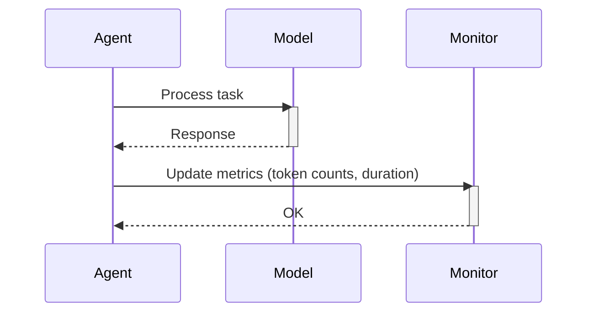

# Chapter 10: Monitoring

In the previous chapter, [MCP Client](09_mcp_client.md), we learned how to connect our agent to external tools. Now, let's explore how to keep track of our agent's performance. This is like checking our chef agent's cooking time and ingredient usage to see how efficient they are.  This is where **Monitoring** comes in.

## What is Monitoring?

Monitoring is like a kitchen timer and ingredient tracker for our agent. It helps us understand how long the agent takes to complete tasks and how many resources it uses. This information is crucial for optimizing the agent's efficiency and identifying potential bottlenecks.  Imagine our chef agent takes too long to chop vegetables. Monitoring would reveal this issue, allowing us to find a faster way, like using a food processor.

## Using Monitoring

`smolagents` automatically tracks key metrics during the agent's operation.  Let's see how to access this information:

```python
from smolagents import CodeAgent, InferenceClientModel

# Create a simple agent
agent = CodeAgent(model=InferenceClientModel())

# Run the agent with a task
agent.run("What's the weather in Paris today?")

# Access the monitoring data
print(f"Total input tokens: {agent.monitor.total_input_token_count}")
print(f"Total output tokens: {agent.monitor.total_output_token_count}")
print(f"Step durations: {agent.monitor.step_durations}")
```

This code creates a `CodeAgent` and runs it with a simple task. After the agent finishes, we can access the monitoring data through `agent.monitor`.  This provides information like the total number of input and output tokens used by the [Model](03_model.md) and the duration of each step.

## Inside Monitoring

Here's a simplified sequence diagram showing how monitoring works:



1. The [Agent](01_agent.md) sends a task to the [Model](03_model.md).
2. The model processes the task and returns a response.
3. The agent updates the `Monitor` with information like the number of tokens used by the model and the duration of the step.

The `Monitor` class in the `monitoring.py` file handles the tracking of these metrics.

```python
# Simplified code from monitoring.py
class Monitor:
    def __init__(self, tracked_model, logger):
        self.step_durations = []
        # ...

    def update_metrics(self, step_log):
        step_duration = step_log.duration
        self.step_durations.append(step_duration)
        # ... update token counts
```

The `update_metrics` method is called after each step to update the tracked metrics.  The `step_log` contains information about the step, including its duration.

The agent calls this method after each step:

```python
# Simplified code from agents.py
class MultiStepAgent(ABC):
    # ...
    def run(self, task: str):
        # ...
        while not finished:
            # ...
            self.monitor.update_metrics(action_step)
            # ...
```

## Conclusion

In this chapter, we learned about `Monitoring` in `smolagents` and how it helps us track the agent's performance by recording metrics like token usage and step durations.  This information is valuable for understanding and optimizing the agent's efficiency.  This concludes the tutorial. We hope you now have a good understanding of the core concepts of `smolagents`!


---

Generated by [AI Codebase Knowledge Builder](https://github.com/The-Pocket/Tutorial-Codebase-Knowledge)