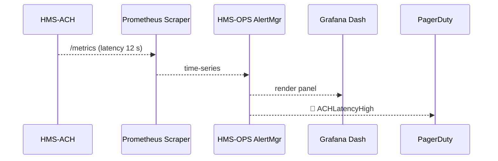

# Chapter 10: Operations & Observability (HMS-OPS)

*(Jumped in from [Financial Transaction Engine (HMS-ACH)](09_financial_transaction_engine__hms_ach__.md))*  

---

## 1 — Why Does HMS Need a “Control Tower”?

Imagine 9 PM on a Friday.  
HUD has just queued **10,000 emergency payments** in [HMS-ACH](09_financial_transaction_engine__hms_ach__.md).  
Suddenly — latency to the Federal Reserve rail jumps from **200 ms to 12 s**.

If nobody notices:

* ACH files miss the nightly cutoff → citizens don’t get rent money.  
* A batch retry doubles the payment → Treasury accountants work the weekend.  

HMS-OPS is the **air-traffic control tower** that prevents this chaos.  
It watches *every request*, *every job*, and *every server* in the stack and yells **“⚠️ turbulence ahead!”** before a single payment is lost.

---

## 2 — Key Concepts in Plain English

| “Control-Tower” Word | Think of it as… |
|----------------------|-----------------|
| Metric               | A speedometer — “latency = 12 s” |
| Log                  | The black box — “Payment #42 queued” |
| Trace                | The flight path of **one** request |
| Dashboard            | Radar screen showing live metrics |
| Alert                | Siren that wakes the on-call engineer |
| Runbook              | Emergency checklist — “If ACH latency > 5 s → switch to RTP” |
| Incident             | A logged event when SLAs are broken |
| Rollback             | “Turn the plane around” — instantly deploy the last good version |

Keep these eight words handy; the rest of the chapter builds on them.

---

## 3 — 60-Second Walk-Through: Add a Metric, Plot It, Alert It

Below is *all* you need to expose **ACH latency** from Laravel, plot it in Grafana, and page the on-call engineer.  

### 3.1  Emit the Metric (Laravel ≤ 15 lines)

```php
// app/Services/ACH/Engine.php
use Prometheus\CollectorRegistry;

function recordLatency(float $seconds)
{
    $registry = app(CollectorRegistry::class);
    $timer = $registry->getOrRegisterHistogram(
        'hms', 'ach_latency_seconds', 'ACH rail round-trip time'
    );
    $timer->observe($seconds);
}
```

Explanation  
1. We reuse the **Prometheus PHP client** (installed via Composer).  
2. `ach_latency_seconds` is a **histogram** — perfect for latency buckets.  
3. Each `observe()` call is scraped by Prometheus every 15 s.

### 3.2  Ship Logs & Traces (Laravel ≤ 10 lines)

```php
// app/Http/Middleware/TrackTrace.php
public function handle($req, $next)
{
    $span = Trace::start('api.request');
    $span->set('route', $req->path());
    $resp = $next($req);
    $span->finish();
    Log::info('req_done', ['route' => $req->path(), 'ms' => $span->duration()]);
    return $resp;
}
```

• `Trace::start()` opens an OpenTelemetry span.  
• `Log::info()` writes JSON to **stdout** — HMS-OPS tail-ingests it.

### 3.3  Create a Dashboard (Grafana GUI – No Code)

1. Add panel → select metric `hms_ach_latency_seconds_bucket`.  
2. Choose “Heatmap” → X-axis *time*, Y-axis *latency bucket*.  
3. Save as **ACH Latency Radar**.

### 3.4  Wire an Alert (YAML ≤ 10 lines)

```yaml
# hms-ops/rules/ach_latency.yaml
groups:
- name: ach
  rules:
  - alert: ACHLatencyHigh
    expr: histogram_quantile(0.95,
            rate(hms_ach_latency_seconds_bucket[5m])) > 5
    for: 3m
    labels:
      severity: critical
    annotations:
      runbook: https://runbooks.gov/ops/ach_latency
```

If the 95-th percentile stays above **5 s** for 3 minutes → page `@Treasury_OnCall`.

---

## 4 — Flight-Path Under the Hood



1. **APP** exposes `/metrics`.  
2. **SCR** pulls numbers every 15 s.  
3. **OPS AlertMgr** evaluates rules, sends pages.  
4. **Grafana Dash** shows the red spike.

---

## 5 — Inside HMS-OPS (File Tour)

```
hms-ops/
 ├─ prometheus/            # scrapers + alert rules
 │   └─ prometheus.yml
 ├─ alertmanager/          # routing to email / PagerDuty
 │   └─ config.yml
 ├─ loki/                  # log aggregation (Grafana Loki)
 ├─ tempo/                 # distributed tracing store
 ├─ dashboards/            # JSON Grafana boards
 └─ runbooks/              # Markdown emergency guides
```

### 5.1  prometheus.yml (≤ 15 lines)

```yaml
scrape_configs:
- job_name: hms
  metrics_path: /metrics
  static_configs:
  - targets: ['ach-svc:9000','api-gw:8080']
```

### 5.2  Alert Routing (≤ 10 lines)

```yaml
# alertmanager/config.yml
receivers:
- name: treasury
  pagerduty_configs:
  - routing_key: ${PAGERDUTY_KEY_TREASURY}
route:
  group_by: ['alertname']
  receiver: treasury
```

---

## 6 — Rollbacks & Incidents in One Command

If an alert fires and the runbook says “rollback,” on-call can run:

```bash
hms-ops rollback ach@v1.8.2
```

The command:

1. Tells Kubernetes to **pin** `hms-ach` to the previous container tag.  
2. Posts a note to the **Incident channel** with the diff.  
3. Closes the PagerDuty incident when latency drops below threshold.

---

## 7 — Government Analogy Cheat-Sheet

HMS-OPS Thing      | Real-World Counterpart
-------------------|------------------------
Metric             | Air-traffic radar ping (“plane at 30,000 ft”)  
Log                | Pilot voice recorder  
Trace              | Flight path drawn on the screen  
Alert              | “Pull up, pull up!” stall warning  
Runbook            | FAA checklist laminated in cockpit  
Rollback           | Divert plane to alternate airport  

---

## 8 — Common Beginner Pitfalls

1. **Not exporting metrics on port `/metrics`** → Prometheus errors “`context deadline exceeded`”.  
2. **Logging plain text** → Loki can’t parse; always use **JSON lines**.  
3. **Forgetting `for: …` in alert rule** → false positives on short spikes.  
4. **Runbook URL 404** → on-call wastes time hunting instructions.  
5. **No trace IDs in logs** → impossible to stitch metrics ↔ logs ↔ traces.

---

## 9 — Mini-Exercise

1. Add `sleep(3)` inside `recordLatency()` to simulate slowness.  
2. Watch **ACH Latency Radar** turn red.  
3. Confirm PagerDuty test event fires after 3 minutes.  
4. Run `hms-ops rollback ach@prev` — latency drops — alert auto-resolves.  
5. Open the Incident postmortem; note the timeline is auto-filled from logs & traces.

---

## 10 — Recap & What’s Next

You learned how **HMS-OPS**:

* Collects **metrics, logs, and traces** across the stack.  
* Turns red spikes into **actionable alerts** and links them to **runbooks**.  
* Automates **rollbacks** so downtime stays within SLA.  

But what if the system could *predict* problems **before** they happen?  
That’s where we go in [Autonomous Performance Monitor](11_autonomous_performance_monitor_.md).

---

Generated by [AI Codebase Knowledge Builder](https://github.com/The-Pocket/Tutorial-Codebase-Knowledge)