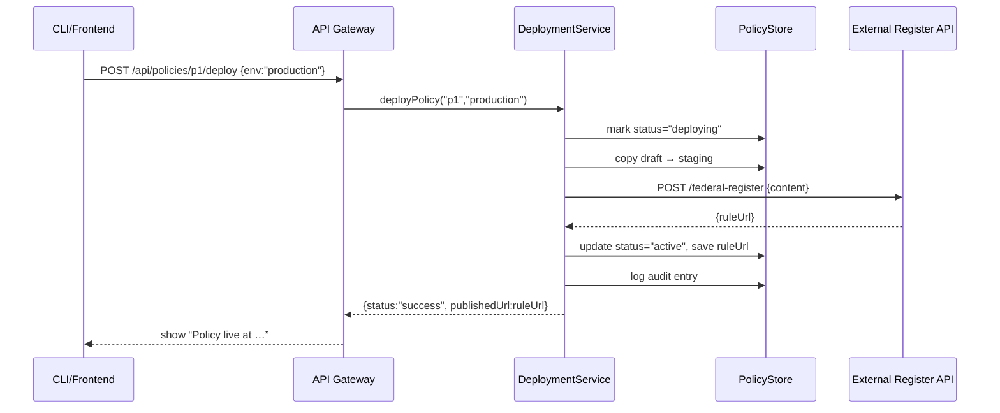

# Chapter 10: Policy Deployment Workflow

Welcome back! In [Chapter 9: Real-Time External Sync](09_real_time_external_sync_.md) we learned how to push approved policies to outside systems immediately. Now it’s time to see the **end-to-end pipeline** that takes a human-approved proposal and turns it into an active rule inside HMS-MFE—just like the federal rule-making process: drafting, interagency review, publishing in the Federal Register, and instant enforcement.

## Why Policy Deployment Workflow Matters

Imagine the Environmental Protection Agency (EPA) has just approved a new dredging-permit policy:

1. A policy proposal was drafted and AI-scored (see [Chapter 7: Process Proposal Module](07_process_proposal_module_.md)).  
2. A senior official reviewed and approved it (see [Chapter 8: Human-in-the-Loop Override](08_human_in_the_loop_override_.md)).  
3. Now, it must go live in multiple systems—citizen portal, back-office dashboard, analytics pipelines—and be published publicly in the Federal Register.

Without a clear **Deployment Workflow**, you might forget a step, push incomplete data, or publish stale rules—leading to confusion and non-compliance. This chapter shows you how to automate and coordinate every stage, ensuring a smooth, auditable rollout.

## Key Concepts

1. Deployment Pipeline  
   A sequence of automated steps—from validation to publication.

2. Staging vs. Production  
   - **Staging**: draft environment for final checks.  
   - **Production**: live environment serving citizens.

3. Publication Step  
   Calling an external “Federal Register” API to make the policy publicly visible.

4. Enforcement Step  
   Toggling a feature flag or writing to a rules table so systems start enforcing the new policy.

5. Audit & Logging  
   Record each phase—who deployed when, what changed, and whether each step succeeded.

## Using the Policy Deployment Workflow

Let’s see a minimal example. We have a `PolicyDeploymentService` that handles everything in one call:

```ts
// src/policy/deployUsage.ts
import { PolicyDeploymentService } from './policyDeploymentService'

async function run() {
  const svc = new PolicyDeploymentService()
  const result = await svc.deployPolicy('p1', { env: 'production' })
  console.log(result.status)      // ➜ "success"
  console.log(result.publishedUrl) // ➜ "https://federalregister.gov/rule/1234"
}

run()
```

Explanation:
- We call `deployPolicy` with the proposal ID (`p1`) and choose the environment (`production`).
- The service validates, stages, publishes to the Federal Register, forces enforcement, and returns a final status plus a public URL.

## What Happens Behind the Scenes



1. The frontend triggers a deploy.  
2. The `DeploymentService` marks the policy as “deploying.”  
3. It pushes a draft to staging for final checks.  
4. It calls the Federal Register API to publish the rule.  
5. On success, it marks the policy “active” and logs everything.  
6. The frontend finally shows the public URL.

## Under the Hood: Internal Implementation

### 1. Service Entry Point

File: `src/policy/policyDeploymentService.ts`

```ts
export class PolicyDeploymentService {
  async deployPolicy(id: string, opts: { env: string }) {
    const policy = await this.loadProposal(id)
    await this.stageInDB(policy, opts.env)
    const url = await this.publishToRegister(policy)
    await this.activatePolicy(id, url, opts.env)
    return { status: 'success', publishedUrl: url }
  }
  // ...
}
```

Explanation:
- `loadProposal` verifies the proposal is approved.  
- `stageInDB` copies it to a staging area for final checks.  
- `publishToRegister` calls the external publication API.  
- `activatePolicy` flips it live and writes audit logs.

### 2. Staging in the Database

```ts
private async stageInDB(policy: any, env: string) {
  // mark as deploying
  await db.update('policies', { id: policy.id }, { status: 'deploying', env })
}
```

Explanation:
- We tag the policy record with `deploying` and the target environment.

### 3. Publishing to the Federal Register

```ts
private async publishToRegister(policy: any) {
  const res = await fetch('https://api.federalregister.gov/rules', {
    method: 'POST',
    headers: { 'Content-Type': 'application/json' },
    body: JSON.stringify({ title: policy.title, text: policy.content })
  })
  const data = await res.json()
  return data.ruleUrl // e.g. "https://federalregister.gov/rule/1234"
}
```

Explanation:
- We send the policy text to the Federal Register API.  
- The API returns a public URL for the published rule.

### 4. Activating the Policy

```ts
private async activatePolicy(id: string, url: string, env: string) {
  await db.update('policies', { id }, {
    status: 'active',
    publishedUrl: url,
    activatedAt: new Date().toISOString()
  })
  // Trigger real-time sync across our systems
  syncService.emit('policy.activated', { id, env })
  // Audit log
  await db.insert('auditLogs', {
    policyId: id, action: 'deploy', timestamp: new Date(), env
  })
}
```

Explanation:
- We mark the policy as `active`, store the public URL, and record the timestamp.  
- We call our **Real-Time External Sync** from [Chapter 9](09_real_time_external_sync_.md) to push the live rule everywhere.  
- Finally, we insert an audit record for compliance.

## Summary

In this chapter you learned how to:

- Coordinate all steps in the **Policy Deployment Workflow**—from DB staging to public publication and system enforcement.  
- Use a single `PolicyDeploymentService` to keep the process atomic and auditable.  
- Integrate with the Federal Register API to make policies publicly visible.  
- Invoke **Real-Time External Sync** to enforce the new rule across connected systems.

Up next, we’ll take a bird’s-eye view of the **Management Layer** that monitors metrics, deploys health checks, and handles user permissions at scale. See you in [Chapter 11: Management Layer](11_management_layer_.md)!

---

Generated by [AI Codebase Knowledge Builder](https://github.com/The-Pocket/Tutorial-Codebase-Knowledge)