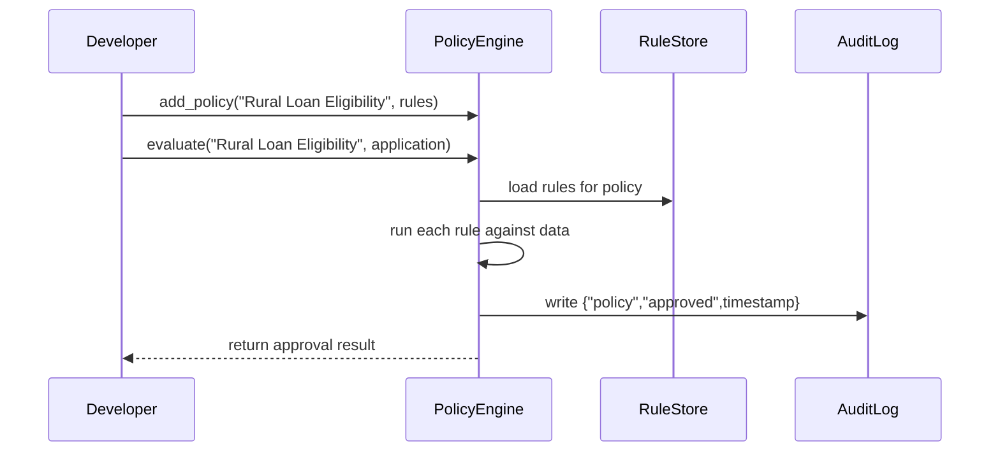

# Chapter 10: Policy Engine

In [Chapter 9: Microservice](09_microservice_.md), we saw how each office (microservice) handles one piece of our workflow. Now we’ll add a “rulebook clerk” that ensures every action follows the right regulations. Welcome to the **Policy Engine**!

---

## 1. Why a Policy Engine?

Imagine the Rural Housing Service (RHS) receives dozens of loan applications every day. Before anyone can approve a loan, a clerk must check that each application:

- Meets **credit score** and **income** thresholds  
- Is for a **rural** property  
- Doesn’t exceed program **loan limits**

Manually enforcing these rules is slow, error-prone, and hard to update when regulations change. The **Policy Engine** automates this “rule check”:

- Stores rules in one place  
- Evaluates each application against those rules  
- Logs every decision for auditability  
- Updates rules automatically when policies change

---

## 2. Key Concepts

1. **Policy**  
   A named set of rules (e.g. “Rural Loan Eligibility”).  
2. **Rule**  
   A single check within a policy (e.g. “credit_score ≥ 650”).  
3. **Evaluator**  
   The component that runs rules against input data.  
4. **Enforcement**  
   Approving or denying an action based on rule results.  
5. **Audit Log**  
   A record of each evaluation and its outcome.

---

## 3. Using the Policy Engine

Let’s write a tiny example where we:

1. Create a `PolicyEngine`.  
2. Add a “Rural Loan” policy.  
3. Check a sample application.

```python
# File: app.py
from hms_ach.policy_engine import PolicyEngine

# 1. Initialize the engine
engine = PolicyEngine()

# 2. Define a policy with simple rules
engine.add_policy(
    name="Rural Loan Eligibility",
    rules=[
        lambda app: app["credit_score"] >= 650,
        lambda app: app["income"] <= 80000,
        lambda app: app["property_location"] == "rural"
    ]
)

# 3. Sample application
application = {
    "credit_score": 680,
    "income": 75000,
    "property_location": "rural"
}

# 4. Evaluate the application
result = engine.evaluate("Rural Loan Eligibility", application)
print(result)  # Output: {"approved": True, "failed_rules": []}
```

Explanation:

- We register a policy named **Rural Loan Eligibility** with three rules.  
- We pass in an `application` dict.  
- `evaluate` returns whether it’s approved and which rules (if any) failed.

---

## 4. Under the Hood: Step-by-Step Flow

When `engine.evaluate(...)` runs, here’s what happens:



1. **Load rules**: Engine fetches the list of rule functions.  
2. **Run checks**: Each rule is executed with the application data.  
3. **Log**: Outcome is recorded for later auditing.  
4. **Return**: Engine tells you if it’s approved and any failures.

---

## 5. Peek at the Implementation

Below is a very simple version of `policy_engine.py`.

### 5.1 Core Class & Policy Storage

```python
# File: hms_ach/policy_engine.py

class PolicyEngine:
    def __init__(self):
        self.policies = {}    # name -> list of rule functions
        self.audit_log = []   # list of {policy, approved, details}
```

- `self.policies` holds each policy’s rules.  
- `self.audit_log` records every evaluation.

### 5.2 Adding Policies & Evaluation

```python
class PolicyEngine:
    # ... __init__ above ...

    def add_policy(self, name, rules):
        self.policies[name] = rules

    def evaluate(self, name, data):
        failed = []
        for rule in self.policies.get(name, []):
            if not rule(data):
                failed.append(rule.__name__ or "anonymous rule")
        approved = len(failed) == 0
        # Record in audit log
        self.audit_log.append({
            "policy": name,
            "approved": approved,
            "failed_rules": failed
        })
        return {"approved": approved, "failed_rules": failed}
```

- `add_policy` registers your rules.  
- `evaluate` runs each rule, collects failures, logs the result, and returns a summary.

---

## 6. Conclusion

You’ve learned how the **Policy Engine** acts like an automated “rulebook clerk”:

- It centralizes and enforces business rules.  
- It audits every decision for transparency.  
- It updates easily when regulations change.

Next up, we’ll see how a human reviewer can step in when the engine can’t decide, in [Human Decision Maker](11_human_decision_maker_.md).

---

Generated by [AI Codebase Knowledge Builder](https://github.com/The-Pocket/Tutorial-Codebase-Knowledge)