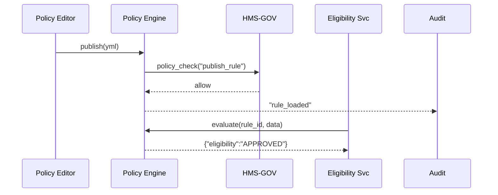

# Chapter 10: Policy & Process Engine
*(File: 10_policy___process_engine_.md)*  

[← Back to Backend API Gateway](09_backend_api_gateway__hms_api__.md)

---

## 1. “Why Can’t I Just Change the Rule in One Afternoon?”

### A 60-Second Story  
The **State of Evergreen** learns that the federal poverty line has increased.  
To stay compliant, Evergreen must raise the **Medicaid income-limit** from  
\$29,160 ➜ \$31,200.

Today’s reality:  
* Business analyst drafts a memo.  
* Developers update 6 micro-services.  
* QA spins a test environment.  
* Release train ships next **3 months**.

Citizens wait, clinics file paper, auditors sigh.

Enter the **Policy & Process Engine (PPE)**—a low-code “rulebook compiler.”  
A policy official types a single line, clicks **Publish**, and every eligibility check updates **within minutes**.

---

## 2. Key Concepts in Plain English

| Word | What it really means | Friendly analogy |
|------|----------------------|------------------|
| Rule | IF/THEN statement (e.g., `income ≤ 31200 → eligible`) | A clause in the tax code |
| SLA  | Time promise like “Approve within 48 h” | USPS “2-Day Priority” |
| Escalation | Who gets alerted if SLA missed | Calling the shift supervisor |
| DSL | Human-readable mini-language to write rules | Mad-Libs for policies |
| Workflow | Auto-generated steps the system runs | Domino chain you don’t have to set up by hand |
| Hot-Reload | Instantly swap old rule for new one | Traffic light that re-programs without digging up asphalt |

> Keep this picture in mind: **Official types rule ➜ PPE compiles ➜ Micro-services obey.**

---

## 3. Quick-Start: Update Medicaid Income Limit in 3 Steps

### Step 1 – Author the Rule (DSL)

```yaml
# file: policies/medicaid_income.yml
id: MEDICAID-INCOME-2024-04
description: "Poverty line adjustment, effective Apr-2024"
if:
  - field: income
    op:   "<="
    value: 31200
then:
  eligibility: "APPROVED"
else:
  eligibility: "DENIED"
sla: 48h                 # finish within 48 hours
escalate_to: supervisor@evergreen.gov
```

*Readable even for non-coders.*  

### Step 2 – Compile & Deploy

```bash
$ hms-ppe compile policies/medicaid_income.yml
✔ syntax ok
✔ unit tests passed
✔ workflow id WF-87A loaded
```

### Step 3 – Watch a Service Use the New Rule

```python
# file: eligibility_service.py
from hms_ppe import evaluate

applicant = {"income": 30100}

result = evaluate("MEDICAID-INCOME-2024-04", applicant)
print(result["eligibility"])      # ➜ "APPROVED"
```

No redeploy of `eligibility_service.py` was required—the rule hot-reloaded.

---

## 4. What Happens Behind the Curtain?



Five players, milliseconds of work.

---

## 5. Inside the Engine – Mini Code Tour (All Blocks <20 Lines)

### 5.1 Parser (`parser.py`)

```python
import yaml

def parse(path):
    raw  = yaml.safe_load(open(path))
    cond = raw["if"][0]             # support one IF for demo
    rule = lambda data: (
        data[cond["field"]] <= cond["value"]
    )
    return {"id": raw["id"], "rule": rule, "meta": raw}
```

*Reads YAML ➜ returns a tiny Python lambda.*

### 5.2 Registry & Hot-Reload (`registry.py`)

```python
import importlib, pathlib, time
RULES = {}

def load_folder(folder="policies"):
    for yml in pathlib.Path(folder).glob("*.yml"):
        spec = parse(yml)
        RULES[spec["id"]] = spec
        _log("loaded", spec["id"])

def _watch():
    while True:
        load_folder()          # overwrite changed rules
        time.sleep(30)
```

*A background thread refreshes every 30 s.*

### 5.3 Public Facade (`__init__.py`)

```python
from .registry import RULES, load_folder
load_folder()

def evaluate(rule_id, data):
    rule = RULES[rule_id]["rule"]
    verdict = "APPROVED" if rule(data) else "DENIED"
    return {"eligibility": verdict}
```

Three lines give any micro-service access to the newest rule.

---

## 6. SLAs & Escalations in 10 Lines

```python
# file: sla.py
import time, smtplib

DEADLINES = {}    # {case_id: (due_ts, email)}

def start_timer(case_id, sla_hours, email):
    DEADLINES[case_id] = (time.time() + sla_hours*3600, email)

def tick():
    now = time.time()
    for case, (due, email) in list(DEADLINES.items()):
        if now > due:
            _notify(email, case)
            DEADLINES.pop(case)

def _notify(addr, case):
    smtplib.SMTP("mail.gov").sendmail("noreply@hms", addr,
        f"Case {case} breached SLA")
```

The engine calls `start_timer` when a workflow begins and runs `tick()` in a scheduler.

---

## 7. How PPE Plays With Other Layers

| Concern | Which Layer Controls It | Chapter |
|---------|------------------------|---------|
| Who may **publish** rules? | Governance + RBAC | [Governance Layer](01_governance_layer__hms_gov__.md), [RBAC](04_role_based_access_control__rbac__.md) |
| Audit of rule changes | Security & Compliance | [Security & Compliance Framework](03_security___compliance_framework_.md) |
| API calls generated by workflows | Go through HMS-API | [Backend API Gateway](09_backend_api_gateway__hms_api__.md) |
| Human approvals inside workflows | HITL checkpoints | [Human-In-The-Loop Decision Point](08_human_in_the_loop_decision_point_.md) |
| Metrics on SLA breaches | Observability layer | [Observability & Continuous Monitoring](14_observability___continuous_monitoring_.md) |

---

## 8. Common Pitfalls & Quick Fixes

| Pitfall | Symptom | Fix |
|---------|---------|-----|
| Typo in `field` name | Every applicant turns “DENIED” | Run `hms-ppe test` before publish |
| Forgetting `else` block | Engine throws `KeyError` | Always include `else:` section |
| Large rule set slows reload | Latency spike every 30 s | Shard policies by domain (`medicaid/`, `veterans/`) |
| SLA timer never fires | No cron running `tick()` | Enable PPE scheduler or Kubernetes cronjob |

---

## 9. Try It Yourself

1. `git clone <repo>` and `cd examples/ppe/`  
2. Edit `policies/medicaid_income.yml`—change value to `25000`.  
3. Wait 30 s or run `hms-ppe reload`.  
4. Run:

   ```python
   from hms_ppe import evaluate
   print(evaluate("MEDICAID-INCOME-2024-04", {"income":26000}))
   ```
5. Observe `"DENIED"`—rule took effect instantly.  
6. Check `ppe_audit.log` to see your change recorded.

---

## 10. What You Learned

✓ How a low-code **DSL** turns policy text into executable workflows.  
✓ Hot-reload magic: edit YAML ➜ every service obeys.  
✓ Built-in SLA timers and escalation emails.  
✓ Where Governance, RBAC, and other layers plug in.

Ready to see these rules ripple out to **external partner systems** (state HIEs, federal data hubs, county CRMs)?  
That’s the job of our next component: the **External System Synchronization Bus**.

[Continue to External System Synchronization Bus](11_external_system_synchronization_bus_.md)

---

Generated by [AI Codebase Knowledge Builder](https://github.com/The-Pocket/Tutorial-Codebase-Knowledge)