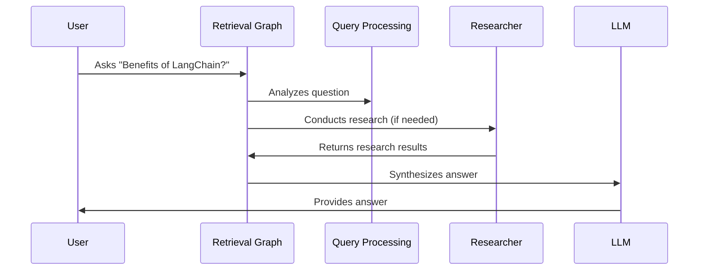

# Chapter 10: Retrieval Graph

In the previous chapter, [Researcher Graph](09_researcher_graph_.md), we learned how to generate multiple search queries and retrieve documents for each. Now, let's explore how this fits into the larger retrieval system, the *Retrieval Graph*.  This component orchestrates the entire research process, making our chatbot a truly intelligent research assistant.

Imagine you're writing a research paper. You wouldn't just search for information and immediately start writing. You'd plan your research, gather information, analyze it, and then synthesize it into a coherent argument. The Retrieval Graph helps our chatbot do the same.

## What is the Retrieval Graph?

The Retrieval Graph is the mastermind behind our chatbot's research abilities. It's like a research assistant that plans the research steps, retrieves relevant information, and prepares the final answer. It encompasses all the components we've learned about so far, including [LLM (Large Language Model)](01_llm__large_language_model__.md), [Retrieval](02_retrieval_.md), [Vector Store](03_vector_store_.md), [Embeddings](04_embeddings_.md), [Query Analysis/Rephrasing](06_query_analysis_rephrasing_.md), and the [Researcher Graph](09_researcher_graph_.md).

## How the Retrieval Graph Works

Let's break down the process with a simple example: "What are the benefits of using LangChain?"

1. **Analyze Question:** The Retrieval Graph first analyzes the question using an [LLM](01_llm__large_language_model__.md) to understand its intent and determine the best research strategy.  This is like deciding what resources (books, articles, etc.) are needed for your research paper.

2. **Create Research Plan (Optional):** For complex questions, the Retrieval Graph might create a multi-step research plan. This involves generating a series of related queries to explore different aspects of the question. This is like outlining the sections of your research paper.

3. **Conduct Research:** The Retrieval Graph uses the [Researcher Graph](09_researcher_graph_.md) to execute the research plan. This involves generating search queries, retrieving relevant documents from the [Vector Store](03_vector_store_.md) using [Embeddings](04_embeddings_.md) and [Retrieval](02_retrieval_.md), and gathering the results. This is like gathering information for each section of your outline.

4. **Synthesize Answer:** Finally, the Retrieval Graph uses an [LLM](01_llm__large_language_model__.md) to synthesize the retrieved information into a coherent and informative answer. This is like writing the actual content of your research paper based on your research.



## Retrieval Graph in Code

The Retrieval Graph is defined in `backend/retrieval_graph/graph.py`.  It's implemented using `langgraph`, a library for building stateful graphs.

```python
# backend/retrieval_graph/graph.py (simplified)
builder = StateGraph(AgentState, input=InputState, config_schema=AgentConfiguration)
builder.add_node(create_research_plan)
builder.add_node(conduct_research)
builder.add_node(respond)

# ... add edges to connect the nodes ...

graph = builder.compile()
```

This code snippet shows how the Retrieval Graph is constructed.  Nodes representing different stages of the research process (e.g., `create_research_plan`, `conduct_research`, `respond`) are added to the graph, and edges define the flow between these nodes.

## Looking Under the Hood: `graph.ainvoke`

When you call `graph.ainvoke` with a user question, the following happens:

1. **Initialize State:** The `InputState` is created with the user's message.

2. **Traverse Graph:** The graph is traversed according to the defined edges.  Each node performs its specific function (e.g., analyzing the question, conducting research, synthesizing the answer), updating the state along the way.

3. **Return Final State:** The final state, containing the generated answer, is returned.

```python
# backend/api.py (simplified)
from backend.retrieval_graph import graph

# ... other code ...

async def chat(...):
    # ... other code ...
    result = await graph.ainvoke(
        {"messages": [{"type": "human", "content": question}]}, config=config
    )
    # ... other code ...
```

This simplified code snippet from `backend/api.py` shows how the `graph.ainvoke` function is used to process a user's `question`.

## Conclusion

The Retrieval Graph orchestrates the entire research process, making our chatbot a powerful research assistant. By combining different components like [LLM](01_llm__large_language_model__.md), [Retrieval](02_retrieval_.md), and the [Researcher Graph](09_researcher_graph_.md), it can effectively answer complex questions. This concludes our tutorial on building a chatbot with HMS-AGT.


---

Generated by [AI Codebase Knowledge Builder](https://github.com/The-Pocket/Tutorial-Codebase-Knowledge)