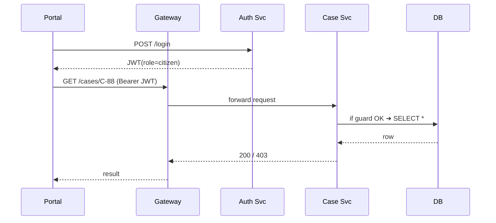

# Chapter 10: Role-Based Access Control (RBAC)

*Coming from [Security & Compliance Framework](09_security___compliance_framework_.md).*

---

## 1. Why Do We Need It? – A 90-Second Story  

Imagine you are **Maria**, a single mother who just applied for **Rental Assistance** from the *Department of Housing and Urban Development (HUD).*  
At the same time, **Mr. Patel**, a HUD program manager, is adjusting next month’s budget, and **Ella**, a contractor, is helping with data cleanup.

The platform must guarantee that:

1. **Maria** sees *only* her own application—never her neighbor’s.  
2. **Mr. Patel** can edit budgets but cannot touch payroll.  
3. **Ella** may read case data to fix typos but cannot approve payments.

Hard-coding these rules in every microservice would be a security nightmare.  
**Role-Based Access Control (RBAC)** acts like an **ID-badge system** for software: every request shows a badge (role), and services open doors only if the badge matches.

---

## 2. Key Concepts (Beginner-Friendly Table)

| Analogy            | RBAC Term  | One-Line Explanation |
|--------------------|------------|----------------------|
| ID badge           | **Role**   | A named set of permissions (e.g., `citizen`, `budget_mgr`). |
| Locked door label  | **Permission** | Verb + Resource pair such as `READ_CASE`, `UPDATE_BUDGET`. |
| Office file cabinet| **Resource** | Thing being protected (case, budget, payroll). |
| Badge directory    | **Role Map** | YAML/DB list that links roles ➜ permissions. |
| Security guard     | **Enforcer** | Tiny library that checks “Does this badge allow the action?” |

Keep these five words in mind—everything else is detail.

---

## 3. Guided Walk-Through: “Rental Assistance” Use Case  

Goal:  
1. Define roles & permissions in one YAML file.  
2. Issue JWT tokens that carry a user’s role.  
3. Add **6-line** middleware so every FastAPI endpoint checks RBAC.

### 3.1 Step-1: Declare Roles & Permissions  

File: `roles.yml`

```yaml
roles:
  citizen:
    - READ_OWN_CASE
  case_officer:
    - READ_CASE
    - UPDATE_CASE
  budget_mgr:
    - UPDATE_BUDGET
```

Beginner notes:  
• Each list item is a *permission string*.  
• `READ_OWN_CASE` is “dynamic” (self-only) – the middleware will enforce owner logic.

---

### 3.2 Step-2: Issue a Token with the Role  

```python
# auth_service.py  (snippet)
import jwt, datetime
SECRET = "super-secret"

def create_token(user_id, role):
    payload = {
       "sub": user_id,
       "role": role,
       "exp": datetime.datetime.utcnow() + datetime.timedelta(hours=8)
    }
    return jwt.encode(payload, SECRET, algorithm="HS256")
```

What happens?  
The login endpoint calls `create_token()`.  
The browser now holds a **signed** JWT like:

```json
{
  "sub": "USR-17",
  "role": "citizen",
  "exp": 1713200000
}
```

---

### 3.3 Step-3: Enforce in the Case Service  

```python
# rbac_middleware.py  (only 14 lines!)
import jwt, yaml
RULES = yaml.safe_load(open("roles.yml"))["roles"]
SECRET = "super-secret"

def allowed(role, perm): return perm in RULES.get(role, [])

def owner_check(user_id, case_owner, perm):
    return perm!="READ_OWN_CASE" or user_id==case_owner

def add_rbac(app, get_case_owner):
    @app.middleware("http")
    async def _mw(req, call_next):
        token = req.headers.get("Authorization","").replace("Bearer ","")
        try: payload = jwt.decode(token, SECRET, algorithms=["HS256"])
        except Exception: return JSONResponse(status_code=401)
        req.state.user = payload["sub"]; req.state.role = payload["role"]
        resp = await call_next(req)
        return resp

    def guard(perm):
        def decorator(fn):
            async def wrapper(user_req, case_id: str, *a, **kw):
                role = user_req.request.state.role
                if not allowed(role, perm): raise HTTPException(403)
                if not owner_check(user_req.request.state.user,
                                   get_case_owner(case_id), perm):
                    raise HTTPException(403)
                return await fn(user_req, case_id, *a, **kw)
            return wrapper
        return decorator
    app.guard = guard
```

Beginner explanation:  
1. Middleware decodes the JWT and stores `user` & `role` in the request.  
2. `app.guard("PERM")` wraps any endpoint with an RBAC check.  
3. `owner_check()` handles the special `READ_OWN_CASE` permission.

---

### 3.4 Protect an Endpoint in **One Line**

```python
# case_service.py
from fastapi import FastAPI, HTTPException
from rbac_middleware import add_rbac
app = FastAPI()
add_rbac(app, get_case_owner=lambda cid: DB.case(cid).owner)

@app.get("/cases/{cid}")
@app.guard("READ_CASE")          # yes, guard is an attribute
async def read_case(req, cid: str):
    return DB.case(cid)
```

What will happen?  
• Citizen token (`role=citizen`) fails `READ_CASE`, so the guard auto-returns **403**.  
• Officer token passes, and the case JSON is returned.  
• If you replaced `"READ_CASE"` with `"READ_OWN_CASE"`, citizens would succeed *only* for their own ID.

---

## 4. Under the Hood – 5-Actor Sequence  



No service touches RBAC logic except **Case Svc**; other services reuse the same middleware.

---

## 5. Internal Implementation Pieces  

### 5.1 RBAC Registry Service (optional)  

For large programs, store roles/permissions centrally (so teams don’t edit YAML by hand).

File: `rbac_registry.py` (≤15 lines)

```python
from fastapi import FastAPI
import yaml, uuid
app = FastAPI()
DB = {"citizen": ["READ_OWN_CASE"], "budget_mgr": ["UPDATE_BUDGET"]}

@app.get("/roles")
def list_roles(): return DB

@app.post("/roles")
def add_role(r: dict):
    DB[r["name"]] = r["perms"]; return {"id": uuid.uuid4().hex}
```

Other services can `GET /roles` at startup instead of reading `roles.yml`.

### 5.2 Governance Tie-In  

*Roles themselves* are subject to policy approval—store the YAML (or registry diff) in [Governance Layer (HMS-GOV)](02_governance_layer__hms_gov__.md) so auditors can see *who added the “budget_mgr” role and why*.

---

## 6. Frequently Asked Questions  

1. **How is RBAC different from OAuth scopes?**  
   RBAC focuses on *who* you are (`role`) while scopes focus on *what* the client app can do. HMS-SCM supports both; scopes live in the token **alongside** `role`.

2. **Can one user have multiple roles?**  
   Yes—store an array in the JWT (`"roles": ["citizen","veteran"]`) and tweak `allowed()` to iterate.

3. **Does RBAC replace attribute-based access (ABAC)?**  
   No, but it covers 90 % of day-to-day needs. You can layer ABAC later for edge-cases (e.g., time-based rules).

---

## 7. Debugging Tips for Beginners  

* `print(req.state.role)` inside endpoints to confirm the middleware runs.  
* If **every** request returns 403, check that the token’s `role` matches YAML spelling.  
* Use `jwt.io` to inspect the payload and expiration time.  
* Keep the YAML small; a giant unreadable policy file leads to mistakes.

---

## 8. Key Takeaways  

• RBAC is the badge system: **Roles ➜ Permissions ➜ Guard**.  
• A **14-line middleware** plus a **small YAML** gives strong access control.  
• Tokens carry roles; services don’t need to call a database on every request.  
• Roles and changes to them should be versioned via [Governance Layer](02_governance_layer__hms_gov__.md) and protected by the [Security & Compliance Framework](09_security___compliance_framework_.md).

---

## 9. What’s Next?  

Now that services know **who** can do **what**, we need a **single front door** that validates every token and routes requests to the correct microservice.  
Enter the gateway layer in [Backend API Gateway (HMS-API / HMS-MKT)](11_backend_api_gateway__hms_api___hms_mkt__.md).

---

Generated by [AI Codebase Knowledge Builder](https://github.com/The-Pocket/Tutorial-Codebase-Knowledge)