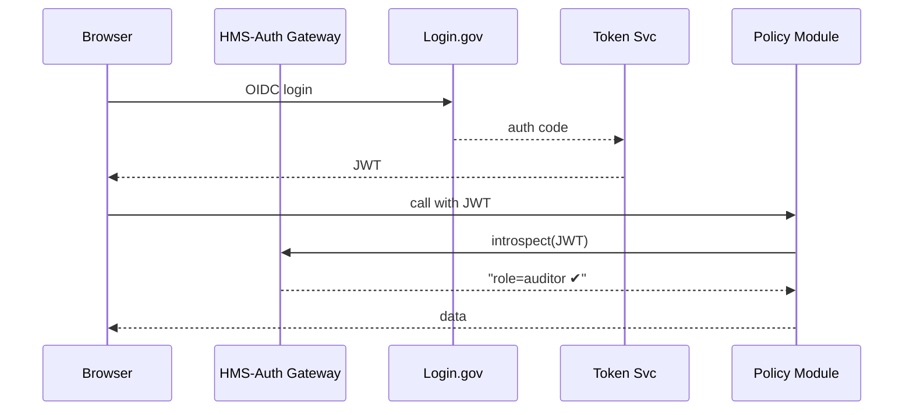
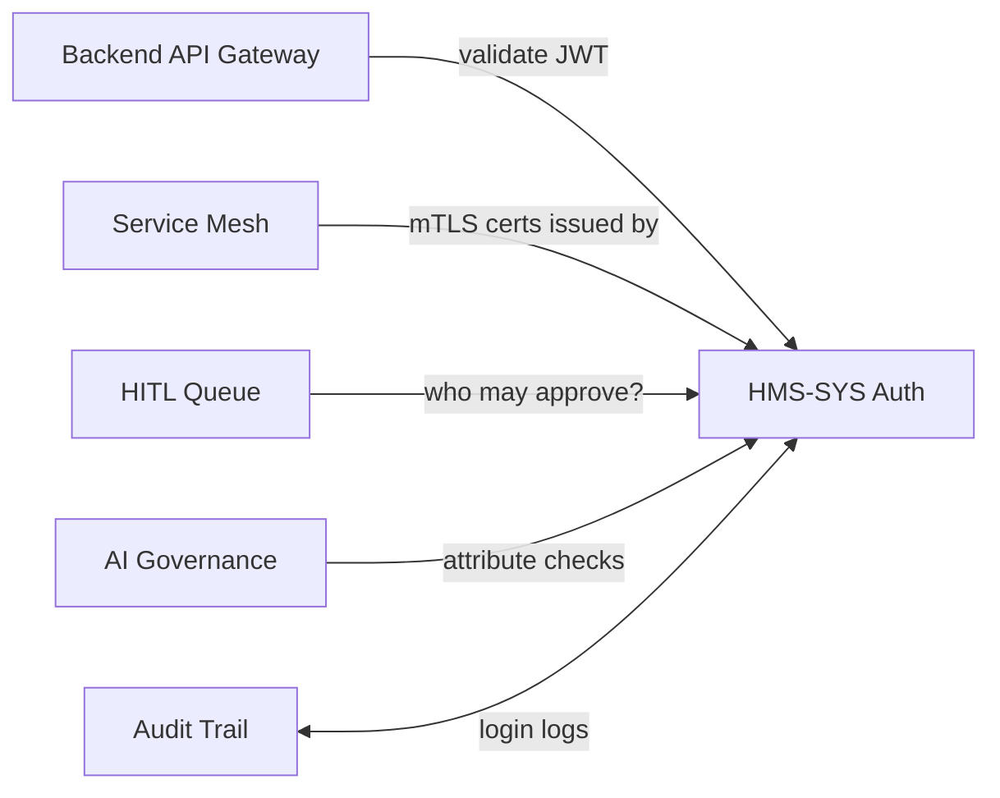

# Chapter 10: Role & Identity Management (HMS-SYS Auth)

*(Coming from [Microservice Mesh & Service Discovery](09_microservice_mesh___service_discovery_.md))*  

---

## 1. Why Does HMS-SYS Auth Exist?

Meet **Tamika**, an auditor at the **Federal Motor Carrier Safety Administration (FMCSA)**.  
In one morning she must:

1. Approve a **hazmat-truck permit**.  
2. Peek at **accident-report dashboards**.  
3. File an **internal travel voucher**.

Before HMS-SYS Auth, Tamika juggled **three passwords, two VPNs, and a paper badge**.  
Now she:

```text
• Clicks “Sign in with Login.gov”
• Gets one digital badge (JWT token)
• Re-uses it everywhere the policy allows
```

Result: 1 login, 0 password resets, and FMCSA data stays locked to authorized eyes only.

**HMS-SYS Auth is the platform’s “badge office.”**  
It issues digital credentials, honors role/attribute rules, and federates with external providers (Login.gov, ID.me, agency LDAP).

---

## 2. Key Concepts in Plain English

| Word | Beginner Analogy | What It Means Here |
|------|------------------|--------------------|
| Identity Provider (IdP) | DMV issuing driver’s licenses | Service (Login.gov, LDAP) that proves *who* you are |
| Credential / Token | Visitor badge | A signed JWT you show to every door |
| Role (RBAC) | Job title on badge | “auditor”, “citizen”, “contractor” |
| Attribute (ABAC) | Badge stickers | Extra facts: agency=FMCSA, clearance=moderate |
| Policy | Guard’s rulebook | Logic saying *who can open which door* |
| Single Sign-On (SSO) | TSA Pre✓ line | Log in once, breeze through future doors |

---

## 3. 5-Minute Hands-On: Log In & Call a Protected API

### 3.1 Start a Local Auth Stack

```bash
npm  i -g  @hms-sme/auth-cli
hms-auth dev         # http://localhost:7101
```

### 3.2 Federate With Login.gov Sandbox

```bash
hms-auth add-provider login-gov \
  --client-id demo --client-secret demo
```

### 3.3 Get Your Token

```bash
hms-auth login --provider login-gov \
  --scope "openid profile email"
# outputs token.txt
```

### 3.4 Use the Token

```ts
// call-eligibility.ts  (Node ≤10 lines)
import fetch from 'node-fetch';
const token = require('fs').readFileSync('token.txt','utf8');

fetch('https://localhost:8443/api/dmv/license/renewal/v1/evaluate',{
  method:'POST',
  headers:{'Authorization':'Bearer '+token,
           'Content-Type':'application/json'},
  body: JSON.stringify({age:30,visionScore:0.9,lastRenewalDate:"2019-06-01"})
}).then(r=>r.json()).then(console.log);
```

Output:

```json
{ "eligible": true, "fee": 25 }
```

Behind the scenes the **Backend API Gateway** asks HMS-SYS Auth,  
“Is this JWT valid, and does Tamika have `dmv.license.renew` permission?”  
Only then is the request forwarded.  

---

## 4. What Happens Under the Hood?



---

## 5. Issuing Digital Credentials (“Badge Office”)

### 5.1 Minimal Badge Definition

```yaml
# badges/fmcsa-auditor.yml
id: fmcsa.auditor.badge
roles:  ["auditor"]
attrs:
  agency: "FMCSA"
  clearance: "moderate"
ttl: "8h"
```

### 5.2 One-Liner to Issue

```bash
hms-auth badge issue fmcsa.auditor.badge tamika@dot.gov
```

Tamika receives a **magic-link** e-mail; clicking it drops the JWT into her browser’s secure storage.

---

## 6. Enforcing RBAC / ABAC in Code

### 6.1 Service-Side Guard (Node ≤12 lines)

```ts
import { guard } from '@hms-sme/auth-sdk';

export const route = guard({
  role:  'auditor',            // RBAC
  where: {agency:'FMCSA'}      // ABAC
}, (req,res)=>{
   res.json({secret:"🚚 crash stats"});
});
```

If the caller lacks the role **or** agency attribute, the helper returns **403** automatically.

### 6.2 Declarative Policy Snippet

```yaml
# access-policy.yaml
allow:
  - when:  role == "citizen"   && path == "/renewal/*"
  - when:  role == "auditor"   && agency == "FMCSA"
deny:
  - when:  clearance == "low"  && data_tag == "PII"
```

Upload once:

```bash
hms-auth policy deploy access-policy.yaml
```

Every microservice now enforces the same rules via distributed cache.

---

## 7. Internal Implementation Peeks

### 7.1 Token Service (TypeScript ≤15 lines)

```ts
// src/tokenService.ts
import jwt from 'jsonwebtoken';
export function mint(user, badge){
  return jwt.sign({
     sub: user.id,
     roles: badge.roles,
     attrs: badge.attrs,
     exp: Date.now()/1000 + toSec(badge.ttl)
  }, process.env.AUTH_PRIVATE_KEY, {algorithm:'RS256'});
}
```

### 7.2 Fast Introspection Endpoint

```ts
// routes/introspect.ts
router.post('/introspect', (req,res)=>{
  try{
    const decoded = jwt.verify(req.body.token, PUB_KEY);
    res.json({active:true, ...decoded});
  }catch(e){ res.json({active:false}); }
});
```

*Both snippets stay under 20 lines and ignore logging/metrics for clarity.*

### 7.3 Federation Bridge (Go ≤15 lines)

```go
// bridge/loginGov.go
func Exchange(code string) (User, error) {
  tok, _ := http.PostForm(loginGovTokenURL, url.Values{
     "code":{code}, "client_id":{cid},"secret":{sec}})
  var id struct{ Email string }
  json.NewDecoder(tok.Body).Decode(&id)
  return User{Email:id.Email}, nil
}
```

---

## 8. Where HMS-SYS Auth Connects to Other Chapters



---

## 9. Common Beginner Questions

**Q: Can citizens and contractors live in the same tenant?**  
Yes. Roles/attributes isolate access even if tokens come from the same IdP.

**Q: What if the IdP is down?**  
Tokens are self-signed (JWT). Services accept them until expiry; background jobs refresh metadata every 5 min.

**Q: How long should tokens live?**  
Default **8 hours**; override per badge. Access-token rotation is silent to users.

**Q: Do internal microservices need to re-authenticate?**  
No. The **sidecar proxy** in the mesh attaches a short-lived **service token** minted by HMS-SYS Auth.

---

## 10. Recap & Next Steps

You:

• Saw how a single JWT badge unlocks the whole HMS-SME platform.  
• Logged in via Login.gov and securely called an API.  
• Issued a custom badge, enforced RBAC/ABAC rules, and peeked at token minting code.  
• Learned how Auth interacts with the gateway, mesh, HITL, and more.

Next, we’ll learn **how every login, approval, and policy change is immutably recorded for auditors and IG offices** in [Data Governance & Audit Trail](11_data_governance___audit_trail_.md).

---

Generated by [AI Codebase Knowledge Builder](https://github.com/The-Pocket/Tutorial-Codebase-Knowledge)