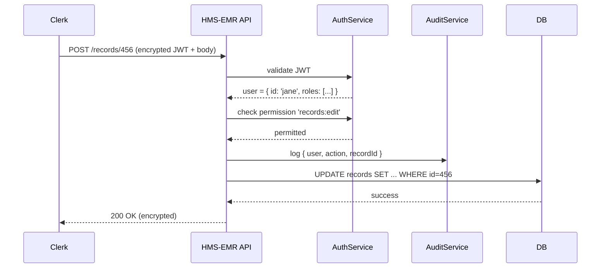

# Chapter 10: Security & Compliance Framework

In [Chapter 9: AI Governance Model](09_ai_governance_model_.md), we learned how to vet AI decisions for transparency, ethics, and compliance. Now, let’s lock down the entire HMS-EMR system so that only the right people get access, every action is logged, and sensitive data stays protected—just like security at a federal building with keycard readers, visitor logs, and CCTV cameras.

---

## 1. Motivation & Central Use Case

Imagine a public health official in a federal medical records office trying to update a citizen’s immunization record. We need to ensure:

1. They’re who they claim to be (Authentication).  
2. They’re allowed to modify that specific record (Authorization).  
3. Every change is tracked in an audit log (Auditing).  
4. Medical data is encrypted in transit and at rest (Data Protection).

Without these controls, unauthorized users could alter records, we’d lose accountability, or sensitive data could leak.

---

## 2. Key Concepts

1. **Authentication**  
   Verifying identity (e.g., keycard swipe or JWT login).

2. **Authorization**  
   Checking permissions (e.g., “Can Nurse Jane edit record #456?”).

3. **Auditing**  
   Recording who did what and when (e.g., “Jane changed allergy info at 10 AM”).

4. **Data Protection**  
   Encrypting data on the wire (TLS) and in storage (AES encryption).

These four controls “cut across” every service in HMS-EMR, much like building-wide security protocols.

---

## 3. How to Use This Framework

Here’s a minimal Express.js example showing all four controls on an endpoint that updates a medical record:

```js
import express from 'express';
import { authenticate, authorize } from './security/auth';
import { logAction } from './security/audit';
import { decryptPayload, encryptResponse } from './security/encryption';

const app = express();
app.use(express.json());

// Secure endpoint: update a patient record
app.post(
  '/records/:id',
  authenticate(),                              // 1. Who are you?
  authorize('records:edit'),                   // 2. Can you edit?
  logAction('update_record'),                  // 3. Audit this action
  decryptPayload(),                            // 4. Decrypt incoming data
  async (req, res) => {
    // ... perform update in DB (omitted) ...
    const updated = { id: req.params.id, status: 'ok' };
    res.send(encryptResponse(updated));         // Encrypt outgoing data
  }
);

app.listen(3000, () => console.log('Secure API listening'));
```

Explanation:
- `authenticate()` checks the user’s token.  
- `authorize('records:edit')` ensures the user holds the right role/permission.  
- `logAction()` writes an audit record.  
- `decryptPayload()` and `encryptResponse()` protect data.

---

## 4. Under the Hood: Step-by-Step



1. **API** authenticates the user via **AuthService**.  
2. It checks if the user is authorized for `records:edit`.  
3. Logs the action in **AuditService**.  
4. Performs the database update.  
5. Returns an encrypted response to the clerk.

---

## 5. Internal Implementation Breakdown

### 5.1 src/security/auth.js  
Handles both authentication and authorization.

```js
// src/security/auth.js
import jwt from 'jsonwebtoken';

export function authenticate() {
  return (req, res, next) => {
    const token = req.headers.authorization?.split(' ')[1];
    try {
      req.user = jwt.verify(token, process.env.JWT_SECRET);
      next();
    } catch {
      res.status(401).send({ error: 'Unauthorized' });
    }
  };
}

export function authorize(permission) {
  return (req, res, next) => {
    if (req.user.permissions?.includes(permission)) {
      next();
    } else {
      res.status(403).send({ error: 'Forbidden' });
    }
  };
}
```

Explanation:
- `authenticate()` decodes a JWT, attaching `req.user`.  
- `authorize()` checks that `req.user.permissions` contains the required permission.

---

### 5.2 src/security/audit.js  
Writes audit entries for every secured action.

```js
// src/security/audit.js
export function logAction(action) {
  return (req, res, next) => {
    const entry = {
      user: req.user.id,
      action,
      recordId: req.params.id,
      timestamp: new Date().toISOString()
    };
    // In production, write to a durable store
    console.log('Audit:', entry);
    next();
  };
}
```

Explanation:
- Captures user, action type, target record, and timestamp.  
- In real life, you’d send `entry` to a logging database.

---

### 5.3 src/security/encryption.js  
Protects data at rest and in transit.

```js
// src/security/encryption.js
import crypto from 'crypto';

const ALGO = 'aes-256-cbc';
const KEY  = Buffer.from(process.env.DATA_KEY, 'hex');

export function decryptPayload() {
  return (req, res, next) => {
    // ... decrypt req.body.payload into req.body ...
    next();
  };
}

export function encryptResponse(obj) {
  // ... encrypt JSON.stringify(obj) into a payload ...
  return { payload: 'ENCRYPTED_DATA' };
}
```

Explanation:
- Placeholder for AES encryption/decryption using a shared secret key.  
- Ensures sensitive fields never appear in plaintext.

---

## 6. Conclusion

In this chapter, you learned how to build a **Security & Compliance Framework** that:

- Authenticates users with JWT (keycard analogy).  
- Authorizes actions based on fine-grained permissions.  
- Audits every change for accountability.  
- Encrypts data end-to-end for confidentiality.  

With these controls in place, HMS-EMR ensures only cleared personnel act on sensitive records, and every action is recorded—just like a secure federal facility.  

Next up, we’ll learn how to collect, visualize, and alert on system performance in [Chapter 11: Monitoring & Metrics Engine](11_monitoring___metrics_engine_.md).

---

Generated by [AI Codebase Knowledge Builder](https://github.com/The-Pocket/Tutorial-Codebase-Knowledge)