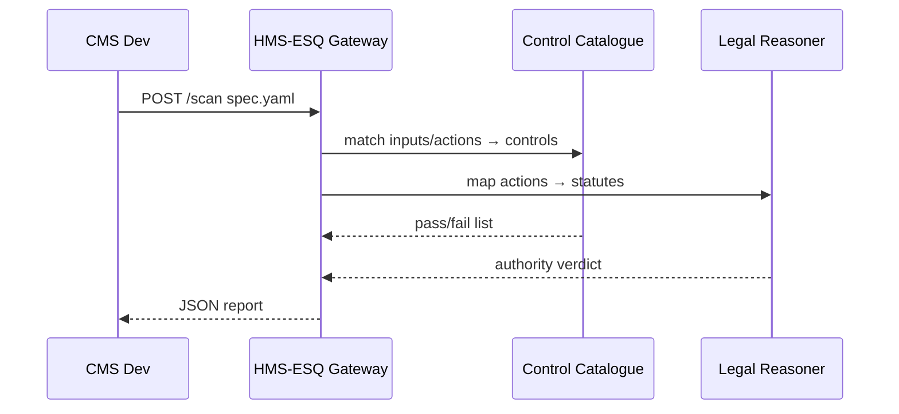

# Chapter 10: Security, Compliance & Legal Reasoning (HMS-ESQ, HMS-SYS)

[← Back to Chapter 9: HMS-CDF Policy Governance Engine](09_hms_cdf_policy_governance_engine_.md)

---

## 1. Why Do We Need a “Legal X-Ray Machine”?

Picture the **Centers for Medicare & Medicaid Services (CMS)** rolling out a new AI chatbot that:

1. Reads citizens’ prescription histories.  
2. Suggests cost-saving alternatives.  
3. Books a tele-health appointment.

Great… **unless** the bot leaks *Protected Health Information* (PHI) or violates the *21st Century Cures Act*.  
CMS developers need a **one-click scan** that shouts:

> “⚠️ HIPAA §164.308(a)(1) violated — appointment vendor lacks BA agreement!”

That scanning (and auto-remedy advice) is exactly what **HMS-ESQ / HMS-SYS** offers.

Think of it as the **TSA body scanner for data & rules**: every byte, model, or workflow passes through before it can board production.

---

## 2. Key Concepts (Plain-English Cheat-Sheet)

| Term                | What It Really Means                                                                                       |
|---------------------|-------------------------------------------------------------------------------------------------------------|
| Guardrail           | A policy rule (e.g., “No PHI leaves FedRAMP High boundary”).                                               |
| Compliance Scan     | Automated pass/fail check against frameworks like FISMA, HIPAA, FedRAMP.                                   |
| Legal Reasoner      | Small LLM prompt that maps actions → statutory authority (cites U.S. Code).                                |
| Evidence Log        | Tamper-proof JSON bundle proving each guardrail passed.                                                    |
| Enforcement Hook    | Code line that calls ESQ before an action (blocks or allows).                                              |
| Drift Monitor       | Background job that rescans running systems for new violations.                                            |

Remember these six words—you already speak 80 % of HMS-ESQ.

---

## 3. Guided Walk-Through: “Scan My Chatbot” in 3 Steps

### 3.1 Describe What You Want to Deploy

_File: `cms-chatbot.spec.yaml` (12 lines)_

```yaml
name: cms-prescription-bot
owner: cms-ai-team@cms.gov
dataInputs:
  - prescriptionHistory # PHI
  - drugPricingFeed     # public
actions:
  - suggestGenericAlternative
  - scheduleTeleHealth
hosting: aws-us-gov-west-1
```

### 3.2 Call the Scanner (one line!)

```bash
hms-esq scan cms-chatbot.spec.yaml
```

### 3.3 Read the Report

```jsonc
{
  "summary": "FAILED",
  "findings": [
    {
      "id": "HIPAA-164.308(a)(1)",
      "severity": "high",
      "detail": "Hosting region not FedRAMP High ATO."
    },
    {
      "id": "USC-42§1395w",
      "severity": "medium",
      "detail": "Scheduling action exceeds statutory scope."
    }
  ],
  "evidenceLog": "s3://hms-esq-logs/cms-bot-2024-04-29.json"
}
```

Boom—caught before citizens ever see the chatbot.

---

## 4. How Does the Scan Work? (Zero-Code View)



Five actors—easy to keep in your head.

---

## 5. Using Guardrails Inside Code (4 Lines)

Most HMS components just add **one enforcement hook**:

```ts
import { guard } from '@hms/esq-client'

await guard('cms-prescription-bot', specYaml)
// if any HIGH severity -> throws Error and blocks release
```

Explanation  
1. `guard()` uploads the spec, waits for the scan, and **throws** on high-risk findings.  
2. Low/medium findings are logged but won’t block by default (configurable).

---

## 6. Tiny Peek Under the Hood

### 6.1 Scanner Entry Point (15 Lines)

_File: `esq/src/scan.ts`_

```ts
export async function scan(spec: BotSpec): Promise<Report> {
  const controls = await catalogue.lookup(spec)            // HIPAA, FISMA…
  const ctrlResults = await Promise.all(controls.map(run)) // run each check

  const lawResult = await reasoner.mapActions(spec.actions)

  const findings = [...ctrlResults, ...lawResult]
  const summary  = findings.some(f => f.severity === 'high') ? 'FAILED' : 'PASSED'

  const logUri = await evidence.store({ spec, findings })

  return { summary, findings, evidenceLog: logUri }
}

function run(ctrl){ /* tiny function calling bash, osquery, etc. */ }
```

Line-by-line:  
• `catalogue.lookup` picks relevant controls.  
• `run()` executes each control script in parallel.  
• `reasoner.mapActions` calls a tiny LLM to cite statutes.  
• Results go to an **evidence log** in S3 for auditors.

### 6.2 Drift Monitor Worker (8 Lines)

```ts
setInterval(async () => {
  const liveSpecs = await db.listDeployedBots()
  for (const s of liveSpecs)
    if ((await scan(s)).summary === 'FAILED')
      await alertOps(s.name)
}, 3600_000) // every hour
```

If something drifts out of compliance at 2 a.m., ops gets paged.

---

## 7. Where HMS-ESQ Plugs Into the Rest of HMS

Component | How They Use ESQ
----------|-----------------
[HMS-CDF Policy Governance Engine](09_hms_cdf_policy_governance_engine_.md) | Calls `scan()` on every draft to auto-flag legal conflicts.  
[AI Representative Agent](04_ai_representative_agent__hms_agt___agx__.md) | Applies `guard()` before executing a high-risk action.  
[HMS-ACT Workflow Engine](08_hms_act_orchestration___workflow_engine_.md) | Runs drift monitor on active workflows.  
[Human-in-the-Loop Framework](14_human_in_the_loop__hitl__oversight_framework_.md) | Inserts mandatory human approval if ESQ warns.  
[HMS-DTA Unified Data Lake](11_hms_dta_unified_data_lake___catalog_.md) | Stores evidence logs for auditors.

---

## 8. 60-Second Hands-On Lab

```bash
# 1. Run demo scanner
npm run dev --workspace=hms-esq

# 2. Scan a safe spec
hms-esq scan examples/fbi-crime-bot.safe.yaml   # should PASS

# 3. Scan an unsafe spec
hms-esq scan examples/fbi-crime-bot.unsafe.yaml # will FAIL
```

Open the generated evidence log (`./logs/...json`) to see each control result.

---

## 9. Recap

You just:

• Met **HMS-ESQ / HMS-SYS**, the TSA scanner for data, models, and rules.  
• Ran a real-world HIPAA scan in one line.  
• Learned the six core concepts: Guardrail, Compliance Scan, Legal Reasoner, Evidence Log, Enforcement Hook, Drift Monitor.  
• Added a four-line guard to block unsafe releases.  
• Saw how other HMS layers rely on ESQ to stay out of legal trouble.

[Next Chapter: HMS-DTA Unified Data Lake & Catalog](11_hms_dta_unified_data_lake___catalog_.md) will show where all these evidence logs, workflow records, and AI outputs live—plus how to query them with a single SQL view.

---

Generated by [AI Codebase Knowledge Builder](https://github.com/The-Pocket/Tutorial-Codebase-Knowledge)