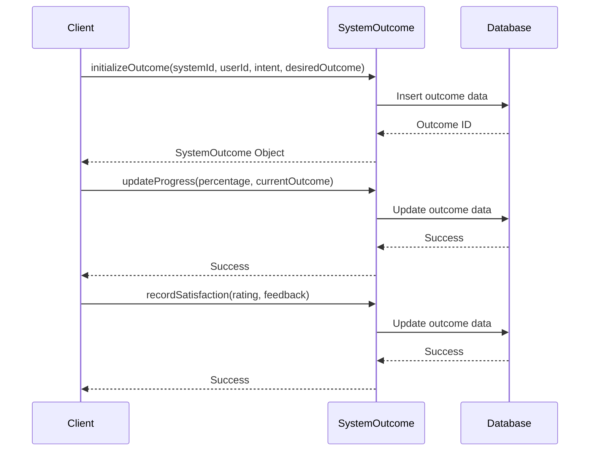

# Chapter 10: SystemOutcome

In the previous chapter, [SystemWorkflow](09_systemworkflow.md), we learned how to guide a student through the process of enrolling in Sunnyside Elementary's Chess Club.  But how do we know if that student successfully enrolled and is happy with the club?  This is where `SystemOutcome` comes in.

## What problem does SystemOutcome solve?

Imagine Sunnyside Elementary wants to know if their Chess Club is achieving its goals. Are students improving their chess skills? Are they enjoying the club?  `SystemOutcome` tracks the results of a participant's journey through the system. It's like a report card that tells us how well the system is doing in helping participants achieve their desired outcomes.  It helps us measure the effectiveness of the system and identify areas for improvement.

## Key Concepts

1. **Desired Outcome:** This is what the participant wants to achieve, like "Enroll in Chess Club" or "Improve chess skills."

2. **Actual Outcome:** This is what actually happened.  Did the student enroll? Did their skills improve?

3. **Progress:**  This tracks how far along the participant is in achieving their desired outcome.  It's often represented as a percentage.

4. **Barriers:** These are obstacles that prevent the participant from achieving their desired outcome, like a long waiting list for the Chess Club or difficulty understanding the rules.

5. **Satisfaction:** This measures how happy the participant is with the outcome.

## Using SystemOutcome: Tracking Chess Club Success

Let's track a student's outcome in the Chess Club.

```php
// Simplified example - see SystemOutcome.php for full implementation
use App\Models\SystemOutcome;

$outcome = SystemOutcome::initializeOutcome(
    1, // Sunnyside Elementary's system ID
    2, // The student's user ID
    'Join Chess Club', // Initial intent
    'Become a proficient chess player', // Desired outcome
    ['entry_context' => 'Enjoys board games']
);

// Later, update the progress
$outcome->updateProgress(50, 'Learning basic chess moves');

// Even later, mark the outcome as completed
$outcome->updateProgress(100, 'Successfully enrolled and actively participating in the Chess Club');

// Record satisfaction
$outcome->recordSatisfaction(9, 'Really enjoying the club!');
```

This code first initializes a `SystemOutcome` for a student wanting to join the Chess Club and become a proficient player.  We then update the progress as the student learns and finally mark the outcome as completed when they successfully enroll and participate.  Finally, we record the student's satisfaction with the club.

## Internal Implementation

When you call `initializeOutcome`, it creates a new `SystemOutcome` entry in the database.  `updateProgress` updates the progress and status of the outcome. `recordSatisfaction` records the participant's satisfaction rating.



The code for these functions can be found in `Gov/Entities/Base/SystemOutcome.php`.

```php
// Gov/Entities/Base/SystemOutcome.php (simplified)
public function updateProgress(float $progressPercentage, string $currentOutcome): bool
{
    // ... (Update progress, status, and timestamp) ...
    return true;
}
```

## Conclusion

In this chapter, we learned about `SystemOutcome`, which tracks the results of a participant's journey through the system. We saw how to create and update a `SystemOutcome` for a student enrolling in Sunnyside Elementary's Chess Club and track their progress and satisfaction. This concludes our tutorial on the `Modules` project.


---

Generated by [AI Codebase Knowledge Builder](https://github.com/The-Pocket/Tutorial-Codebase-Knowledge)