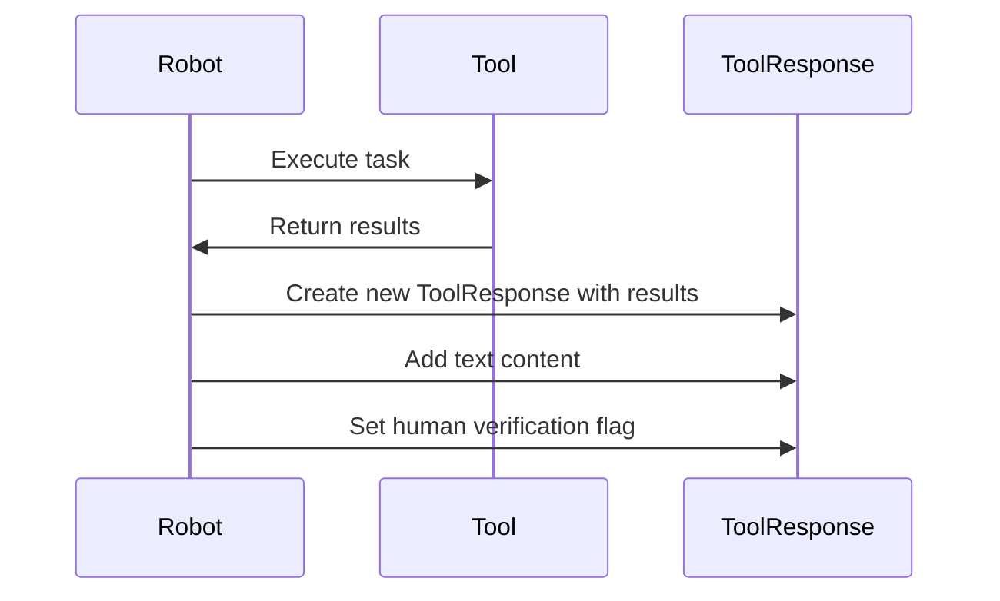

# Chapter 10: ToolResponse

Following on from our understanding of the [Standards Registry](09_standards_registry.md), we'll now explore `ToolResponse`.

Imagine our factory robots need to perform various tasks, like assembling a product or inspecting its quality.  Each robot uses different tools and might report results differently. How can we easily understand the outcome of each task, regardless of which robot or tool was used? That's where `ToolResponse` comes in.

## Understanding ToolResponse

`ToolResponse` is like a standardized report format used in the factory. Every robot, after completing a task, provides a report in this format, making it easy to understand the outcome regardless of which robot performed the task.

## Key Concepts of ToolResponse

1. **`is_error`:** A boolean indicating whether the tool execution resulted in an error.  Think of it as a pass/fail flag on our report.

2. **`content`:**  The actual results of the tool execution. This can include text messages, data in JSON format, or even files. Think of this as the main body of the report, containing the findings.

3. **`metadata`:** Additional information about the tool execution, such as whether the results comply with [Standards Registry](09_standards_registry.md) rules or if a human has reviewed the results.  Think of this as the supplementary section of the report, providing extra context.

## Using ToolResponse: Example

Let's say a robot performs a quality inspection using a vision system. Here's a simplified example of a `ToolResponse`:

```rust
use crate::protocols::mcp::ToolResponse;
use serde_json::json;

// ... other code ...

let inspection_results = json!({"defects": 0, "passed": true});

let response = ToolResponse::new(inspection_results)
    .with_text("Inspection complete.")
    .with_human_verification(true);

// ... process the response ...
```

This code creates a `ToolResponse` with the inspection results. It adds a text message "Inspection complete" and indicates that a human has verified the results.

## Inside ToolResponse: Implementation

Here's a sequence diagram illustrating how a `ToolResponse` is created:



The `ToolResponse` struct is defined in `src/protocols/mcp/mod.rs`. Here's a simplified snippet:

```rust
// src/protocols/mcp/mod.rs
use serde::{Deserialize, Serialize};

#[derive(Debug, Clone, Serialize, Deserialize)]
pub struct ToolResponse<T> {
    pub is_error: bool,
    pub content: Vec<ToolResponseContent>,
    // ... other fields ...
}

// ... other code ...

impl<T> ToolResponse<T> {
    pub fn new(data: T) -> Self where T: Serialize {
        // ... code to create ToolResponse with data ...
    }

    // ... other functions for adding content and metadata ...
}
```

This code shows the basic structure of the `ToolResponse` and the `new()` function for creating a new response.  Other functions like `with_text()`, `with_standards_compliance()`, and `with_human_verification()` are used to add content and metadata.

## Conclusion

`ToolResponse` provides a standardized way to represent the outcome of any task performed by our factory robots, making it easy to understand and process the results. This is crucial for building a robust and flexible factory system.  There are no further chapters in this tutorial.


---

Generated by [AI Codebase Knowledge Builder](https://github.com/The-Pocket/Tutorial-Codebase-Knowledge)