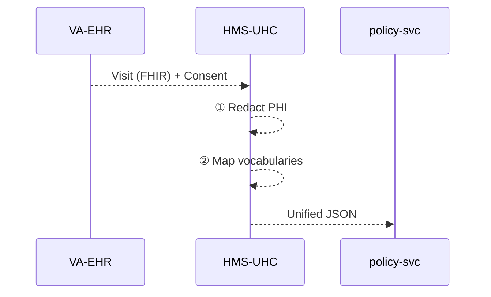

# Chapter 10: Universal Health Care Integration (HMS-UHC)

*(Follow-up to [Financial Transaction Clearinghouse (HMS-ACH)](09_financial_transaction_clearinghouse__hms_ach__.md))*  

---

## 1. Why Does HMS Need a “Universal Translator” for Health Data?

Imagine this true-to-life scene:

1. Congress passes a **Mental-Health Reimbursement Act**.  
2. The rule says *“Any visit coded as **F32.1** (Major Depressive Disorder) must be reimbursed at 100 %.”*  
3. Data lives in **three** very different places:  
   • a Veterans Affairs **EHR** (HL7/FHIR JSON)  
   • a Medicaid **claims file** (flat CSV with CPT codes)  
   • a State **Immunization Registry** (custom XML)  
4. Auditors at the **National Institute of Mental Health (NIMH)** want one clean spreadsheet showing *every* reimbursed visit—without leaking patients’ names.

Doing that by hand would mean months of manual file merges and a HIPAA nightmare.  
**HMS-UHC** is the *universal translator* that:

* pulls data from all health systems,  
* redacts Protected Health Information (PHI),  
* aligns medical vocabularies (ICD-10 ↔ SNOMED ↔ CPT),  
* and hands one **HIPAA-compliant** JSON stream to policy services.

---

## 2. Key Concepts (Plain English)

| Term                     | Friendly Meaning |
|--------------------------|------------------|
| PHI Redaction            | Removing names, SSNs, addresses before data leaves the hospital. |
| Vocabulary Mapper        | Converts codes (e.g., CPT 90834) into a single canonical code (e.g., ICD-10 F32.1). |
| Source Connector         | Tiny plug-in that knows how to talk to one system (FHIR API, SFTP CSV, etc.). |
| Consent Envelope         | Metadata proving the patient agreed to share data. |
| HIPAA Vault              | Encrypted bucket where raw, sensitive files are held *inside* the hospital network only. |

Remember: **UHC** = many **Source Connectors** → **PHI Redaction** → **Mapper** → safe, unified feed.

---

## 3. A 60-Second Tour – How Does a Claim Get Unified?



One hop for you, many safety rails inside UHC.

---

## 4. Using HMS-UHC from Your Service (18 lines)

Suppose the **policy-svc** from Chapter 4 wants all *depression visits* last week.

```javascript
// policy-svc/mentalHealth.js
import { queryVisits } from 'hms-uhc-sdk'

export async function listReimbursable(start, end) {
  const visits = await queryVisits({
    code: 'F32.1',          // canonical ICD-10
    from: start,
    to:   end
  })
  // visits now safe: no names, no SSN
  return visits.filter(v => v.coverage === 'MEDICAID')
}
```

Explanation  
1. `queryVisits` hides all complexity—source systems, PHI stripping, code mapping.  
2. Returned objects already look like:

```json
{
  "visitId": "VA-77af",
  "date": "2025-02-12",
  "code": "F32.1",
  "coverage": "MEDICAID",
  "geo": "CA"
}
```

No PHI, fully standardized, ready for reimbursement logic.

---

## 5. What Really Happens Under the Hood?

### 5.1 5-Step Walkthrough

1. **Connector** pulls raw records (could be FHIR, CSV, or XML).  
2. **HIPAA Vault** stores the raw file inside the hospital’s network.  
3. **Redaction Engine** deletes or hashes PHI fields (name → hash).  
4. **Vocabulary Mapper** converts local codes into the HMS canonical table.  
5. **Policy Service** receives the sanitized, aligned JSON.

### 5.2 File Map (Simplified)

```
hms-uhc/
 ├─ sdk/                 tiny client (queryVisits)
 ├─ connectors/
 │   ├─ fhir_ehr.js
 │   ├─ medicaid_csv.js
 │   └─ immreg_xml.js
 ├─ redactor/            strips PHI
 ├─ mapper/              code translation tables
 └─ api/query.js         HTTP entry for services
```

---

## 6. Internal Code Nuggets (All ≤ 20 lines)

### 6.1 Redacting PHI (10 lines)

```python
# redactor/core.py
PHI_KEYS = {'name','ssn','address','dob'}

def redact(record):
    return {k: ('***' if k in PHI_KEYS else v)
            for k, v in record.items()}
```

Beginners’ take-away: Anything in `PHI_KEYS` becomes `***`.

---

### 6.2 Mapping Codes (12 lines)

```javascript
// mapper/index.js
import table from './map.json'  // {"ICD10":{"F32.1":"Depression"},"CPT":{"90834":"F32.1"}}

export function toCanonical(code, system){
  if(system==='ICD10') return code
  if(system==='CPT')   return table.CPT[code]
  if(system==='SNOMED')return table.SNOMED[code]
  throw 'Unknown system'
}
```

• CPT 90834 → ICD-10 F32.1 in one line.

---

### 6.3 Query Endpoint (18 lines)

```javascript
// api/query.js
router.post('/visits', async (req, res) => {
  const { code, from, to } = req.body
  const rows = []

  for (const c of connectors) {
    const raw = await c.fetch(from, to)      // system-specific
    for (const r of raw){
      const safe = redact(r)
      safe.code  = toCanonical(r.code, r.system)
      if(safe.code === code) rows.push(safe)
    }
  }
  res.json(rows)
})
```

Focus: iterate connectors → redact → map → filter → return.

---

## 7. Adding a New Source System – 4 Steps

1. Scaffold:  
   ```bash
   npx hms-uhc add-connector county-clinic
   ```
2. Implement `connectors/county_clinic.js` (≤ 15 lines):  
   ```javascript
   export async function fetch(from, to){
     // GET /visits.csv?from=...   (returns CSV)
     const csv = await downloadCSV(from, to)
     return csvToJson(csv)        // [{code:'Z23', system:'ICD10', ...}]
   }
   ```
3. Register it in `connectors/index.js`.  
4. Push—CI checks HIPAA tests (`redact` must remove PHI) before merging.

Total coding time for beginners: **~30 minutes**.

---

## 8. HIPAA & Consent Safety Rails You Get for Free

* Automatic **audit log**: who queried what, when, why (JWT `sub` + reason code).  
* **Minimal necessary** filter: only requested fields leave the Vault.  
* **Consent Envelope**: every record must carry `consent=true`; otherwise it is silently dropped and a warning is logged.  
* **De-identification validator**: nightly job samples 1 % of outputs to ensure no PHI slipped through.

All live inside `redactor/` and `auditor/`; you never copy-paste legal clauses.

---

## 9. Beginner Q & A

**Q: Do I need to learn medical coding systems?**  
No. Just use canonical codes (ICD-10). UHC maps the rest.

**Q: What if a source sends corrupt data?**  
The connector rejects the record and logs `ERROR_CORRUPT`. Your service never sees bad rows.

**Q: Can citizens request their own data?**  
Yes, via the regular [HMS-API Gateway](02_backend_api_gateway__hms_svc___hms_api__.md); UHC ensures only *their* records are returned, with PHI intact (since they are the patient).

**Q: How large is the mapper table?**  
≈ 15 000 rows. Loaded once at boot; lookup is O(1).

---

## 10. What You Learned

• **HMS-UHC** is a HIPAA-compliant *universal translator* for EHRs, claims, and registries.  
• Services call one simple SDK (`queryVisits`) and get safe, unified JSON.  
• Under the hood: Source Connector → PHI Redaction → Vocabulary Mapper → Output.  
• Adding a new hospital or state registry is quick: write a small connector, no legal headaches.

In the next chapter we’ll see how an **AI Representative Agent** can *talk* to this clean health data to answer policy questions: [AI Representative Agent (HMS-AGT / HMS-AGX)](11_ai_representative_agent__hms_agt___hms_agx__.md).

---

Generated by [AI Codebase Knowledge Builder](https://github.com/The-Pocket/Tutorial-Codebase-Knowledge)