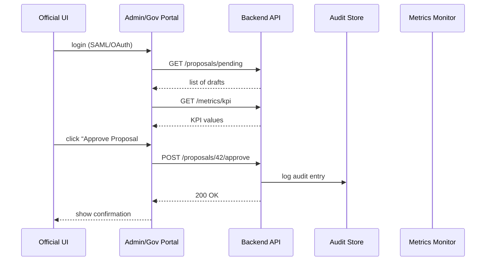

# Chapter 11: Admin/Gov Portal

In the last chapter we saw how individual UI pieces are split into Micro-Frontends in the [Frontend Micro‐Frontend (MFE)](10_frontend_micro_frontend__mfe__.md). Now we assemble those pieces into a secure **Admin/Gov Portal**—the “briefing room” where policy administrators and elected officials review AI-driven proposals, adjust parameters, and publish new processes.

---

## 1. Why We Need an Admin/Gov Portal

Imagine a secure room in the U.S. Capitol where staffers and members of Congress:

- See AI-generated draft legislative texts.  
- Examine performance dashboards (e.g., average permit approval time).  
- Browse audit logs of who changed what, and when.  
- Approve, tweak, or reject proposals before they go live.  

Without a unified Admin/Gov Portal, each agency would spin up its own dashboard and approval screens—duplicated work, inconsistent user experience, and higher risk of errors. Our portal centralizes:

- Approval workflows aligned to agency missions (e.g., NCPC, USDA, EPA).  
- Audit trails for full accountability.  
- Real-time performance metrics.  
- Secure parameter tuning in a single interface.

---

## 2. Key Concepts

1. **Secure Briefing Room**  
   A locked-down UI section where only authorized decision-makers can enter (single sign-on, multi-factor authentication).

2. **Approval Workflow**  
   A queue of AI proposals needing human sign-off: “Draft → Review → Publish.”

3. **Performance Dashboard**  
   Visualization of KPIs (e.g., average application processing time) powered by our [Metrics Monitoring & Verification](06_metrics_monitoring___verification_.md).

4. **Audit Logs**  
   Immutable records showing who viewed or changed a policy, with timestamps.

5. **Parameter Tuning Panel**  
   Controls (sliders, form fields) that let officials adjust thresholds or limits in live processes.

---

## 3. Building the Admin/Gov Portal

Below is a minimal example that loads three MFEs into our portal shell:

```javascript
// admin_portal.js
const remotes = [
  { name: 'ApprovalQueue', url: '/mfe/approval/remoteEntry.js', mountId: 'approval-queue' },
  { name: 'PerformanceDashboard', url: '/mfe/dashboard/remoteEntry.js', mountId: 'perf-dashboard' },
  { name: 'AuditLogViewer', url: '/mfe/audit/remoteEntry.js', mountId: 'audit-log' }
];

async function mountRemote(m) {
  await new Promise(r => {
    const s = document.createElement('script');
    s.src = m.url; s.onload = r;
    document.head.appendChild(s);
  });
  window[m.name].mount(m.mountId);
}

// Kick off all admin MFEs
remotes.forEach(mountRemote);
```

Explanation:
- We define three MFEs by name, URL, and container `<div>` ID.  
- For each one, we inject its script and call its `mount` function.  
- In practice, those MFEs render approval lists, KPI charts, and log tables.

### HTML Shell

```html
<!-- admin_index.html -->
<h1>Admin/Gov Portal</h1>
<div id="approval-queue"></div>
<div id="perf-dashboard"></div>
<div id="audit-log"></div>
<script src="admin_portal.js"></script>
```

Explanation:
- The shell page has three empty `<div>` placeholders.  
- `admin_portal.js` then plugs in each widget at runtime.

---

## 4. What Happens Under the Hood?



1. **Login**: Official signs in via enterprise SSO.  
2. **Fetch Data**: Portal calls the **Backend API** for pending proposals and KPI data.  
3. **Approve**: When the official approves, the API records an audit entry and updates status.  
4. **Feedback**: The UI confirms the action and refreshes the queue.

---

## 5. Inside the Admin/Gov Portal

### Non-Code Walkthrough

1. **Authentication**  
   - Requires MFA and role checks.  
2. **Data Fetching**  
   - Poll or subscribe to pending proposals and KPI endpoints.  
3. **Parameter Tuning**  
   - Render form controls; on change, call `PUT /processes/:id/parameters`.  
4. **Approval Actions**  
   - “Approve”, “Tweak”, or “Reject” buttons trigger API calls.  
5. **Audit & Notifications**  
   - Every action logs to the audit store and optionally emails stakeholders.

### Simplified Internal Code

```javascript
// admin_services.js
class AdminService {
  constructor(apiClient) { this.api = apiClient; }

  fetchPending() {
    return this.api.get('/proposals?status=pending');
  }

  fetchKPIs() {
    return this.api.get('/metrics/current');
  }

  approve(id) {
    return this.api.post(`/proposals/${id}/approve`);
  }

  tuneParameter(procId, params) {
    return this.api.put(`/processes/${procId}/parameters`, params);
  }
}
module.exports = AdminService;
```

Explanation:
- `fetchPending()` retrieves the approval queue.  
- `fetchKPIs()` gets live metrics.  
- `approve()` and `tuneParameter()` send updates to the server.

---

## 6. Summary & Next Steps

You’ve seen how the **Admin/Gov Portal**:

- Secures access for decision-makers  
- Loads Micro-Frontends for approvals, dashboards, and audit logs  
- Coordinates with the **Backend API** for every action  
- Records immutable **audit trails** and allows live **parameter tuning**  

In the next chapter, we’ll flip perspectives and build the [User Portal](12_user_portal_.md) that citizens use to submit requests and track their status.

---

Generated by [AI Codebase Knowledge Builder](https://github.com/The-Pocket/Tutorial-Codebase-Knowledge)