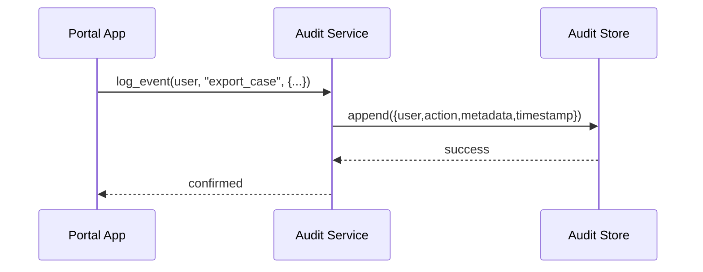

# Chapter 11: Audit & Compliance Logging

In [Chapter 10: Real-Time Metrics & Monitoring](10_real_time_metrics___monitoring_.md) we learned how to watch system health and SLAs in real time. Now we’ll complete our transparency story by capturing **every** action—who did what, when, and why—so we can support internal reviews, external audits, and Freedom-of-Information requests. Welcome to **Audit & Compliance Logging**, our system’s courtroom stenographer.

---

## 1. Why We Need Audit & Compliance Logging

Central Use Case:  
A federal background-check portal at the FBI must prove in court or during a civil-liberties review that no unauthorized officer has viewed sensitive records. Every “view,” “edit,” or “export” needs a tamper-proof record.

Without a single, immutable store of these events, you can’t demonstrate transparency, meet statutory retention periods, or answer FOIA requests. Audit Logging solves this by:

- Recording **who** performed **what** action  
- Timestamping **when** it happened  
- Storing it in an **append-only**, secure repository  
- Generating reports for audits, regulators, and public records

---

## 2. Key Concepts

1. **Event Capture**  
   - Plug-in calls at every touchpoint (UI clicks, API calls, agents).  
   - Example: `audit.log_event(user_id="agent42", action="view_record", record_id=123)`  

2. **Immutable Storage**  
   - Write-once logs (file, database, or ledger) that can never be altered.  
   - Think of it like a padded envelope of daily transcripts.

3. **Query & Reporting**  
   - Tools to filter logs by user, date, action type, or case.  
   - Supports internal compliance checks or public‐records requests.

4. **Retention & Security**  
   - Policies to purge or archive logs after legal retention periods.  
   - Encryption and access controls to prevent log tampering or unauthorized reads.

---

## 3. How to Use Audit Logging

Below is a minimal example in Python showing how a citizen-service portal might log every time an officer exports case data:

```python
# example_app.py
from audit_service import AuditService

audit = AuditService(store="secure_audit_db")

def export_case(user, case_id):
    # 1. Perform the export operation (omitted)
    data = {"case_id": case_id, "fields": ["name","status"]}
    # 2. Log the action
    audit.log_event(
        user_id=user.id,
        action="export_case",
        metadata=data
    )
    return {"download_url": "/exports/{}.zip".format(case_id)}
```

Explanation:
- We create `AuditService` pointing to our secure audit database.  
- After exporting, we call `log_event()` with the user, action, and any extra context.

---

## 4. What Happens Step-by-Step



1. The **App** calls `AuditService.log_event()`.  
2. **Audit Service** writes a new record into the **append-only store**.  
3. It returns confirmation—never overwriting existing entries.

---

## 5. Under the Hood: Core Implementation

### 5.1 Audit Service

File: `audit_service.py`

```python
class AuditService:
    def __init__(self, store):
        # store is our append-only database client
        self.store = store

    def log_event(self, user_id, action, metadata=None):
        entry = {
            "user_id": user_id,
            "action": action,
            "metadata": metadata or {},
            "timestamp": self._now()
        }
        # Append entry immutably
        self.store.append(entry)
```

Explanation:
- Builds an `entry` dictionary with all required fields.  
- Calls `store.append()` to write the log.

### 5.2 Audit Store

File: `audit_store.py`

```python
class AuditStore:
    def __init__(self, db_client):
        self.db = db_client

    def append(self, entry):
        # Simplified: insert into a write-once table
        self.db.insert("audit_logs", entry)
```

Explanation:
- `append()` inserts into a table with no UPDATE/DELETE permissions.  
- Ensures logs remain immutable.

---

## 6. Reporting & FOIA Requests

Once logs accumulate, you can build a small report service:

```python
# report_service.py
class ReportService:
    def __init__(self, audit_store):
        self.store = audit_store

    def fetch_logs(self, user_id=None, action=None, since=None):
        # Build a simple SQL WHERE clause based on filters
        return self.store.query(
            table="audit_logs",
            filters={"user_id":user_id, "action":action, "timestamp>= ":since}
        )
```

- Call `fetch_logs()` to retrieve events for an internal audit or a public-records request.

---

## 7. Summary & Next Steps

You’ve seen how **Audit & Compliance Logging** acts like our system’s courtroom stenographer—capturing every action in an immutable log for transparency, audits, and FOIA response. You learned:

- Why immutable, append-only logs are essential  
- How to call the `AuditService` in your app  
- The simple under-the-hood design of the log service and store  

Next up, we’ll learn how to **sync** these logs and other data with external systems in [Chapter 12: Integrated External System Sync](12_integrated_external_system_sync_.md).

---

Generated by [AI Codebase Knowledge Builder](https://github.com/The-Pocket/Tutorial-Codebase-Knowledge)