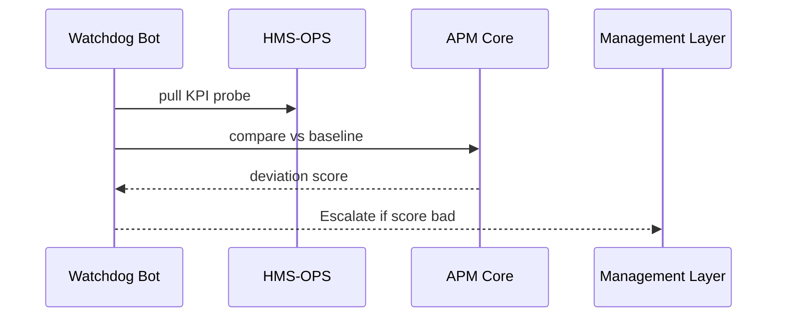

# Chapter 11: Autonomous Performance Monitor  

*(jumped in from [Operations & Observability (HMS-OPS)](10_operations___observability__hms_ops__.md))*  

---

## 1 — Why Do We Need a “Robot Inspector General”?  

The White House announces a new **“Fast-Track Housing Voucher”** rule.  
Congress expects average **wait-time to drop from 90 days to 30 days**.

Three months later:

* Case workers insist the rule is working.  
* Citizens on Twitter still complain they wait **100+ days**.  
* Leadership must know who is right—**tonight**, not in next year’s audit.

The **Autonomous Performance Monitor (APM)** is our **robot Inspector General**:

1. **Learns** the *expected* outcome given in the policy packet.  
2. **Fetches** *actual* metrics from [HMS-OPS](10_operations___observability__hms_ops__.md).  
3. **Compares** the two on a schedule.  
4. **Flags** under-performance and—if humans keep ignoring fixes—  
   can even **recommend management changes** to [Management Layer](12_management_layer__hms_act___oms___ops__.md).

Result: bad news surfaces automatically, good programs get proof they work, and citizens see faster service.

---

## 2 — Key Ideas in Plain English  

| Monitor Word    | Think of it as…                                   |
|-----------------|---------------------------------------------------|
| Baseline        | The promise: “Wait-time **≤ 30 days**.”           |
| KPI Probe       | The thermometer that measures real wait-time.     |
| Deviation Score | How far we drift from the promise.                |
| Watchdog Bot    | Code that checks the score on a schedule.         |
| Escalation Path | Who gets pinged at 3 AM when things are bad.      |

Keep these five words: **Baseline → Probe → Score → Bot → Escalation.**

---

## 3 — 60-Second Code Tour – Track One KPI  

Below is *everything* needed to monitor housing-voucher wait-time.  

### 3.1 Define the Baseline (≤ 15 lines)

```python
# monitor/register_baseline.py
from hms_apm import Baseline

wait_time = Baseline.create(
    program_id   = 42,                      # “Fast-Track Voucher”
    name         = "avg_wait_days",
    target_value = 30,                      # ≤ 30 days
    compare_op   = "le",                    # le = “less-or-equal”
    probe_query  = "rate(housing_wait_days_sum / housing_wait_count [7d])"
)
print("✅ Baseline ID:", wait_time.id)
```

Explanation  
1. `program_id` links back to the **Program Model** so audits know *which law* promised what.  
2. `probe_query` is a PromQL snippet already exposed by [HMS-OPS](10_operations___observability__hms_ops__.md).  
3. The Baseline lives as one row in *`baselines`*.

---

### 3.2 Run the Watchdog Bot (≤ 20 lines)

```python
# monitor/daily_check.py
from hms_apm import Watchdog, Escalate

@Watchdog.schedule(cron="0 2 * * *")       # 02:00 UTC nightly
def check_housing_wait():
    score = Watchdog.compare(baseline_id=wait_time.id)     # returns %
    print("📊 Deviation:", score)

    if score > 20:                         # >20 % over target? BAD.
        Escalate.send(
            baseline_id = wait_time.id,
            message     = f"Wait-time off by {score:.1f}% (>{30} days)",
            level       = "critical"
        )
```

What happens?  
* Every night at 02:00 UTC the bot pulls yesterday’s metric.  
* If we are **20 %** worse than promised (≈ 36 days) it files an alert.

---

### 3.3 Auto-Escalate to Management Layer (≤ 10 lines)

```python
# monitor/escalation_policy.yaml
- baseline: avg_wait_days
  after_days_no_fix: 14
  action: "recommend_leadership_review"
```

If the KPI stays red for **14 days**, APM opens a ticket in the [Management Layer](12_management_layer__hms_act___oms___ops__.md) requesting a leadership review.

---

## 4 — Under the Hood (Step-By-Step)



1. **BOT** reads the metric from Prometheus.  
2. **APM Core** calculates `Deviation = (actual - target)/target`.  
3. If `Deviation > threshold` → create an escalation record.  
4. **Management Layer** shows the alert on executive dashboards.

---

## 5 — Inside the Codebase (File Tour)

```
hms-apm/
 ├─ models.py          # Baseline & Deviation ORM
 ├─ probes/            # Tiny adapters to Prometheus, SQL, etc.
 ├─ watchdog.py        # Scheduler + comparison logic
 ├─ escalation.py      # Routes alerts to Slack, email, HMS-ACT
 └─ policies/          # escalation_policy.yaml files
```

### 5.1 Deviation Logic (≤ 15 lines)

```python
# watchdog.py
def compare(baseline_id: int) -> float:
    bl = Baseline.find(baseline_id)
    actual = Probe.run(bl.probe_query)      # e.g., returns 37.2
    deviation = ((actual - bl.target_value) / bl.target_value) * 100
    Deviation.create(bl.id, actual, deviation)
    return deviation
```

### 5.2 Escalation Hook (≤ 12 lines)

```python
# escalation.py
def send(baseline_id: int, message: str, level: str):
    Escalation.create(baseline_id, message, level)
    # Fan-out to channels
    Slack.post("#kpi-alerts", message)
    HmsAct.open_ticket(baseline_id, message, severity=level)
```

---

## 6 — Government Analogy Cheat-Sheet  

APM Item               | Real-World Counterpart  
-----------------------|------------------------  
Baseline               | Congressional mandate (“30-day wait”)  
Probe                  | Inspector’s stopwatch  
Deviation Score        | Audit finding “+24 % over budget”  
Watchdog Bot           | Office of Inspector General auditor  
Escalation Policy      | Letter to the Secretary requesting action  

---

## 7 — Common Beginner Pitfalls  

1. **Probe returns NULL** → Watchdog treats it as *100 % deviation*; always ensure your metric exists.  
2. **Comparison operator confusion** → use `"le"` (≤) for *upper* targets, `"ge"` (≥) for *lower* targets.  
3. **Too many alerts** → set `threshold` wisely or you will page the Secretary every night.  
4. **Skipping `program_id`** → audits cannot trace KPI back to the law.  

---

## 8 — Mini-Exercise  

1. Register a baseline for **“Application Error Rate ≤ 1 %”** using a probe like  
   `rate(api_errors_total / api_requests_total [24h]) * 100`.  
2. Set the threshold to **10 % deviation**.  
3. Inject errors (`curl /test/error` 100×).  
4. Wait for the Watchdog run (or `Watchdog.run_once()` manually).  
5. Observe a Slack alert and a new ticket in HMS-ACT.

---

## 9 — Recap & Next Step  

In this chapter you learned how the **Autonomous Performance Monitor**:

* Stores **Baselines** that capture policy promises.  
* Runs **Watchdog Bots** to check live metrics against those promises.  
* Raises smart **Escalations**—even recommending leadership review when humans ignore problems.  

Next we’ll see how those escalations flow into dashboards, task queues, and executive approvals in the [Management Layer (HMS-ACT / OMS / OPS)](12_management_layer__hms_act___oms___ops__.md).

---

Generated by [AI Codebase Knowledge Builder](https://github.com/The-Pocket/Tutorial-Codebase-Knowledge)