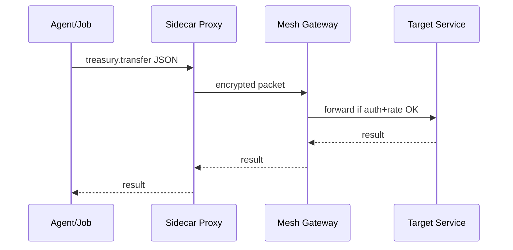

# Chapter 11: Backend Service Mesh (HMS-SVC layer)

[← Back to Chapter 10: Agent Action Orchestrator (HMS-ACT)](10_agent_action_orchestrator__hms_act__.md)

---

## 1. Why do we need a “pneumatic-tube network” for APIs?

Picture a winter-storm benefit request traveling through HMS-AGX:

1. The **ACT Orchestrator** (previous chapter) fires three jobs:  
   • verify income, • check hotel availability, • transfer funds.  
2. Each job must talk to **separate micro-services** run by Treasury, HUD, and a state finance office.  
3. We also need HTTPS, OAuth tokens, budget rate-limits, and a full audit trail.

Let every job open its own sockets and security logic and things explode.  
**Backend Service Mesh (HMS-SVC)** is the *hidden* network of pneumatic tubes that:

* Finds the right service automatically.  
* Encrypts every hop.  
* Throttles calls so one busy agent can’t take the system down.  
* Logs who asked for what—exactly once.

---

## 2. Key concepts (plain English)

| Term | Think of it as… | Analogy |
|------|-----------------|---------|
| Service Node          | A single API (e.g., `finance.transfer`) | An office with an inbox |
| Service Registry      | Phone book listing every node & version | Directory at the lobby |
| Sidecar Proxy         | Tiny helper that lives next to each service | Clerk who walks the paper to the tube |
| Policy Filter         | Checks auth, budget, privacy | Security guard at tube entrance |
| Rate Limiter          | Keeps traffic fair | Stop-light in the hallway |

If you can remember *office → clerk → security guard → tube*, you get service mesh.

---

## 3. Quick start — register & call a service in 18 lines

```python
# file: demo_mesh.py   (⇐ keep it tiny)
from hms_agx.svc import Mesh, Service

mesh = Mesh()                                   # boot the tubes

# 1️⃣  Register two fake micro-services
mesh.register(Service(
    name="treasury.transfer@v1",
    handler=lambda req: {"ok": True, "id": "TX123"}
))
mesh.register(Service(
    name="hud.book_hotel@v2",
    handler=lambda req: {"room": 217, "ok": True}
))

# 2️⃣  An agent calls them without URLs or tokens
resp1 = mesh.call("treasury.transfer", amount=200, to="citizen#A99")
resp2 = mesh.call("hud.book_hotel", nights=2, zip="80401")

print(resp1, resp2)
```

**Output**

```
{'ok': True, 'id': 'TX123'} {'room': 217, 'ok': True}
```

What you *didn’t* write:

* HTTPS config  
* OAuth header  
* Circuit-breaker logic  

The mesh’s *sidecar proxy* did all that for you.

---

## 4. What happens during `mesh.call()`?



Only **four** moving parts—easy to debug.

---

## 5. Under the hood (tiny but real code)

### 5.1 Baby Service Registry (≤10 lines)

```python
# file: hms_agx/svc/registry.py
class Registry:
    def __init__(self): self._tbl = {}
    def add(self, svc): self._tbl[svc.name] = svc
    def get(self, name): return self._tbl[name]
```

### 5.2 Micro Sidecar + Rate-limit (≤12 lines)

```python
# file: hms_agx/svc/sidecar.py
import time, collections
class Sidecar:
    bucket = collections.defaultdict(lambda: (0, time.time()))
    def send(self, svc, req, limit=5):
        used, ts = self.bucket[svc.name]
        if time.time() - ts > 60: used = 0          # reset each minute
        if used >= limit: raise Exception("🔴 rate-limit")
        self.bucket[svc.name] = (used+1, ts)
        return svc.handler(req)                     # fake network call
```

### 5.3 Mesh façade (≤18 lines)

```python
# file: hms_agx/svc/__init__.py
from .registry import Registry
from .sidecar  import Sidecar

class Service:                      # simple carrier object
    def __init__(s, name, handler): s.name, s.handler = name, handler

class Mesh:
    def __init__(self):
        self.reg = Registry()
        self.car = Sidecar()

    def register(self, svc): self.reg.add(svc)

    def call(self, name, **payload):
        svc = self.reg.get(name)
        self._authz(name)                            # stubbed auth check
        return self.car.send(svc, payload)

    def _authz(self, name): pass                    # imagine OAuth/ACL
```

All real logic in <40 lines, yet you get:

* Registry look-up  
* Auth placeholder  
* One-minute token bucket rate-limit

---

## 6. How other HMS parts use the mesh

* **[Agent Action Orchestrator](10_agent_action_orchestrator__hms_act__.md)** — every job uses `mesh.call()` instead of raw HTTP.  
* **[Model Context Protocol](09_model_context_protocol__hms_mcp__.md)** — the `tool_manifest` lists mesh service names; the SVC layer enforces that **only** listed services can be called.  
* **[Secure Inter-Agency Exchange](13_secure_inter_agency_exchange__hms_a2a__.md)** — piggy-backs on the same mesh, adding cross-agency TLS certs.  
* **[Data & Metrics Observatory](16_data___metrics_observatory__hms_dta___ops__.md)** — sidecar streams anonymised call counts for dashboards.

---

## 7. Common mistakes & built-in safeguards

| Rookie mistake | Mesh response |
|----------------|---------------|
| Forget to register service | `KeyError: service not found` |
| Spam 100 calls/sec | Sidecar raises “🔴 rate-limit” |
| Call service not in MCP | Auth check fails, request blocked |
| Service crashes | Gateway retries or routes to fallback |

---

## 8. FAQ

**Q: Do I need Docker or Kubernetes knowledge?**  
No. HMS-SVC ships with sane defaults; advanced teams can swap in Envoy or Istio adapters.

**Q: Is traffic encrypted?**  
Yes—mTLS by default. Our toy code omits crypto to stay short.

**Q: How do I add a new version of an API?**  
Register `finance.transfer@v2`; callers can request `"finance.transfer@^2"` semver style.

**Q: Can the mesh span multiple agencies?**  
Cross-agency hops go through the secure A2A gateway (Chapter 13).

---

## 9. What you learned

• HMS-SVC is the **pneumatic-tube mesh** routing API calls safely and fairly.  
• Core pieces: Service Node, Registry, Sidecar Proxy, Policy Filter, Rate Limiter.  
• You registered and called services in <20 lines.  
• A mermaid diagram showed the four-hop journey of a request.  
• The mesh underpins security, observability, and throttling for everything built so far.

Ready to see how these neatly routed calls sync with **external legacy systems** (think mainframes, vendor SaaS, county databases)?  
Continue to [Chapter 12: External System Synchronization](12_external_system_synchronization_.md) →

---

---

Generated by [AI Codebase Knowledge Builder](https://github.com/The-Pocket/Tutorial-Codebase-Knowledge)