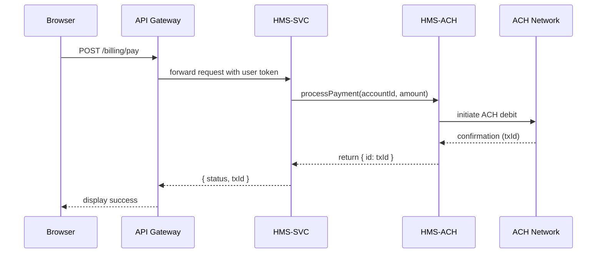

# Chapter 11: Backend Services (HMS-SVC / HMS-ACH)

In [Chapter 10: Account & Authorization System](10_account___authorization_system_.md) we learned how users log in and get permissions. Now we’ll build the **brains** of HMS-ACT: the **Backend Services**—our “utility plants” that run business rules, process data, and handle payments. In particular, **HMS-SVC** is the general service layer, and **HMS-ACH** is our secure payment processor for municipal fees.

---

## Why Backend Services Matter

Imagine a citizen paying their water bill online:

1. They log in (handled by the Account & Authorization System).  
2. They click **Pay Bill** on the portal.  
3. The frontend calls **HMS-SVC**, which:
   - Checks the user’s account balance.
   - Records the transaction.
   - Calls **HMS-ACH** to move money through the ACH network.
4. Finally, the portal shows **“Payment Successful!”** and the city’s ledger updates.

Without clear backend services:
- Payment code would be glued to the frontend.
- Business rules (late fees, account holds) scatter across many apps.
- Security and auditing become a nightmare.

With **HMS-SVC** and **HMS-ACH**, we keep financial logic in one place—secure, auditable, and testable.

---

## Key Concepts

1. **HMS-SVC (Service Layer)**  
   - Exposes REST APIs for city services (billing, permits, reports).  
   - Implements business rules, data processing, and orchestration.

2. **HMS-ACH (Payment Processor)**  
   - A sub-service of HMS-SVC dedicated to ACH transactions.  
   - Talks to external banking networks securely.

3. **Service Route**  
   - A URL endpoint (e.g., `POST /api/billing/pay`).

4. **Client Library**  
   - A reusable module (e.g., `achClient.js`) that wraps ACH API calls.

5. **Transaction Record**  
   - A database entry storing request, status, and audit info.

---

## Using HMS-SVC / HMS-ACH for a Water Bill Payment

Below is a minimal example of a **PaymentService** route in Node.js using Express.

```javascript
// File: services/hms-svc/routes/payment.js
import express from 'express';
import { achClient } from '../lib/achClient';
import { checkPermission } from 'hms-sys/security';

const router = express.Router();

router.post('/billing/pay', (req, res) => {
  // 1. Authorization
  if (!checkPermission(req.user, 'submit_payment')) {
    return res.status(403).send('Forbidden');
  }
  const { accountId, amount } = req.body;
  // 2. Business Logic & ACH call
  achClient.processPayment(accountId, amount)
    .then(result => res.json({ status: 'ok', txId: result.id }))
    .catch(err => res.status(500).json({ error: err.message }));
});

export default router;
```

Explanation:
- We protect the endpoint with `checkPermission`.  
- We extract `accountId` and `amount` from the request.  
- We call `achClient.processPayment(...)`.  
- On success, we return a transaction ID; on failure, we send an error.

### Example Input & Output

**Request** `POST /api/billing/pay`  
```json
{ "accountId": "W123", "amount": 75.50 }
```

**Response**  
```json
{ "status": "ok", "txId": "ACH-456789" }
```

---

## What Happens Under the Hood?



1. **API Gateway** forwards the call with user credentials.  
2. **HMS-SVC** enforces business and permission checks.  
3. It invokes **HMS-ACH**, which calls the external ACH network.  
4. The bank returns a transaction ID, propagation back to the browser.

---

## Behind the Scenes: Internal Implementation

Let’s peek at how **achClient** is built and how HMS-ACH handles a payment.

### 1. ACH Client Library

```javascript
// File: services/hms-svc/lib/achClient.js
import fetch from 'node-fetch';

export const achClient = {
  async processPayment(accountId, amount) {
    // Minimal request to the ACH service
    const resp = await fetch('http://localhost:4000/ach/process', {
      method: 'POST',
      headers: { 'Content-Type': 'application/json' },
      body: JSON.stringify({ accountId, amount })
    });
    if (!resp.ok) throw new Error('ACH failed');
    return resp.json(); // { id: 'ACH-456789' }
  }
};
```

- We send a JSON payload to `HMS-ACH` at port 4000.  
- We throw if the call fails, otherwise return the result.

### 2. HMS-ACH Service

```javascript
// File: services/hms-ach/server.js
import express from 'express';
import { v4 as uuid } from 'uuid';
import { recordTransaction } from './store';

const app = express();
app.use(express.json());

app.post('/ach/process', (req, res) => {
  const { accountId, amount } = req.body;
  // 1. Record the request for audit
  const tx = { id: uuid(), accountId, amount, status: 'pending' };
  recordTransaction(tx);
  // 2. Simulate external ACH call (omitted)
  tx.status = 'completed';
  // 3. Update record
  recordTransaction(tx);
  res.json({ id: tx.id });
});

app.listen(4000, () => console.log('HMS-ACH on 4000'));
```

- We generate a unique `id` for each transaction.  
- We save the record twice: before and after completion.  
- Finally, we respond with `{ id }`.

---

## Conclusion

In this chapter you learned how **HMS-SVC** and **HMS-ACH** form the backbone of backend logic:

- **HMS-SVC** exposes REST endpoints that enforce business rules and permissions.  
- **HMS-ACH** handles secure, auditable payments via ACH.  
- A shared **ACH client** library ties them together.  

Next, we’ll connect our system to outside data sources in [Chapter 12: External System Synchronization](12_external_system_synchronization_.md).

---

Generated by [AI Codebase Knowledge Builder](https://github.com/The-Pocket/Tutorial-Codebase-Knowledge)