# Chapter 11: Backend Services Layer (HMS-SVC)
[← Back to Chapter 10: Real-Time Metrics & Monitoring](10_real_time_metrics___monitoring_.md)

---

## 0. Why Do We Need a “Service Counter” Behind Every Screen?

Imagine the **National Endowment for the Arts (NEA)** accepts grant
applications every spring.  

* Maria, a jazz composer, submits a form in **HMS-MFE**.  
* A minute later, Evan, an NEA reviewer, sees Maria’s file in **HMS-GOV**.  

What secretly connected those two screens?  
Answer: the **Backend Services Layer (HMS-SVC)**—think of it as a row of
specialized clerks behind reinforced counters.  
Every request (web, mobile, or AI agent) *must* pass these clerks for:

1. Business-rule checks  
2. Data validation  
3. Secure hand-offs to databases or external federal systems  

Without HMS-SVC we would end up with brittle, duplicative code scattered
across every front-end and agent.

---

## 1. Key Concepts in Plain English

| Term | Analogy | Why It Exists |
|------|---------|---------------|
| **Service** | One clerk window | Owns a focused domain (e.g., `/grants`) |
| **Endpoint** | The form you slide | Specific action (e.g., `POST /grants`) |
| **Validation** | Clerk checks signature | Blocks bad or incomplete data |
| **Business Rule** | Clerk consults policy book | Enforces agency-specific logic |
| **Transformation** | Clerk converts inches→cm | Normalizes data for storage |
| **Adapter** | Secure chute to archive | Talks to DBs / external APIs |

Keep these six in mind; everything else is plumbing.

---

## 2. A 5-Minute Walk-Through: Creating a “Grant” Service

### 2.1 Define an Endpoint (Express – 18 lines)

```js
// services/grants/create.js
import { validateGrant } from './rules.js';
import { db } from '../util/db.js';

export async function create(req, res) {
  const draft = req.body;                  // 1️⃣ raw input

  // 2️⃣ Validation
  const errors = validateGrant(draft);
  if (errors.length) return res.status(422).json({ errors });

  // 3️⃣ Business Rule: limit one open app per citizen
  const open = await db('grants').where({ ssn: draft.ssn, status: 'OPEN' });
  if (open.length) return res.status(409).send('Existing application found.');

  // 4️⃣ Transformation: phone to E.164
  draft.phone = toE164(draft.phone);

  // 5️⃣ Persist
  const [id] = await db('grants').insert({ ...draft, status: 'OPEN' }).returning('id');

  res.status(201).json({ id });
}
```

What happens?  
1. Input arrives untouched.  
2. Validation blocks typos *before* hitting the DB.  
3. The rule “one open app” protects policy.  
4. Data is normalized (phone numbers).  
5. Only clean data is stored—front-end simply sees `201 Created`.

### 2.2 Wire It Into the Router (6 lines)

```js
// services/grants/index.js
import express from 'express';
import { create } from './create.js';

const r = express.Router();
r.post('/', create);              // POST /grants
export default r;
```

Drop this file; HMS-SVC auto-discovers and mounts every router.

---

## 3. Life of a Request (Step-By-Step)

```mermaid
sequenceDiagram
    participant UI as HMS-MFE
    participant SVC as Grants Service
    participant DB as 🎯 Database
    participant MON as 🛰️ Metrics
    UI->>SVC: POST /grants {…}
    SVC->>SVC: validate + rules + transform
    SVC->>DB: INSERT application
    SVC-->>UI: 201 Created
    SVC-->>MON: grant.success +1
```



Only four hops—easy to reason about and monitor.

---

## 4. Under the Hood (Code-Light Tour)

### 4.1 Auto-Loader (14 lines)

```js
// loader.js
import fs from 'fs';
import express from 'express';

export function loadServices(app) {
  const files = fs.readdirSync('./services');
  files.forEach(name => {
    const router = (await import(`./services/${name}/index.js`)).default;
    app.use(`/${name}`, router);   // e.g., "/grants"
  });
}
```

Add a new folder `services/payments` → restart → instantly live.

### 4.2 Shared Validation Helpers (10 lines)

```js
// services/grants/rules.js
import { z } from 'zod';

const schema = z.object({
  name: z.string().min(3),
  ssn: z.string().regex(/^\d{9}$/),
  phone: z.string()
});

export const validateGrant = draft => {
  const res = schema.safeParse(draft);
  return res.success ? [] : res.error.issues;
};
```

Beginners swap regexes; no DB knowledge required.

---

## 5. Talking to the Outside World

Need Treasury’s **HMS-ACH** to cut checks?  
Add an Adapter:

```js
// adapters/ach.js  (12 lines)
import axios from 'axios';
import { token } from './auth.js';

export const pay = data =>
  axios.post('https://ach.hms.gov/transfer', data, {
    headers: { Authorization: `Bearer ${token()}` }
  });
```

Services never embed secrets; `token()` pulls a short-lived JWT from
[Role-Based Access Control & Accountability Ledger](09_role_based_access_control___accountability_ledger_.md).

---

## 6. Typical Folder Blueprint

```
hms-svc/
 ├─ services/
 │   ├─ grants/
 │   │   ├─ create.js
 │   │   ├─ index.js
 │   │   └─ rules.js
 │   └─ payments/
 ├─ adapters/
 │   └─ ach.js
 ├─ util/
 │   ├─ db.js
 │   └─ metrics.js
 └─ loader.js
```

Everything lives in **one folder per domain**—no mega-monolith files.

---

## 7. How HMS-SVC Plays With Other Layers

* **Front-ends** from [User Interface Suite](01_user_interface_suite__hms_mfe___hms_gov__.md) call HMS-SVC for data and actions.  
* **AI Agents** ([Specialized AI Agents](05_specialized_ai_agents__hms_a2a__.md)) also hit these endpoints instead of the DB.  
* Every call is measured by the collector introduced in  
  [Real-Time Metrics & Monitoring](10_real_time_metrics___monitoring_.md).  
* Access checks (`req.user`) rely on tokens issued under the rules in  
  [Role-Based Access Control & Accountability Ledger](09_role_based_access_control___accountability_ledger_.md).  
* Complex workflows (e.g., dual approvals) delegate policy look-ups to the  
  [Policy & Process Management API](08_policy___process_management_api_.md).

---

## 8. Mini-FAQ

**Q: Why not let the front-end talk straight to the database?**  
Security & consistency: one clerk (service) enforces rules; citizens never touch raw data.

**Q: Microservices or monolith?**  
HMS-SVC is a *modular monolith*: one repo, many isolated routers. Split into separate deploys only when traffic demands.

**Q: Where do I log errors?**  
Call `metrics.inc('grants.error')`; Chapter 10 shows how this ends up on dashboards.

---

## 9. Recap & What’s Next

You learned:

1. The motivation for HMS-SVC: **validated, rule-driven APIs** that sit between every UI/agent and your data.  
2. Six key concepts—Service, Endpoint, Validation, Business Rule, Transformation, Adapter.  
3. How to build a real “Grant” endpoint in under 20 lines.  
4. How HMS-SVC auto-loads new services and plugs into monitoring, governance, and RBAC.

Ready to move money after a grant is approved?  
Jump to [Chapter 12: Financial Transaction Hub (HMS-ACH)](12_financial_transaction_hub__hms_ach__.md) →

---

---

Generated by [AI Codebase Knowledge Builder](https://github.com/The-Pocket/Tutorial-Codebase-Knowledge)