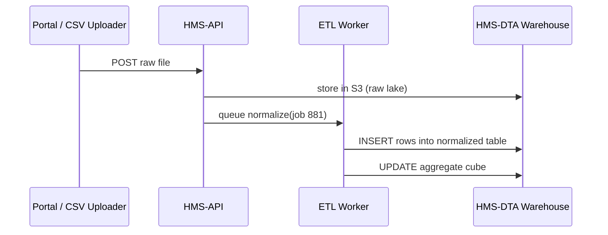
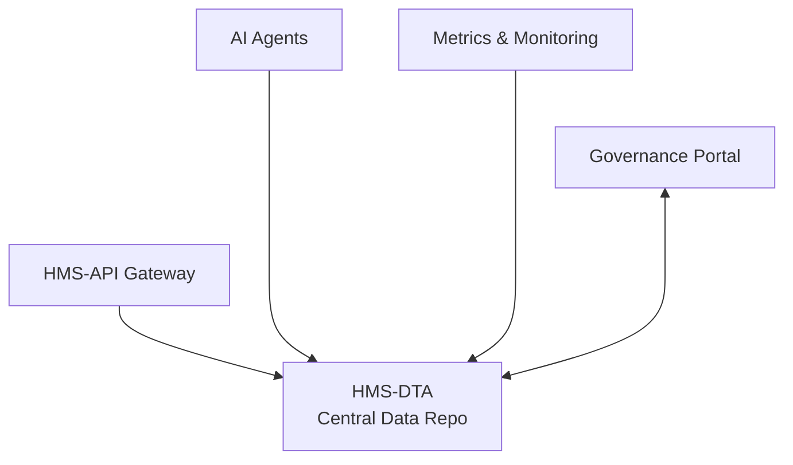

# Chapter 11: Central Data Repository (HMS-DTA)

*(Just zipped through how ideas ride the [Policy Proposal Pipeline](10_policy_proposal_pipeline_.md) conveyor belt? Great—now let’s open the **vault** where every log, record, and metric lands after the ride!)*  

---

## 1. Why Do We Need a Vault?

Imagine the **Department of Transportation (DOT)** investigating seat-belt failures.

1. Citizens file complaints → **raw text**.  
2. AI agents suggest new safety thresholds → **structured JSON**.  
3. Inspectors upload test results → **CSV files**.  
4. Congress asks: “Across all car models, what % failed in the last 90 days?”  

If these data live in 14 different apps, no one can answer quickly.  
**HMS-DTA** is the **single, trusted vault**—much like the U.S. Census Bureau’s databases that power almost every federal policy study.

---

## 2. Hero Use-Case – “Give me 90-day failure stats in one query”

Goal: A DOT analyst runs **one SQL query** and instantly sees:

```
 model      | failures | tests | failure_rate
------------|----------|-------|--------------
 Model-Z    |   112    |  810  |   13.8 %
 Model-A    |    14    |  744  |    1.9 %
 ...
```

We’ll reach this goal in ~10 lines of code, but first meet the moving parts.

---

## 3. Key Concepts (Plain-English Cheatsheet)

| Concept               | Think of it as…                                  | Why it matters                |
|-----------------------|--------------------------------------------------|-------------------------------|
| Raw Log Lake          | “Inbox” folder; nothing filtered                 | Keeps **every** byte for forensics |
| Normalized Tables     | Clean rows (Program ID, timestamp, …)            | Easy to join & index          |
| Aggregate Cubes       | Pre-calculated counts / averages                 | Sub-second dashboards         |
| Time-Travel Snapshot  | Read data **as-of** any date                     | Audits & FOIA compliance      |
| Data Contract         | Schema pact between producers & DTA              | Stops “surprise” columns      |

Keep these five in mind—everything else is plumbing.

---

## 4. Using HMS-DTA in Real Life

### 4.1 Drop a Raw Log (8 lines)

```bash
curl -X POST https://api.hms.gov/dta/raw \
     -H "Authorization: Bearer $JWT" \
     -F "program_id=12" \
     -F "file=@seatbelt_2024_07_31.csv"
```

Explanation  
1. Send file + metadata.  
2. Gateway stores it in **Raw Log Lake** (S3) and queues a *normalize* job.  
3. Response:

```json
{ "raw_id": 881, "status": "queued_for_etl" }
```

### 4.2 Query an Aggregate Cube (Python, 12 lines)

```python
import pandas as pd, duckdb

con = duckdb.connect("hms_dta.duckdb")  # ✨ Demo file DB
sql = """
SELECT model,
       SUM(fail)      AS failures,
       COUNT(*)       AS tests,
       ROUND(100.0*SUM(fail)/COUNT(*),1) AS failure_rate
FROM car_seatbelt_c_90d   -- an aggregate cube
WHERE program_id = 12
GROUP BY model
ORDER BY failure_rate DESC;
"""
df = con.execute(sql).df()
print(df)
```

Output (trimmed):

```
    model  failures  tests  failure_rate
0  Model-Z       112    810         13.8
1  Model-A        14    744          1.9
```

Done—90-day stats in one shot!

---

## 5. What Happens Behind the Curtain?



Only four actors—easy to picture.

---

## 6. Peeking at the ETL Job (18 lines)

```python
# jobs/etl_normalize.py
import pandas as pd
from hms_dta import lake, warehouse

def run(raw_id):
    raw_path = lake.fetch(raw_id)          # 1) download CSV
    df = pd.read_csv(raw_path)

    # 2) normalize column names
    df = df.rename(columns={
        "car_model":"model",
        "sensor_fail":"fail",
        "test_time":"tested_at"
    })
    df["program_id"] = 12                 # metadata
    warehouse.insert("car_sensor_tests", df)

    # 3) update 90-day cube (simple SQL)
    warehouse.exec("""
      REFRESH MATERIALIZED VIEW car_seatbelt_c_90d;
    """)
```

Line-by-line  
1. Fetch raw file from S3.  
5-10. Clean headers, stamp Program ID.  
11. Insert into **Normalized Table**.  
14-16. Re-build the 90-day **Aggregate Cube**—dashboards update instantly.

---

### Folder Map

```
hms_dta/
├─ lake/              # S3 helpers
├─ warehouse/         # DB helpers
├─ jobs/
│   └─ etl_normalize.py
└─ schemas/
    └─ car_sensor_tests.sql
```

Everything is plain files—easy for new devs.

---

## 7. Time-Travel Example (7 lines)

Need yesterday’s view for an audit?

```sql
SELECT * FROM car_seatbelt_c_90d
  FOR SYSTEM_TIME AS OF '2024-07-30 23:59:59';
```

The warehouse keeps **immutable snapshots** so you can reproduce any report submitted to Congress.

---

## 8. Best-Practice Checklist

1. **Partition by Program & date** → fast queries, lower cost.  
2. **PII Masking** → store hashes instead of SSNs inside DTA.  
3. **Data Contracts** → each ETL job validates schema before insert.  
4. **Immutable Raw Lake** → never mutate originals; append new versions.  
5. **Public-Sector Backups** → nightly S3 copy + cross-region replicate (meets NARA guidance).

---

## 9. Where HMS-DTA Sits in the HMS Galaxy



Every other service **reads or writes** here—DTA is the heart.

---

## 10. Recap & Next Stop

You can now:

1. Explain why HMS-DTA is the **single source of truth**.  
2. Upload raw logs, run a 90-day aggregate query, and travel in time—all with <20 lines of code.  
3. Visualize the simple ETL flow under the hood.  
4. List best practices for secure, audit-ready federal data warehouses.

Raw data in, clean insights out!  
Ready to see how we keep the whole HMS machine healthy in real time? Jump to [Metrics & Monitoring (HMS-OPS)](12_metrics___monitoring__hms_ops__.md).

---

---

Generated by [AI Codebase Knowledge Builder](https://github.com/The-Pocket/Tutorial-Codebase-Knowledge)