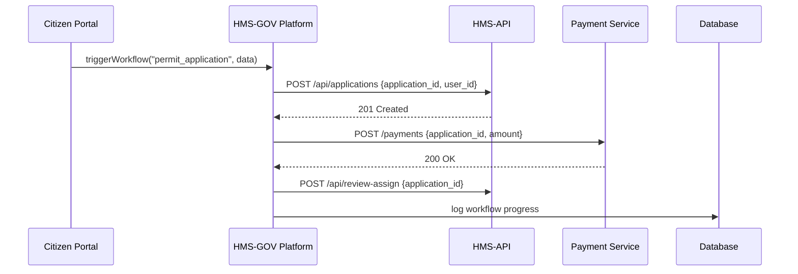

# Chapter 11: Core System Platform (HMS-GOV)

In [Chapter 10: Human-in-the-Loop Override](10_human_in_the_loop_override_.md), we saw how a real person signs off on AI’s workflow suggestions. Now let’s zoom out to the **Core System Platform**—the “city hall” of HMS, where every department head (microservice) meets, coordinates, and follows data-governance rules.

## Why a Core System Platform?

Picture a city hall building where:

- The Planning Department (application service)  
- The Finance Department (payment service)  
- The Inspection Department (review & schedule)  

…all convene in a council room to orchestrate a single permit application end-to-end. HMS-GOV is that council room: it loads workflow definitions, enforces data governance, and triggers each department in turn.

**Central Use Case**  
> A citizen submits a “Building Permit” application. HMS-GOV:  
> 1. Loads the “permit_application” workflow  
> 2. Calls the submission API in HMS-API  
> 3. Triggers the fee-payment microservice  
> 4. Notifies the zoning reviewer  
> 5. Opens an inspection schedule task  

All using one central orchestration layer.

---

## Key Concepts

1. Workflow Registry  
   A config of named workflows and their ordered steps.  
2. Orchestration Engine  
   The code that reads a workflow, calls each step, and tracks progress.  
3. Data Governance  
   Shared schemas, privacy rules, audit logging across all steps.  
4. Event Bus  
   A publish/subscribe system so services can react asynchronously.  
5. Service Registry  
   A lookup for service URLs (HMS-API, payment gateway, external partners).

---

## Quick Start: Triggering a Workflow

### 1. Define Workflows in config/hms_gov.php

```php
// config/hms_gov.php
return [
  'workflows' => [
    'permit_application' => [
      'steps' => [
        'submitForm',
        'processPayment',
        'assignReviewer',
        'scheduleInspection'
      ]
    ]
  ]
];
```
*Explanation:* We map a name (`permit_application`) to an ordered list of step IDs.

### 2. Call the Orchestration Engine

```php
use App\Services\Core\GovPlatform;

// Start the permit_application workflow
GovPlatform::triggerWorkflow('permit_application', [
  'application_id' => 42,
  'user_id'        => 99
]);
```
*Explanation:* `triggerWorkflow` looks up the steps and runs them one by one, passing our parameters.

---

## What Happens Step-by-Step



1. The portal calls HMS-GOV with workflow name & data.  
2. HMS-GOV calls HMS-API to record the application.  
3. It calls the payment service.  
4. It calls HMS-API again to assign a reviewer.  
5. It logs each step in a central database.

---

## Under the Hood: Core Classes

### Orchestration Engine

```php
// app/Services/Core/GovPlatform.php
namespace App\Services\Core;

class GovPlatform
{
    public static function triggerWorkflow($name, $params)
    {
        $wf = config('hms_gov.workflows')[$name];
        foreach ($wf['steps'] as $step) {
            self::runStep($step, $params);
        }
    }

    protected static function runStep($step, $params)
    {
        // Simplified dispatcher: calls a service class per step
        $class = "\\App\\Services\\Core\\Steps\\" . ucfirst($step);
        $class::execute($params);
        EventBus::publish("workflow.step_completed", compact('step','params'));
    }
}
```
*Explanation:*  
- `triggerWorkflow` loads the step list.  
- `runStep` finds a Step class and calls its `execute()`.  
- After each step, it publishes an event for any subscriber.

### Event Bus

```php
// app/Services/Core/EventBus.php
namespace App\Services\Core;

class EventBus
{
    public static function publish(string $topic, array $payload)
    {
        // In production, push to Redis, Kafka, or HTTP webhooks
        // Here we just log for simplicity:
        logger("Published {$topic}", $payload);
    }
}
```
*Explanation:* Services can listen for `"workflow.step_completed"` to kick off notifications, updates, or next actions.

---

## Data Governance & Audit

Every orchestration call and step result is checked against the rules in our [Governance Layer](08_governance_layer_.md). Before and after each step:

- **Privacy**: no sensitive fields leak  
- **Transparency**: we write an audit log entry  
- **Ethics**: no unauthorized overrides  

These checks happen in the Step classes via a shared trait:

```php
// app/Services/Core/Traits/GovernedStep.php
trait GovernedStep
{
    protected static function checkGovernance($data)
    {
        // calls the Compliance Engine from [Chapter 8](08_governance_layer_.md)
        return \App\Services\Governance\ComplianceEngine::check($data);
    }
}
```

---

## Recap

In this chapter you learned:

- **What** the Core System Platform (HMS-GOV) is: the central orchestration and data-governance hub.  
- **Key parts**: Workflow Registry, Orchestration Engine, Event Bus, Service Registry, and Governance hooks.  
- **How** to define a workflow in `config/hms_gov.php` and call `GovPlatform::triggerWorkflow()`.  
- **What’s under the hood**: Step classes, event publishing, and governance checks.

Next up: learn how to sync data with outside systems in [Chapter 12: External System Sync](12_external_system_sync_.md).

---

Generated by [AI Codebase Knowledge Builder](https://github.com/The-Pocket/Tutorial-Codebase-Knowledge)