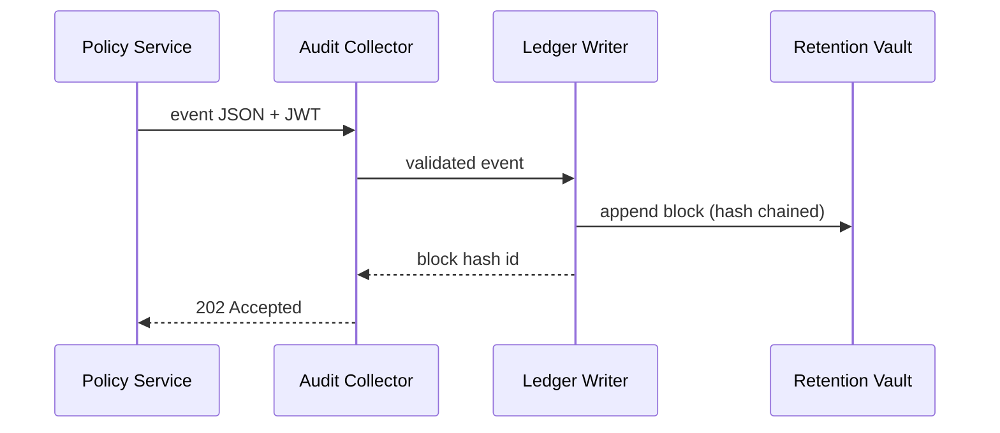
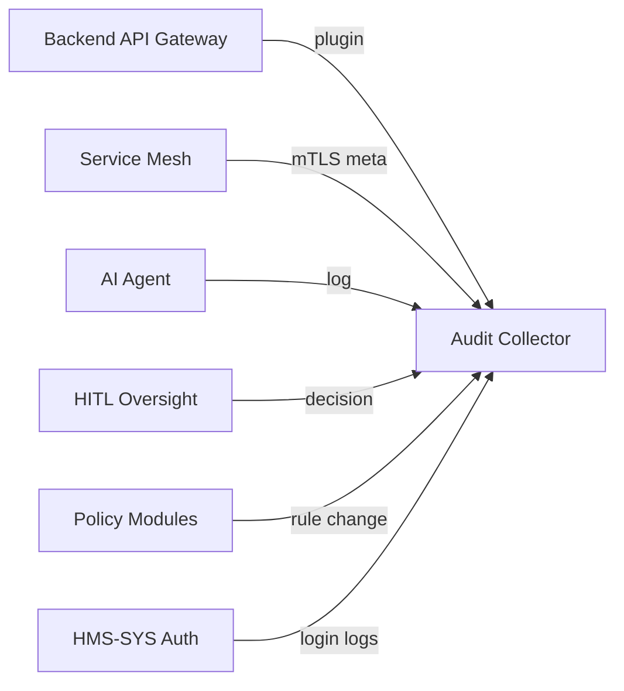

# Chapter 11: Data Governance & Audit Trail  
*(Follow-up to [Role & Identity Management (HMS-SYS Auth)](10_role___identity_management__hms_sys_auth__.md))*  

---

## 1. Why Bother? — A 60-Second Story  

**Scenario:**  
An investigative journalist files a **FOIA request** asking:

> “List every change to the unemployment-benefit rules after July 1st,  
> who made the change, and whether an AI system was involved.”

Without a clean audit trail six bad things happen:  

1. Staff spend weeks stitching logs from e-mails, Git, and chats.  
2. IG auditors flag “unverifiable edits.”  
3. Citizens file appeals claiming the rules were “secretly changed.”  
4. AI accountability law (OMB M-23-18) fines the agency.  
5. Public trust tanks.  
6. Your weekend plans evaporate.  

**Data Governance & Audit Trail (HMS-AUD)** solves this with a **tamper-evident ledger**:

* Every **API call**, **policy edit**, **AI suggestion**, and **human override** is  
  • signed,  
  • time-stamped,  
  • chained by hash,  
  • stored immutably.  

Retrieval becomes as easy as:

```bash
hms-audit query \
  --object unemployment.policy \
  --since 2023-07-01
```

5-second answer instead of 5-week headache. 🎉  

---

## 2. Key Concepts (Beginner-Friendly Table)

| Term | Everyday Analogy | Why It Matters |
|------|------------------|----------------|
| Ledger Block | Page in a bound notebook | Holds a batch of events + previous-page hash |
| Event | Single notebook line | `{who, what, when, why, checksum}` |
| Hash Chain | Page numbers + glue | Changing one page breaks all later pages |
| Collector | Office inbox | Tiny service that receives events from everywhere |
| Retention Vault | Off-site safe | Write-once object store (e.g., S3 + Object Lock) |
| Query Portal | Card catalog | Fast index that points to the immutable pages |

> Think of HMS-AUD as a **“black box flight recorder”** for the whole HMS-SME platform.

---

## 3. 5-Minute Hands-On: Log & Retrieve an Event

### 3.1 Emit an Event (9 lines)

```ts
// services/unemployment.ts
import { audit } from '@hms-sme/sdk';

export async function raiseBenefit(rate: number, user: User){
  /* business logic here */
  await audit.write({
     object:  'unemployment.policy',
     action:  'UPDATE_RATE',
     before:  {rate: 250},
     after:   {rate},
     who:     user.id,
     why:     'Quarterly CPI adjustment'
  });
}
```

Explanation  
1. `audit.write` is **fire-and-forget** (< 5 ms).  
2. Payload size must be < 64 KB; big blobs go to object storage and we log the URI.  
3. The helper automatically appends `when`, `serviceId`, and a **SHA-256 checksum**.

### 3.2 Retrieve Events (FOIA example)

```bash
hms-audit query \
  --object unemployment.policy \
  --fields who,when,action,after.rate
```

Sample output:

```
| when                | who          | action       | after.rate |
|---------------------|--------------|--------------|------------|
| 2023-07-15T10:04Z   | clara@bls    | UPDATE_RATE  | 275        |
| 2023-10-15T09:51Z   | a2a.bot      | AI_SUGGEST   | 295        |
| 2023-10-17T14:22Z   | clara@bls    | HUMAN_REJECT | 250        |
```

Each line is **cryptographically provable**—perfect for FOIA or IG audits.

---

## 4. Step-By-Step: What Happens Internally?



Plain English Flow  

1. **Producer (APP)** sends an event to **Collector** with its JWT (issuer proven by [Role & Identity Management](10_role___identity_management__hms_sys_auth__.md)).  
2. Collector checks schema & signature, then forwards to **Ledger Writer**.  
3. Ledger groups events into a block every *N* seconds, calculates a **hash** that includes the previous block’s hash.  
4. Full block is written to **Retention Vault** (object lock = write-once).  
5. Block hash is returned, giving the producer a **receipt**.

---

## 5. Under-the-Hood Code Peeks (≤ 20 Lines Each)

### 5.1 Collector Endpoint

```ts
// collector/routes/event.ts
router.post('/event', auth, async (req, res) => {
  const ev = req.body;
  if(!schemaValid(ev)) return res.status(400).send('Bad schema');
  const id = await queue.push(ev);           // Kafka / NATS
  res.status(202).json({queued: id});
});
```

* `auth` verifies the JWT using HMS-SYS Auth public key.  
* Events land in a **message queue**—zero loss even if ledger is down.

### 5.2 Ledger Blocker

```ts
// ledger/blocker.ts
setInterval(async () => {
  const batch = await queue.drain(500);          // up to 500 events
  if(!batch.length) return;

  const prev = await store.latestHash();
  const block = {events: batch, prev};
  block.hash = sha256(JSON.stringify(block));

  await store.append(block);                     // S3 + ObjectLock
  idx.add(block);                                // fast query index
}, 5_000);
```

* Runs every 5 s.  
* **sha256** makes later tampering obvious.  
* `idx` writes a small summary (object, who, when) to a SQL/Elastic index for fast search.

### 5.3 Verification Utility

```ts
// cli/verify.ts
import { getBlocks } from './store';
export async function verify(){
  let prev = 'GENESIS';
  for await (const b of getBlocks()){
     if (sha256(JSON.stringify({...b, hash:undefined})) !== b.hash
         || b.prev !== prev) throw 'Ledger broken!';
     prev = b.hash;
  }
  console.log('Ledger intact ✅');
}
```

Run monthly or before handing data to auditors.

---

## 6. Wiring Audit Trail Into Your Service (Middleware)

### 6.1 Gateway Plugin (8 Lines)

```ts
// gateway/plugins/audit.ts
export function auditPlugin(req, res, next){
  res.on('finish', ()=> audit.write({
     object: req.path,
     action: req.method,
     who:    req.user?.id,
     status: res.statusCode
  }));
  next();
}
```

Add it to the [Backend API Gateway](08_backend_api_gateway_.md):

```ts
app.use(auditPlugin);
```

Now **every external request** is logged automatically.

### 6.2 Mesh Sidecar Hook

The mesh proxy already records TLS metadata.  
Enable pass-through with one flag:

```bash
linkerd install --set proxy.audit.enabled=true | kubectl apply -f -
```

All **internal service-to-service** calls are now audited as well.

---

## 7. Built-in Compliance & Governance Features

| Feature | Default | Why It Exists |
|---------|---------|---------------|
| Write-once storage | 7 years | Satisfies FOIA & financial regulations |
| Hash-chained blocks | On | Tamper evidence for IG office |
| Per-event JWT signer | On | Maps event back to real identity (see previous chapter) |
| AI vs Human flag | Automatic | Required by AI Accountability Memo |
| Data export | `hms-audit export --foia` | Produces CSV + block hashes for courts |

---

## 8. Frequently Asked (Beginner) Questions

**Q: How big is a block?**  
Default ~1 MB or 500 events—tunable in `audit.yaml`.

**Q: Can I delete an event?**  
No. You can *append* a `REDACT` event that points to the sensitive record, but the original stays for integrity.

**Q: What if the Retention Vault (S3) is compromised?**  
Object Lock + cross-region replication + block hashes make unauthorized edits detectable by `verify` (5.3).

**Q: Is this blockchain?**  
A very lightweight, private one—no mining, no tokens; just hash chaining.

---

## 9. How HMS-AUD Connects to Everything Else



Every chapter you studied so far **emits** or **uses** audit events.  
They all drink from the same ledger—single source of truth.

---

## 10. Recap & What’s Next

In this chapter you:

• Learned why a **tamper-evident audit trail** is non-negotiable in the public sector.  
• Logged a policy change in 9 lines and answered a FOIA query in one command.  
• Peeked at the simple hash-chain implementation making the magic possible.  
• Saw how every other HMS-SME component streams events into the same ledger.

Next we’ll look at *real-time health* instead of *historical truth*:  
jump into [Metrics & Monitoring Pipeline](12_metrics___monitoring_pipeline_.md) to keep your services fast and happy.

---

Generated by [AI Codebase Knowledge Builder](https://github.com/The-Pocket/Tutorial-Codebase-Knowledge)