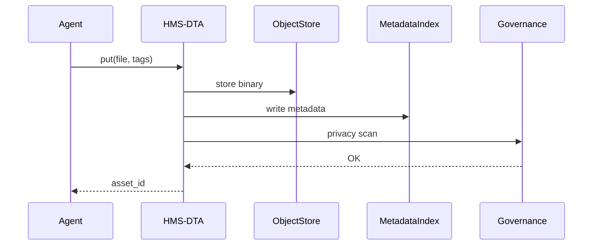

# Chapter 11: Data Repository & Management Service (HMS-DTA)
*A library, catalog and archivist for everything your agents touch.*

[← Back to Chapter 10: Policy & Legislative Engine (HMS-CDF)](10_policy___legislative_engine__hms_cdf__.md)

---

## 1 — Why do we need a giant “data library”?

Picture this real-world day in government IT:

1. The **U.S. Forest Service** uploads the latest *wild-fire-fuel* maps.  
2. **Health & Human Services** hospitals ingest last night’s **EMR** records.  
3. A senator’s aide asks, *“What data did we base the drought relief vote on six months ago?”*

Without a single, well-governed store you would see:

* scattered S3 buckets named `tmp2`,  
* agents guessing where to find files,  
* no way to **rewind** and prove what data existed on the vote day.

**HMS-DTA** fixes this by acting as:

```
Catalog  → “What datasets exist?”
Archivist → “Freeze version 2024-04-17”
Librarian → “Here’s a privacy-scrubbed excerpt for Agent-X”
```

---

## 2 — Core Concepts (plain-English cheat-sheet)

| Term | Beginner-friendly meaning | Analogy |
|------|--------------------------|---------|
| Dataset | A named collection of related files/records. | A book title. |
| Asset | One physical file inside a dataset (CSV, GeoTIFF, PDF). | A chapter. |
| Version | Immutable snapshot of a dataset at a moment in time. | “2nd edition, 2023”. |
| Index | Searchable metadata for every asset. | Library catalog card. |
| Access Policy | Rules that decide *who* can see *what*. | “Reference only—no checkout”. |

Remember these five words—90 % of DTA is just organising them well.

---

## 3 — Hands-On: Store, search and *time-travel* in 17 lines

We will:

1. Create a `wildfire_fuel` dataset.  
2. Upload a GeoTIFF map.  
3. Retrieve an earlier version for audit.

```python
# demo_dta.py  (17 lines)
from hms_dta import Dataset

# 1) open or create the dataset
ds = Dataset("wildfire_fuel")

# 2) add an asset with tags
ds.put("oregon_2024_04.tif",
       tags = {"state":"OR", "year":2024, "month":4})

# 3) commit → returns a new immutable version id
v1 = ds.commit(message="April fuel map")

# ---- two months later ----
v2 = ds.put("oregon_2024_06.tif").commit("June update")

# 4) rewind to the older version
old = ds.at(v1).get("oregon_2024_04.tif")
print(old.path)          # /store/wildfire_fuel/v1/oregon_2024_04.tif
```

What happened?

* `put()` copies the file into secure object storage and writes metadata.  
* `commit()` seals a **version** (`v1`) that can never change.  
* `ds.at(v1)` lets any auditor fetch exactly what existed back then.

---

## 4 — Step-by-step flow



Five actors, one clear responsibility each.

---

## 5 — Tiny peeks under the hood (≤20 lines each)

### 5.1 Dataset manifest (`dataset.yml`, 14 lines)

```yaml
name: wildfire_fuel
owner: usfs.gov
schema:
  - path:      string
  - state:     string
  - year:      int
  - month:     int
access:
  default: deny
  roles:
    - role: "USFS.Analyst"
      allow: ["*"]
    - role: "Public"
      allow: ["state", "year", "month"]
```

*Front-door guard* that defines columns and who may see them.

---

### 5.2 Indexer snippet (Python, 15 lines)

```python
# dta/indexer.py
import sqlite3, json, pathlib

DB = sqlite3.connect("/var/dta/index.db")

def add(asset_meta):
    cols = ",".join(asset_meta.keys())
    qs   = ",".join("?"*len(asset_meta))
    DB.execute(f"INSERT INTO assets ({cols}) VALUES ({qs})",
               tuple(asset_meta.values()))
    DB.commit()
```

Writes a single row per asset—simple SQLite is enough for thousands of datasets.

---

### 5.3 Copy-on-write versioner (Python, 11 lines)

```python
# dta/version.py
import shutil, uuid, pathlib

def commit(ds_path, msg):
    v = "v" + uuid.uuid4().hex[:4]
    dest = pathlib.Path(ds_path)/v
    shutil.copytree(ds_path/"_staging", dest)
    open(dest/"VERSION.txt","w").write(msg)
    shutil.rmtree(ds_path/"_staging")
    return v
```

Makes a full copy inside the dataset folder, writes a human note, cleans staging.

---

## 6 — How HMS-DTA connects to other layers

* UI widgets load dataset previews through the [Backend Service Layer (HMS-SVC)](09_backend_service_layer__hms_svc__.md).  
* Agents from [HMS-AGT](05_agent_framework__hms_agt__.md) use `Dataset(..).query()` instead of hard-coding S3 paths.  
* A2A messages (Chapter 8) often carry only an **asset id**; the receiving agency dereferences it via DTA.  
* Governance scans (Chapter 1) run automatically before any commit.  
* Snapshots from the **Policy Engine (HMS-CDF)** are stored as *datasets*, so “what law looked like on day X” is one `ds.at(version)` call away.  
* Access logs stream to the [Operations Suite (HMS-OPS)](13_operations___monitoring_suite__hms_ops__.md) for real-time audits.

---

## 7 — Frequently Asked Questions

**Q1: Does each commit duplicate gigabytes of data?**  
No. Under the hood DTA uses object-storage *version IDs* or filesystem hard-links—so unchanged blocks are shared.

**Q2: How do I enforce HIPAA on EMR data?**  
Add a policy plugin (e.g., `PHIMaskPlugin`) in `dataset.yml`. The Governance hook invokes it before any read.

**Q3: Can I query across datasets?**  
Yes. `hms-dta sql "SELECT * FROM wildfire_fuel JOIN drought_data ON ..."`—the CLI federates reads and still respects per-column policies.

---

## 8 — Try it yourself (3-minute exercise)

1. Install the lite SDK:

   ```bash
   pip install hms-dta-lite
   ```

2. Create a new dataset and commit two versions.

   ```python
   from hms_dta import Dataset
   ds = Dataset("budget_ledgers")
   ds.put("q1.csv").commit("First quarter")
   ds.put("q2.csv").commit("Second quarter")
   print(ds.history())   # shows v1, v2 with timestamps
   ```

3. Run `hms-dta diff budget_ledgers v1 v2`—see file-level changes.

---

## 9 — What you learned

* HMS-DTA is the **single source of truth** for every file or record in HMS-EMR.  
* Five concepts—Dataset, Asset, Version, Index, Access Policy—cover almost everything you’ll do.  
* With <20-line snippets you stored, searched and *time-traveled* through data.  
* Other layers (agents, policies, workflows) lean on DTA instead of reinventing storage.

Ready to see how we *keep all that data secure and compliant*?  
Continue to [Chapter 12: Security & Compliance Module (HMS-ESQ + Governance Hooks)](12_security___compliance_module__hms_esq___governance_hooks__.md)

---

Generated by [AI Codebase Knowledge Builder](https://github.com/The-Pocket/Tutorial-Codebase-Knowledge)