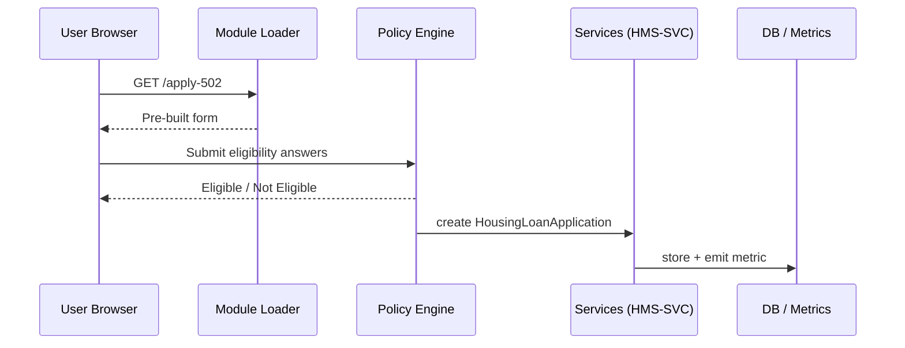

# Chapter 11: Domain-Specific Modules  
*A friendly sequel to* [Microservices Mesh (HMS-SYS)](10_microservices_mesh__hms_sys__.md)

---

## 1. Why Do We Need “Starter Kits” for Each Mission Area?

Picture the **USDA Rural Development** team.  
Congress just expanded the *Section 502 Direct Loan* program so more families can buy homes in rural America. USDA engineers must launch:

1. An eligibility screener  
2. A 20-page loan application  
3. Back-office dashboards for field officers  
4. Monthly outcome metrics for OMB

Building all of that **from scratch** could take months.

**Domain-Specific Modules (DSMs)** are plug-in “starter kits” that ship 60 % of that work out-of-the-box:

* The **Housing Module** already knows what *Section 502 Direct Loan* looks like—forms, fields, income rules, default dashboards.  
* A **Health Module** ships HIPAA-ready appointment objects.  
* A **Finance Module** comes with G/L account schemas and Treasury reports.  

Think of DSMs as the **pre-filled government forms** you grab at the clerk’s desk—just add your name and date instead of redrawing the entire form.

---

## 2. Key Concepts (Plain-English)

| Term | Beginner Explanation |
|------|----------------------|
| **Module** | A zip of templates (objects, forms, metrics) for one mission area—e.g., “housing”. |
| **Domain Object** | A reusable data model, like **“HousingLoanApplication”**. |
| **Eligibility Template** | Yes/No rules (“income ≤ 80 % of AMI”) expressed in YAML so PPE can execute them. |
| **Reporting Pack** | Pre-built SQL + dashboards that feed the Observability pipeline. |
| **Override File** | A tiny YAML where your agency tweaks text, limits, or labels—no code edits. |

---

## 3. Five-Minute Walk-Through: Launch a *Section 502* Screener

### 3.1 Install the Housing Module (2 lines)

```bash
hms dsm add housing          # fetches module
hms dsm list                 # verify it's installed
```

Expected CLI output (snippet):

```
housing  v1.4  ✓ installed  (objects: 12, forms: 5, metrics: 3)
```

### 3.2 Generate a New Program Skeleton (12 lines)

```bash
hms dsm init housing \
  --program "Section 502 Direct Loan" \
  --slug section_502
```

This command:

1. Copies domain objects (`HousingLoanApplication`, `Property`, `Applicant`)  
2. Copies eligibility template `section_502_elig.yaml`  
3. Generates UI forms under `ui/section_502/`  
4. Registers default metrics (e.g., **“Avg App Processing Days”**)

### 3.3 Tweak Only What’s Unique (Override File, 15 lines)

`overrides/section_502.yaml`

```yaml
HousingLoanApplication:
  max_loan_usd: 377600       # 2024 limit
  interest_rate: 4.75
eligibility:
  income_multiplier: 0.80    # 80 % of AMI
ui:
  theme_color: "#005e35"     # USDA green
```

Run:

```bash
hms dsm apply overrides/section_502.yaml
```

Result: the PPE, UI forms, and metrics ingest the new numbers—zero code edits.

### 3.4 Spin Up the Screener Locally

```bash
npm run portal -- --route /apply-502
```

Open `http://localhost:3000/apply-502` and you’ll see a ready-to-use form themed for USDA.

---

## 4. What Happens Under the Hood?



Only five actors keep the flow beginner-friendly.

---

## 5. Peek Inside a Module (Folder Snapshot)

```
housing/
 ├─ objects/
 │   └─ HousingLoanApplication.json
 ├─ eligibility/
 │   └─ section_502_elig.yaml
 ├─ forms/
 │   └─ housing_loan_form.json
 ├─ metrics/
 │   └─ processing_time.sql
 └─ README.md
```

### 5.1 Sample Eligibility Rule (≤ 20 lines)

```yaml
# housing/eligibility/section_502_elig.yaml
id: housing.section_502
if:
  - applicant.income_usd <= (county.ami_usd * overrides.income_multiplier)
  - applicant.credit_score >= 640
then: eligible
else: ineligible
```

Explanation:  
PPE reads this YAML; the placeholder `overrides.income_multiplier` resolves to **0.80** from your override file.

### 5.2 Minimal Loader Code (Python, 18 lines)

```python
# file: hms_dsm/loader.py
import importlib.resources as pkg, yaml

def load_module(mod_name):
    data = {}
    for part in ['objects', 'eligibility', 'forms', 'metrics']:
        for file in pkg.files(f"hms_dsm.{mod_name}.{part}").iterdir():
            data.setdefault(part, {})[file.name] = yaml.safe_load(file.read_text())
    return data
```

Explanation:  
* Walks each folder inside the module package.  
* Loads JSON/YAML into a dict.  
* Caller (`hms dsm init`) copies these pieces into your project folder.

---

## 6. How DSMs Plug into Other HMS Layers

| Layer | What DSM Provides |
|-------|-------------------|
| [Policy & Process Engine](04_policy___process_engine_.md) | Eligibility YAMLs auto-register as PPE policies. |
| [Interface Layer](01_interface_layer__hms_mfe___portals__.md) | JSON form definitions mount as MFEs. |
| [Management Layer](06_management_layer__hms_svc___hms_ach__.md) | Domain objects map to ready CRUD endpoints in HMS-SVC. |
| [Observability & Metrics Pipeline](13_observability___metrics_pipeline_.md) | Pre-built SQL feeds dashboards (“Loans by County”). |
| [Data Privacy & Compliance Layer](09_data_privacy___compliance_layer_.md) | Objects ship column labels so PII auto-masks in logs. |

---

## 7. Quick-Start Checklist

1. `hms dsm add <module>` (housing, health, finance…)  
2. `hms dsm init <module> --program "<name>"`  
3. Edit the generated **override YAML** with limits or colors.  
4. `hms dsm apply <override-file>`  
5. Run your portal and watch 60 % of the work already done!

---

## 8. Beginner FAQ

**Q: Can I mix modules (e.g., Housing *and* Finance)?**  
Yes. Each module lives in its own namespace; objects can reference one another.

**Q: What if my program needs a field that isn’t in the template?**  
Add it in the override file under the object’s schema; HMS regenerates the form and DB migration.

**Q: Are modules versioned?**  
Absolutely. Each module update lands in the [Versioned Policy Store](05_versioned_policy_store_.md). You can pin to `housing@v1.4` or roll back.

**Q: How big are modules?**  
Typically <2 MB—just text files and JSON schemas.

---

## 9. Summary & What’s Next

In this chapter you learned:

• DSMs are pre-configured bundles that jump-start new agency programs.  
• You installed the Housing Module and launched a *Section 502* screener with just a few CLI commands.  
• Eligibility rules, forms, and metrics all auto-wired into existing HMS layers.  
• Overrides let you customize limits, colors, or wording—no code needed.

Ready to see how an **AI Representative Agent** can now talk to those domain objects on behalf of citizens? Head over to [AI Representative Agent (HMS-A2A)](12_ai_representative_agent__hms_a2a__.md).

---

Generated by [AI Codebase Knowledge Builder](https://github.com/The-Pocket/Tutorial-Codebase-Knowledge)