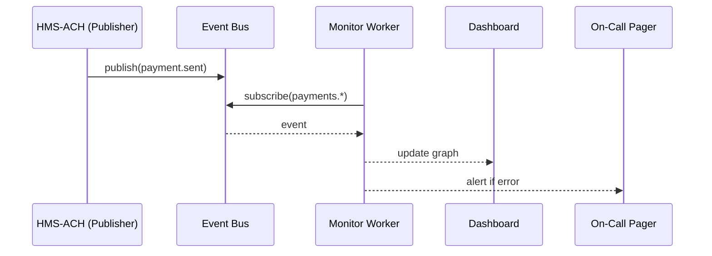

# Chapter 11: Event Bus & Real-Time Monitoring

[← Back to Chapter&nbsp;10: External System Bridge (Real-Time Sync Connectors)](10_external_system_bridge__real_time_sync_connectors__.md)

---

## 1. Why Do We Need a “Central Nervous System”?

### Use-Case — “Hurricane Ida One-Stop Relief”

1. A citizen taps **“Request Emergency Funds”** on the portal.  
2. `HMS-HLT` checks medical evacuation status.  
3. `HMS-ACH` wires \$1 000 to the citizen’s bank.  
4. The **Governor’s Dashboard** must show “💸 1 245 payments sent” _right now_, _not tomorrow morning_.  
5. If a payment fails or the bank API slows, an on-call operator needs a **blaring red alert** before the nightly news does.

Without a live **Event Bus** every service would have to call every dashboard, logger, and alerting tool directly—a tangled phone tree that nobody can debug at 2 a.m.  
The Event Bus turns all that point-to-point shouting into a calm, central “ticker tape” that everyone can read.

---

## 2. Key Concepts (Beginner Cheat-Sheet)

| Concept | Friendly Analogy | One-Line Description |
|---------|------------------|----------------------|
| Event | Tweet | A tiny JSON message: “payment_sent, amount=1000”. |
| Topic | Radio station | Events with the same subject (e.g., `payments.*`). |
| Publisher | Person with mic | Any service that **sends** events. |
| Subscriber | Person with radio | Any service or dashboard that **listens**. |
| Stream Retention | DVR rewind | How long old events are kept (e.g., 24 h). |
| Alert Rule | Smoke detector | Fires when an event matches a pattern (“error ≥ 5/min”). |

_Promise: memorize these six and you know 90 % of real-time systems._

---

## 3. First Taste — 16 Lines to Broadcast & Listen

```python
# file: quick_demo.py
from hms_bus import publish, subscribe

# 1) A service publishes an event
publish("payments.sent", {"user":"CIT-883", "amount": 1000})

# 2) A tiny monitoring script listens
def show(ev):
    print("🛰️  got event:", ev["topic"], ev["data"])

subscribe("payments.*", show)

# Keep the demo alive for 5 sec
import time; time.sleep(5)
```

**What will you see?**

```
🛰️  got event: payments.sent {'user': 'CIT-883', 'amount': 1000}
```

Nothing to configure, nothing to deploy—great for first-timers.

---

## 4. Anatomy of an Event

```json
{
  "ts"    : "2024-06-05T14:22:11Z",
  "topic" : "payments.sent",
  "data"  : {
    "user"  : "CIT-883",
    "amount": 1000
  },
  "src"   : "hms-ach",        // who emitted it
  "id"    : "evt-7c91"        // unique for replay / audit
}
```

Five keys—easy to remember.

---

## 5. What Happens Behind the Curtain?



Only five players; no tangled web.

---

## 6. Internal Implementation (Friendly Size)

### 6.1 File Layout

```
hms_bus/
 ├─ core.py        # in-memory pub/sub
 ├─ monitor.py     # rules → alerts
 └─ retention.py   # simple 24 h buffer
```

### 6.2 core.py — 20 Lines

```python
# Very small teaching stub (not production)
_subs = {}          # topic-pattern → [callback]

def publish(topic, data):
    evt = {"ts": _now(), "topic": topic, "data": data, "id": _uid()}
    retention.save(evt)                  # keep for 24 h rewind
    for pat, fns in _subs.items():
        if _match(topic, pat):
            for fn in fns: fn(evt)

def subscribe(pattern, fn):
    _subs.setdefault(pattern, []).append(fn)

# helpers -------------------------------------------------
import time, uuid, fnmatch
def _now(): return time.strftime("%Y-%m-%dT%H:%M:%SZ", time.gmtime())
def _uid(): return "evt-" + uuid.uuid4().hex[:6]
def _match(t, pat): return fnmatch.fnmatch(t, pat)
```

Beginners’ takeaways:  
* `publish` loops over subscribers and calls them—no networking in this stub.  
* `fnmatch` turns `payments.*` into a quick wildcard match.  
* `retention.save` (next snippet) lets dashboards rewind a few hours.

### 6.3 retention.py — 10 Lines

```python
_buf = []          # ring buffer
KEEP_SEC = 24*3600

def save(evt):
    _buf.append(evt)
    _expire()

def replay(pattern):
    return [e for e in _buf if _age(e)<KEEP_SEC and fnmatch.fnmatch(e["topic"], pattern)]

def _expire():
    now = time.time()
    while _buf and _age(_buf[0]) > KEEP_SEC:
        _buf.pop(0)

def _age(e): return time.time() - time.mktime(time.strptime(e["ts"],"%Y-%m-%dT%H:%M:%SZ"))
```

Now dashboards can **rewind** yesterday’s errors without hitting a database.

### 6.4 monitor.py — 18 Lines

```python
from hms_bus import subscribe, publish
import collections, time

WINDOW = 60             # seconds
THRESH = 5              # 5 errors per min
_counter = collections.deque()

def _on_err(evt):
    _counter.append(evt["ts"])
    _trim()
    if len(_counter) >= THRESH:
        publish("alerts.error_storm", {"count": len(_counter)})

def _trim():
    while _counter and _age(_counter[0]) > WINDOW:
        _counter.popleft()

def _age(ts):  # same helper logic as retention.py
    return time.time() - time.mktime(time.strptime(ts,"%Y-%m-%dT%H:%M:%SZ"))

# Start monitor
subscribe("*.error", _on_err)
```

If five `*.error` events arrive within 60 s we publish a new alert—nothing more to configure.

---

## 7. Connecting to Other Layers

| Layer | How It Uses the Bus |
|-------|---------------------|
| [Governance Layer](01_governance_layer__hms_gov__.md) | Publishes `proposal.approved / denied` so dashboards record policy flow. |
| [Management Layer](07_management_layer__service_orchestration__.md) | Emits `service.degraded` when a pod flaps. |
| [External Bridge](10_external_system_bridge__real_time_sync_connectors__.md) | Sends `bridge.partner.down` when a partner API fails ping. |
| [Compliance & Audit Ledger](14_compliance___audit_ledger_.md) | Listens to **all** events and snapshots them for auditors. |

---

## 8. Beginner FAQ

**Q: Do I need Kafka or RabbitMQ to follow this tutorial?**  
A: No— the stub above runs in pure Python. Swap it for Kafka later; your `publish` / `subscribe` calls stay the same.

**Q: What if two dashboards listen to the same topic—will that double the load?**  
A: Subscribers receive their own copy; the publisher sends only once.

**Q: Can I replay events from last week?**  
A: Production systems pipe everything into the [Compliance & Audit Ledger](14_compliance___audit_ledger_.md) for long-term storage; the simple `retention` buffer holds only 24 h.

**Q: How are alerts delivered?**  
A: The monitor publishes to `alerts.*`; an ops tool subscribes and routes to SMS, Slack, or the fancy NORAD-style wall.

---

## 9. Handy “Cheat Commands”

```python
# See last 10 payment events
for e in retention.replay("payments.*")[-10:]:
    print(e)

# Fire a manual test alert
publish("alerts.test", {"msg":"hello from ops"})
```

Try them in a REPL—instant gratification.

---

## 10. Quick Checklist

☑ `publish(topic, data)` sends an event; `subscribe(pattern, fn)` listens.  
☑ Retention buffer gives a 24 h DVR.  
☑ Monitor script turns error storms into alerts.  
☑ Other layers reuse the bus—no extra wiring.  
☑ Swappable back-end (stub today, Kafka tomorrow).

---

## 11. Conclusion & Next Steps

You now have a **ticker tape + radar screen** rolled into one: the Event Bus pumps every heartbeat from HMS-ACH to mission-control dashboards and 3 a.m. pagers.

Next we’ll catalog the **rules** that decide _which_ events matter, _how_ journeys are structured, and _what_ a “refund” even means in schema terms:  
[Policy & Process Registry](12_policy___process_registry_.md)

---

_You made it!_ 🛰️  Enjoy the live feed.

---

Generated by [AI Codebase Knowledge Builder](https://github.com/The-Pocket/Tutorial-Codebase-Knowledge)