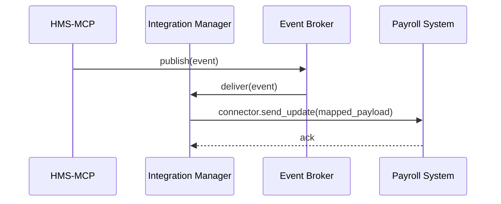

# Chapter 11: External System Integration

In [Chapter 10: Real-Time Synchronization](10_real_time_synchronization_.md) we learned how HMS emits events the moment a policy or process changes. Now let’s build the “airport connector train” that carries those updates automatically into outside systems—scheduling tools, payroll platforms, case-management apps—without anyone having to copy and paste.

## 11.1 Why We Need External System Integration?

Imagine the **Department of Veterans Affairs** approves a new staffing schedule. You want that change to:

- Land in the **payroll system** so hours are billed correctly.  
- Appear on the **calendar tool** so clinicians see their updated shifts.  
- Update the **case-management platform** so every caseworker has the new schedule.

External System Integration is the abstraction that wires HMS to these services. It’s like an automated train: once your update is green-lit, it pulls into each “station” (external API) in real time—no manual loading, no delays.

## 11.2 Key Concepts

1. **Connectors**  
   Small adapters that know how to talk to one external tool (e.g., payroll API, calendar webhook).

2. **Integration Manager**  
   The central hub that holds connectors and routes events to them.

3. **Event Mapping**  
   Translating HMS events into the format each system expects (field names, payload shape).

4. **Retry & Delivery Guarantee**  
   If a system is down, the manager retries until it succeeds, ensuring nothing gets lost.

## 11.3 Using External System Integration

Below is a minimal example of wiring up a connector for a payroll system and letting the Integration Manager push updates automatically.

```python
# 1. Define a simple PayrollConnector
class PayrollConnector:
    def send_update(self, payload):
        # Imagine this posts to https://payroll.gov/api/update
        print("Payroll API called with:", payload)
```

Explanation:  
We make a small class with a `send_update` method. In real life it would use `requests.post(...)`.

```python
# 2. Register the connector and handle an event
from hms_mcp.external_integration import IntegrationManager

manager = IntegrationManager()
manager.register_connector("staff_schedule_updated", PayrollConnector())

# 3. Simulate an event from HMS
event = {
  "type": "staff_schedule_updated",
  "data": {"employee_id": "E123", "new_shift": "2024-07-01T08:00"}
}
manager.handle_event(event)
```

Explanation:  
- We create `manager` and register our `PayrollConnector` for the `"staff_schedule_updated"` event type.  
- When we call `handle_event(...)`, the manager transforms the payload as needed and calls each connector’s `send_update` automatically.

## 11.4 What Happens Under the Hood



1. HMS emits an event into the **Event Broker** (from [Chapter 10](10_real_time_synchronization_.md)).  
2. The **Integration Manager** pulls the event and looks up its connectors.  
3. For each connector (e.g., payroll), it maps the data and calls `send_update`.  
4. On success, the external system acknowledges—and if it fails, the manager retries until it succeeds.

## 11.5 Internal Implementation

#### File: external_integration.py

```python
# external_integration.py
class IntegrationManager:
    def __init__(self):
        self.connectors = {}  # event_type -> [connector, ...]

    def register_connector(self, event_type, connector):
        self.connectors.setdefault(event_type, []).append(connector)

    def handle_event(self, event):
        for conn in self.connectors.get(event["type"], []):
            payload = self._map_event(event)
            self._deliver_with_retry(conn, payload)

    def _map_event(self, event):
        # Placeholder: adapt field names, wrap in envelope, etc.
        return event["data"]

    def _deliver_with_retry(self, connector, payload, retries=3):
        for attempt in range(retries):
            try:
                connector.send_update(payload)
                return
            except Exception:
                pass
        print("Failed to deliver after retries:", payload)
```

Explanation:  
- `register_connector` stores your adapters.  
- `handle_event` looks up connectors by event type, maps data, and calls each one.  
- `_deliver_with_retry` retries on failures.

#### File: payroll_connector.py

```python
# payroll_connector.py
import requests

class PayrollConnector:
    def send_update(self, payload):
        resp = requests.post("https://payroll.gov/api/update", json=payload)
        resp.raise_for_status()
```

Explanation:  
Your real connector would call the external API, check for HTTP errors, and raise exceptions for the manager to retry.

## 11.6 Summary & Next Steps

In this chapter you learned how **External System Integration**:

- Defines **connectors** to each outside service.  
- Uses an **Integration Manager** to listen for HMS events and push updates automatically.  
- Maps and retries payloads so nothing is lost—just like an automated airport train.

Next up: we’ll learn how to capture metrics and watch your integrations in action in [Chapter 12: Analytics & Monitoring](12_analytics___monitoring_.md).

---

Generated by [AI Codebase Knowledge Builder](https://github.com/The-Pocket/Tutorial-Codebase-Knowledge)