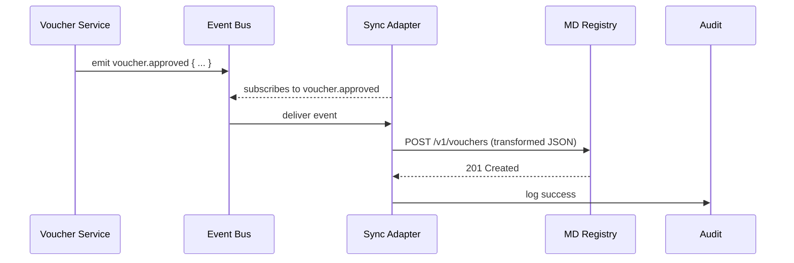

# Chapter 11: External System Sync Adapter  
*(Filename: 11_external_system_sync_adapter_.md)*  

[← Back to Chapter 10: Metrics & Observability Pipeline](10_metrics___observability_pipeline_.md)

---

## 1. Why Bother “Talking to the Neighbors”?

Imagine Maryland’s **Department of Health** already owns a rock-solid **Immunization Registry** built in 2003.  
Your brand-new HMS-MKT module for **Back-to-School Vaccination Vouchers** must:

1. Push every approved voucher into that registry (so nurses can see it).  
2. Pull nightly updates in case a child gets a new shot elsewhere.  
3. Keep a legally defensible audit trail (“who changed what, when”).  
4. Survive outages and *schema drift* (“the registry renamed `pat_last_nm` to `lname` last month!”).

Doing this by sprinkling HTTP calls across random places in your codebase is a recipe for spaghetti.  
Instead, you drop in one **External System Sync Adapter**—our diplomatic envoy that:

* Translates HMS-MKT events → legacy formats  
* Retries politely during outages  
* Records every handshake like a notary public  
* Surfaces metrics & alerts through the pipeline we met in [Metrics & Observability Pipeline](10_metrics___observability_pipeline_.md)

---

## 2. Big Ideas in Plain English

| Term               | Friendly Meaning (Embassy Analogy)                          |
|--------------------|-------------------------------------------------------------|
| Outbound Event     | A sealed envelope we send to the partner agency.            |
| Inbound Snapshot   | A dossier the partner agency sends back nightly.            |
| Mapping            | The translator’s dictionary (“voucher.id” → “DOCNUM”).      |
| Drift Strategy     | How to cope when the partner’s form changes unexpectedly.   |
| Audit Trail        | The notary’s logbook—cannot be erased.                      |
| Eventually Consistent | “Mail might be slow, but both offices end up in sync.” |

---

## 3. A 5-Minute “Hello Sync” Example

Goal:  
Whenever HMS-MKT approves a **School Voucher** record, push it to Maryland’s registry, and log success or failure.

### 3.1 One-Line Publish from Your Service (≤ 15 lines)

```js
// File: svc/voucherService.js  (snippet)
import { publish } from '@/sync/outbox.js'

export async function approveVoucher(rec) {
  // ...business validation...
  await db.save(rec)
  publish('voucher.approved', rec)   // <-- hand over to Sync Adapter
}
```

**What you just did:**  
1. Saved the record locally.  
2. Called `publish()`—no XML, no retries, nothing else to think about.

### 3.2 Minimal Adapter Config (YAML ≤ 12 lines)

```yaml
# File: sync/mappings/voucher_to_md.yml
event: voucher.approved
target: "MD Immunization Registry"
endpoint: "https://md.gov/immu/api/v1/vouchers"
map:
  id:       DOCNUM
  child.ssn: CHILD_SSN
  vaccine:  VAX_CD
retry:
  attempts: 5
  backoff:  "2,4,8,16,32"    # seconds
```

**What it says:**  
• When `voucher.approved` occurs, POST to the endpoint.  
• Rename fields as listed under `map`.  
• Retry up to 5 times, doubling the wait each time.

---

## 4. How the Adapter Works (Step-By-Step, No Code)



If MD’s server is down:

* ADP retries following the back-off plan.  
* After final failure it logs `status:FAILED` and raises a metric that Chapter 10 will alert on.

---

## 5. Peek Under the Hood (Tiny, Friendly Code)

### 5.1 Outbox Publisher (≤ 15 lines)

```js
// File: sync/outbox.js
import bus from '@/svc/eventBus.js'    // 🎟️ from Chapter 4

export function publish(type, payload){
  bus.emit(type, { ts:Date.now(), payload })
}
```

### 5.2 Adapter Worker (≤ 20 lines)

```js
// File: sync/adapterWorker.js
import bus from '@/svc/eventBus.js'
import cfg from './mappings/voucher_to_md.yml'
import fetch from 'node-fetch'

bus.on(cfg.event, async ({ payload }) => {
  const body = transform(payload, cfg.map)   // ① rename fields
  for (let i=0; i<cfg.retry.attempts; i++){
    try {
      const res = await fetch(cfg.endpoint,{
        method:'POST', headers:{'Content-Type':'application/json'},
        body: JSON.stringify(body)
      })
      if(res.ok){ return log('SUCCESS') }
    } catch {}
    await sleep(cfg.retry.backoff.split(',')[i]*1000)
  }
  log('FAILED')
})
```

Line-by-line:

1. Subscribe to the chosen event.  
2. `transform()` is a 3-line helper that applies the YAML `map` rules.  
3. Loop with exponential back-off until success or exhaustion.  
4. Call `log()`—see next snippet.

### 5.3 Tamper-Proof Audit Log (≤ 15 lines)

```js
// File: sync/audit.js
import fs from 'fs'
export function log(status, details={}){
  const rec = { status, ts:Date.now(), ...details }
  fs.appendFile('sync_audit.log', JSON.stringify(rec)+'\n', ()=>{})
}
```

Every entry (success or fail) is later digested by the [Metrics & Observability Pipeline](10_metrics___observability_pipeline_.md).

---

## 6. Handling Schema Drift (Renamed Fields)

Suppose next month the registry renames `CHILD_SSN` to `STU_SSN`.  
Fixing it = **one-line YAML edit**, not a code redeploy.

```diff
-  child.ssn: CHILD_SSN
+  child.ssn: STU_SSN
```

Hot-reloading watchers pick up the change, and new events flow correctly. Old audit logs still show the original mapping for forensic clarity.

---

## 7. Pulling Data *Into* HMS-MKT (Inbound Snapshot)

Some systems only allow nightly CSV dumps via SFTP (yes, really!).  
Add a **pull** mapping:

```yaml
# File: sync/inbound/md_students.yml
schedule: "0 3 * * *"    # 3 AM daily
source: "sftp://md.gov/imms/students.csv"
intoEvent: "student.vaccine_update"
parse:
  csv: true
```

The worker reads the file at 3 AM, converts each row into `student.vaccine_update` events, and publishes them on the same Event Bus so Program Modules can react.

---

## 8. Ties to Other HMS-MKT Layers

* **Event Bus** from [Management / Service Layer](04_management___service_layer__hms_api__hms_svc__.md) carries all sync traffic.  
* **RBAC** ([Chapter 5](05_authorization___role_based_access_control__rbac__.md)) issues a restricted token so the adapter may access only the registry endpoint(s).  
* **Governance Layer** ([Chapter 6](06_governance_layer__hms_gov__.md)) stamps each mapping file; un-stamped mappings refuse to load.  
* **Metrics Pipeline** ([Chapter 10](10_metrics___observability_pipeline_.md)) graphs `sync_success_total` & `sync_failure_total` so ops teams spot trouble fast.

---

## 9. Frequently Asked Questions

**Q: How many adapters can I run?**  
A: One per partner system. Just drop another YAML mapping and start a new worker.

**Q: What if the external API requires SOAP or XML?**  
A: Replace the tiny `fetch` call with a SOAP client—mapping logic stays identical.

**Q: Can I keep secrets (API keys) out of YAML?**  
A: Yes, reference environment variables:  
```yaml
headers:
  Authorization: "Bearer ${MD_API_TOKEN}"
```

**Q: How do I replay missed events after a long outage?**  
A: The adapter can record a local **outbox file**; restart with `--replay` to resend in order.

---

## 10. Recap

You learned how the **External System Sync Adapter**:

• Listens to HMS-MKT events and speaks the dialect of any legacy or partner system.  
• Handles retries, schema drift, and iron-clad audit logging with < 50 lines of code.  
• Fits neatly into the Event Bus, Governance, RBAC, and Metrics ecosystems you already know.

Ready to scale these adapters—and every other micro-service—across dozens of data centers?  
Hop to [Chapter 12: Microservice Mesh & Scalability Backbone](12_microservice_mesh___scalability_backbone_.md) →

---

---

Generated by [AI Codebase Knowledge Builder](https://github.com/The-Pocket/Tutorial-Codebase-Knowledge)