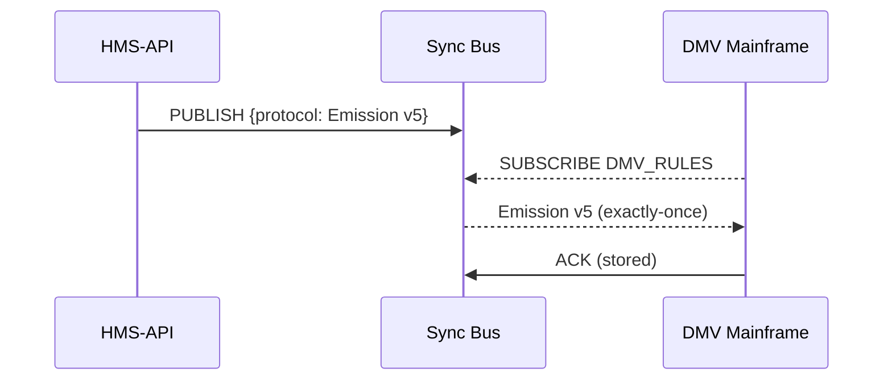
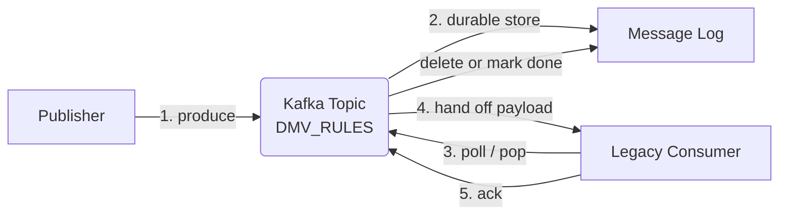

# Chapter 11: External System Sync Bus  
*(The always-on conveyor belt between HMS and every legacy tool in the building)*  

[← Back to “Compliance Reasoner (HMS-ESQ)”](10_compliance_reasoner__hms_esq__.md)

---

## 1. Why Bother With a “Sync Bus”? – A One-Minute Story  

At **3 PM** the *Compliance Reasoner* clears a new emission-testing rule for the **Department of Motor Vehicles (DMV)**.  
Yet the DMV still runs a **COBOL** batch job every night at **11 PM** on a mainframe.  
If that job does **not** contain the fresh rule set, tomorrow’s inspection stickers will be printed with yesterday’s standards—citizens get fined unfairly and reporters have a field day.

The **External System Sync Bus (simply “the Bus”)** is a **24 × 7 conveyor belt** that:

1. **Pushes** policy updates out of HMS the second they are approved.  
2. **Pulls** metrics or status files **back in** from those aging schedulers, SaaS tools, or mainframes.  
3. Guarantees “exactly-once” delivery so no system sees half-finished rules.  

Think of it as the **inter-office mail cart** that never stops rolling.

---

## 2. Beginner Glossary  

| Term             | Plain-English Meaning                            | Emoji |
|------------------|--------------------------------------------------|-------|
| **Connector**    | A plug that speaks one legacy protocol (FTP, CSV, SOAP…) | 🔌 |
| **Channel / Topic** | Named lane on the conveyor belt (e.g., `DMV_RULES`) | 📬 |
| **Envelope**     | Tiny JSON wrapper holding the real payload plus metadata (`program_id`, `revision`) | ✉️ |
| **Publisher**    | Service that **puts** envelopes on a channel     | 📤 |
| **Subscriber**   | Script or legacy app that **grabs** envelopes    | 📥 |
| **Ack**          | “Got it!” message—prevents duplicates           | ✅ |

If you can send a parcel and wait for a signed return card, you already understand the Bus.

---

## 3. The Core Use Case – DMV Nightly Job  



Result: when the mainframe wakes up at 23:00 it already owns **Emission v5**—no manual SFTP, no panic calls.

---

## 4. Publishing Your First Envelope (14 Lines)

```php
use HMS\Bus\Publisher;
use App\Models\Core\Protocol\Protocol;

// 1. Load the freshly-approved protocol
$proto = Protocol::latest('emission_testing');

// 2. Wrap it in an envelope
$env = [
    'channel'     => 'DMV_RULES',
    'program_id'  => $proto->program_id,
    'revision'    => $proto->revision,
    'payload'     => $proto->toJson(),
];

// 3. Drop it on the Bus
Publisher::to('kafka://bus:9092')->send($env);
```

Explanation  
1. `latest()` fetches the newest cleared rule.  
2. The envelope adds routing & version info.  
3. `send()` is protocol-agnostic; today it’s Kafka, tomorrow maybe NATS.

---

## 5. Consuming From a Legacy Cron (17 Lines, Bash)

Imagine the DMV only speaks **FTP + shell**:

```bash
#!/usr/bin/env bash
# nightly_emission_pull.sh
CHANNEL="DMV_RULES"
DEST="/opt/mainframe/rules/emission.json"

# 1. Poll the Bus REST shim (simplest demo)
curl -s "http://bus:8080/pop/$CHANNEL" -o /tmp/incoming.json

# 2. Exit if nothing new
[ ! -s /tmp/incoming.json ] && exit 0

# 3. Move file where COBOL expects it
mv /tmp/incoming.json "$DEST"

# 4. Ack so message disappears from the queue
MSG_ID=$(jq -r '.id' "$DEST")
curl -X POST "http://bus:8080/ack/$MSG_ID"
```

Even a 1990s mainframe can run a cron job like that—mission accomplished.

---

## 6. What Happens Under the Hood? (Five-Step Walkthrough)



Key points  
1. The payload is written **once** to the topic.  
2. The Bus keeps it until the consumer sends a proper **Ack**.  
3. If the consumer crashes, the envelope stays safe and will be redelivered.

---

## 7. A Tiny Peek Into the Code (≤ 18 Lines Each)

### 7.1  Envelope POJO – `app/Bus/Envelope.php`

```php
class Envelope
{
    public function __construct(
        public string $channel,
        public int    $program_id,
        public int    $revision,
        public string $payload,
        public string $id = '',
    ) {
        $this->id = $this->id ?: uniqid('bus_', true);
    }

    public function toJson(): string
    {
        return json_encode(get_object_vars($this));
    }
}
```

Simple data bag—only five properties plus an auto-generated ID.

---

### 7.2  Minimal Publisher – `app/Bus/Publisher.php`

```php
class Publisher
{
    public static function to(string $broker): self
    {
        return new self($broker);
    }

    public function __construct(private string $broker) {}

    public function send(array $env)
    {
        // delegate to chosen driver (Kafka here)
        $msg = new RdKafka\Message($env['channel'], 0, json_encode($env));
        $producer = new RdKafka\Producer(['metadata.broker.list' => $this->broker]);
        $producer->produce($msg);
        $producer->flush(1000);  // ms
    }
}
```

Beginners note: `RdKafka` is a thin PHP extension—you only need two method calls.

---

## 8. Hands-On Exercise (15 min)

1. **Spin up demo stack**

```bash
docker compose -f demo/compose-bus.yml up -d
```

(Starts Kafka + a REST shim at `localhost:8080`.)

2. **Publish a test envelope**

```bash
php artisan tinker
>>> Publisher::to('localhost:9092')->send([
... 'channel'=>'TEST',
... 'program_id'=>999,
... 'revision'=>1,
... 'payload'=>'{"hello":"world"}',
... ]);
```

3. **Consume**

```bash
curl localhost:8080/pop/TEST
# → JSON payload appears
```

4. **Ack**

```bash
curl -X POST localhost:8080/ack/<ID_FROM_PREVIOUS_STEP>
```

5. Repeat the `pop`—queue is now empty.  
You have just run a full publish → consume → acknowledge cycle!

---

## 9. How the Bus Touches Other Chapters

| Task | Which Chapter Provides the Data | Link |
|------|---------------------------------|------|
| Gets freshly cleared protocols | Compliance Reasoner | [Compliance Reasoner](10_compliance_reasoner__hms_esq__.md) |
| Uses Program IDs for routing  | Program Registry | [Program Registry](01_program_registry__program_model__.md) |
| Emits retry / failure metrics | Operations & Monitoring Layer | [Operations & Monitoring Layer](16_operations___monitoring_layer__hms_ops__.md) |
| Feeds aggregated metrics back  | Central Data Lake | [Central Data Lake](15_central_data_lake__hms_dta__.md) |

---

## 10. Government Analogy Cheat-Sheet

| Real Object | Sync Bus Equivalent |
|-------------|--------------------|
| Inter-office mail cart | The Bus itself |
| Manila envelope | JSON envelope |
| Department mail slot (“Finance”, “DMV”) | Channel / Topic |
| Signed delivery receipt | Ack |
| Lost mail search | Retry / redelivery logic |

---

## 11. What You Learned

✔ Why a **continuous Sync Bus** is vital for agencies running mainframes, SaaS, or cron jobs.  
✔ How to **publish** and **consume** envelopes in under 20 lines of code.  
✔ The behind-the-scenes **exactly-once** dance (store → pop → ack).  
✔ How the Bus meshes with earlier pieces like the **Compliance Reasoner** and **Operations Layer**.

Ready to see how multiple **agencies talk to each other**—not just to their own legacy tools?  
Continue to [Inter-Agency Bridge (HMS-A2A)](12_inter_agency_bridge__hms_a2a__.md).

---

Generated by [AI Codebase Knowledge Builder](https://github.com/The-Pocket/Tutorial-Codebase-Knowledge)