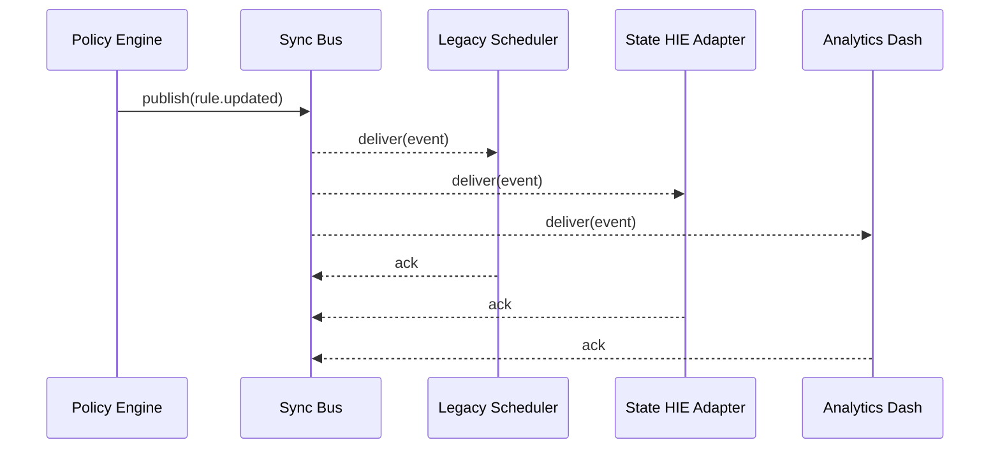

# Chapter 11: External System Synchronization Bus  
*(File: 11_external_system_synchronization_bus_.md)*  

[← Back to Policy & Process Engine](10_policy___process_engine_.md)

---

## 1 · Why Another “Bus”? — A 60-Second Story

It is 5 p.m. at **Evergreen General Hospital**.  
A compliance officer just changed the **discharge-instructions rule** inside the [Policy & Process Engine](10_policy___process_engine_.md):

*Add a mandatory “Fall-Risk Review” for every veteran over 70.*

Great—except:

1. **Legacy Scheduler** (built in 2002) must now book an extra nurse visit.  
2. **State Health Information Exchange (HIE)** must flag discharge summaries.  
3. **Analytics Dashboard** must start a new KPI: “Fall-Risk Completed %”.

If any of these systems sees the change tomorrow—or never—patients could be harmed and auditors will notice.  
The **External System Synchronization Bus (Sync Bus)** solves this by **fanning-out one event to many systems within seconds**, no matter who wrote the code or how old the server is.

> Think of the Sync Bus as a **nationwide emergency broadcast system**—  
> one button is pressed, radios, phones, and TVs *all* beep instantly.

---

## 2 · Key Concepts in Plain English

| Term | What it really means | Handy Analogy |
|------|----------------------|---------------|
| Event | A tiny fact (`rule.updated`) pushed on the bus | Breaking-news headline |
| Topic / Channel | Named pipe for events (`hospital.rules`) | Radio station frequency |
| Publisher | Component that **sends** events (our PPE) | News anchor |
| Subscriber | Component that **receives** events (scheduler, HIE, dashboard) | Radios & TVs |
| Adapter | Tiny script that translates event → vendor API | Foreign-language interpreter |
| Schema (NIEM-like) | Agreed JSON shape so everyone speaks the same | “Associated Press style” |
| At-Least-Once Delivery | Event is retried until ACKed | Certified mail |
| Replay | Ability to re-send old events for new subscribers | TV news archive |

---

## 3 · Quick-Start: Propagate the New Discharge Rule in 3 Steps

### Step 1 — Publish the Event (done by PPE)

```python
# file: ppe_hook.py   (runs inside Policy & Process Engine)
from sync_bus import publish

def on_rule_publish(rule_id):
    event = {
      "type": "rule.updated",
      "rule_id": rule_id,
      "timestamp": now_iso(),
      "author": current_user()
    }
    publish(topic="hospital.rules", event=event)
```

*What it does:*  
After any rule changes, PPE calls `publish()` → the Sync Bus stores the event and starts notifying listeners.

---

### Step 2 — Subscribe a Legacy Scheduler (10 lines)

```python
# file: legacy_scheduler_bridge.py
from sync_bus import subscribe, ack

def handle(evt):
    rule = evt["rule_id"]
    if rule.startswith("DISCHARGE"):
        call_scheduler_api("/add-step", {"step":"fall_risk"})
    ack(evt)                           # tell bus we processed it

subscribe(topic="hospital.rules", callback=handle)
```

*What it does:*  
1. Registers a **callback**.  
2. For every `rule.updated`, calls the 2002 scheduler’s REST API.  
3. Sends `ack()` so the bus knows delivery succeeded.

---

### Step 3 — Dashboard Wants Historical Data? Just **Replay**

```python
# file: dashboard_bootstrap.py
from sync_bus import replay

events = replay(topic="hospital.rules", since="2024-01-01")
for evt in events:
    update_kpi(evt)
```

*What it does:*  
Fetches every rule change since Jan 1 to back-fill the KPI—no CSV exports!

---

## 4 · Life of an Event (5 Actors, 5 Steps)



1. PPE **publishes** once.  
2. Bus **fans-out** to every subscriber.  
3. Each system **acknowledges** so the bus can drop it from the retry queue.

---

## 5 · Inside the Sync Bus — Minimal Implementation

### 5.1 In-Memory Broker (`sync_bus/broker.py` — 20 Lines)

```python
SUBS   = {}                  # topic ➜ [callbacks]
QUEUE  = []                  # pending events w/ retry count

def publish(topic, event):
    QUEUE.append({"topic":topic, "event":event, "retry":0})

def subscribe(topic, callback):
    SUBS.setdefault(topic, []).append(callback)

def ack(evt):
    evt["acked"] = True       # simple flag

def _dispatch():
    for evt in list(QUEUE):
        for cb in SUBS.get(evt["topic"], []):
            try:
                cb(evt["event"])
            except Exception:
                evt["retry"] += 1
                if evt["retry"] > 5:
                    log_dead_letter(evt)
            else:
                if evt.get("acked"):
                    QUEUE.remove(evt)
```

*Beginner takeaways:*  
• **Dictionary** holds subscribers.  
• **List** holds pending events.  
• `_dispatch()` loops every second (start a thread) and retries up to 5 times.  
• Failed forever? Goes to a **dead-letter queue** for human review.

---

### 5.2 NIEM-Lite Schema (1 Minute Read)

```jsonc
{
  "$id": "RuleUpdateEvent",
  "type": "object",
  "required": ["type","rule_id","timestamp"],
  "properties": {
    "type":      { "const": "rule.updated" },
    "rule_id":   { "type": "string" },
    "timestamp": { "type": "string", "format":"date-time" },
    "author":    { "type": "string" }
  }
}
```

*Why care?*  
All vendors validate against the same JSON Schema—exactly what the **National Information Exchange Model (NIEM)** promotes across U.S. agencies.

---

## 6 · Connecting a Really Old SOAP System (Adapter Pattern)

```python
# file: soap_adapter.py
import zeep        # SOAP client
from sync_bus import subscribe, ack

def to_soap(evt):
    client = zeep.Client("https://oldlab.gov/wsdl")
    client.service.MarkRuleUpdated(evt["rule_id"], evt["timestamp"])

subscribe("hospital.rules", lambda e: (to_soap(e), ack(e)))
```

*Tiny adapter = zero pressure on the 1999 codebase.*

---

## 7 · Security, Governance & Observability Hooks

| Concern | How the Sync Bus handles it | Linked Chapter |
|---------|-----------------------------|----------------|
| Who may **publish**? | Calls `check_permission()` before queuing event | [Governance Layer](01_governance_layer__hms_gov__.md) |
| Sensitive payloads | Bus encrypts event body at rest using SCF keys | [Security & Compliance Framework](03_security___compliance_framework_.md) |
| Audit trail | Every publish / delivery / ack appended to `sync_audit.log` | [Observability & Continuous Monitoring](14_observability___continuous_monitoring_.md) |
| Burst traffic | Back-pressure to publishers if queue > 10 000 | [Management Layer](02_management_layer__hms_sys___hms_svc__.md) |

---

## 8 · Common Pitfalls & Quick Fixes

| Pitfall | Symptom | Quick Fix |
|---------|---------|-----------|
| Subscriber never ACKs | Queue size grows, retries spike | Check adapter crash logs; remember to call `ack()` |
| Schema mismatch | “ValidationError: rule_id missing” | Validate events before publish; use shared JSON Schema |
| Legacy system offline | Retries flood logs | Add circuit-breaker around adapter, or pause that subscriber |
| Massive replay floods dashboard | DB CPU at 100 % | Use `replay()` with a date range, not `since="1970"` |

---

## 9 · Try It Yourself

1. `git clone` the repo and `cd examples/sync_bus/`.  
2. Run `python broker_demo.py` — starts the broker and two dummy subscribers.  
3. In a new terminal:

   ```python
   from sync_bus import publish
   publish("hospital.rules", {"type":"rule.updated","rule_id":"DISCHARGE-22"})
   ```

4. Watch both subscribers print the rule within **1 second**.  
5. Kill one subscriber, publish again, restart it, and run `replay()`—see it catch up automatically.

---

## 10 · What You Learned

✓ Why instant, reliable **fan-out** is crucial when rules change.  
✓ The core pieces: **publishers, topics, subscribers, adapters, schema, ACKs**.  
✓ A <20-line broker you can read at lunch.  
✓ How governance, security, and observability still wrap every message.  
✓ How to bolt on 2000-era SOAP services **without** touching their code.

Ready to scale this pattern inside our own micro-services?  
In the next chapter we’ll design the entire platform around events with the **Event-Driven Microservices Architecture**.

[Continue to Event-Driven Microservices Architecture](12_event_driven_microservices_architecture_.md)

---

Generated by [AI Codebase Knowledge Builder](https://github.com/The-Pocket/Tutorial-Codebase-Knowledge)