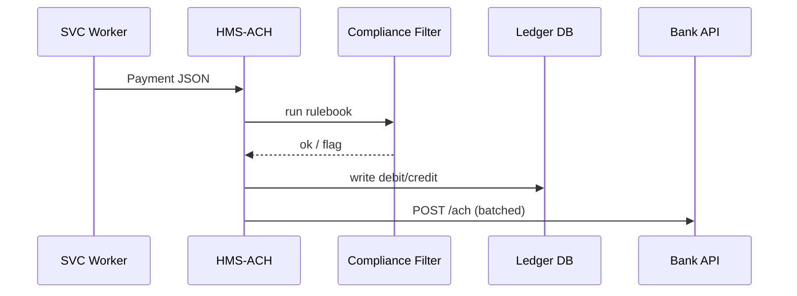

# Chapter 11: Financial Clearinghouse Core (HMS-ACH)

*(continues from [Backend Service Layer (HMS-SVC)](10_backend_service_layer__hms_svc__.md))*  

---

## 1. Why Do We Need HMS-ACH?

### A concrete story

Mrs. Rivera successfully appealed a $43.18 parking ticket.  
Per city statute the Transportation Bureau must:

1. Refund the **exact** amount within 3 business days.  
2. Update both the **City Treasury ledger** *and* the **Transportation sub-ledger**.  
3. Check that Mrs. Rivera is not on the “delinquent taxes” list (legal offset rule).  
4. Flag anything suspicious (e.g., 100+ refunds to the same bank in 1 day).

Trying to juggle all that with spreadsheets invites penny-off errors and audit nightmares.  
**HMS-ACH** is our **mini Federal Reserve ACH**, but tuned for government workflows:

```
UI / Bots ──▶ HMS-ACH ──▶  Bank Network
           ▲            └─▶  Agency Ledgers
           └── Suspicious events → HITL
```

Mrs. Rivera clicks “Submit Refund” once; HMS-ACH does the rest—balanced to the cent, logged for auditors, and blocked if shady.

---

## 2. Key Concepts (plain words)

| Term                     | What it really means | Analogy |
|--------------------------|----------------------|---------|
| Payment Instruction      | JSON that says “who, how much, why.” | Paper check request |
| Clearing Rulebook        | YAML list of “allow, deny, review” tests. | Bank teller checklist |
| Ledger                   | Table of debits (+) & credits (–). | Checkbook register |
| Batch Window             | Timed group of payments sent together. | Nightly mail bag |
| Suspicious Flag          | Tag added when a rule fires (e.g., >$10 k or rapid repeats). | Fraud alert sticker |
| Reconciliation Report    | Auto-generated diff that must be **$0.00**. | Cash drawer balance sheet |

---

## 3. Quick Start — Refund Mrs. Rivera in 18 Lines

```python
# refund.py
from hms_ach import ACH, Payment

ach = ACH(agency="Transportation")

payment = Payment(
    payee="Mrs Rivera",
    bank_routing="031000503",
    bank_account="983456123",
    amount=43.18,
    purpose="Parking refund #TCK-8821"
)

ticket = ach.send(payment)          # ❶ try to clear
print("🧾 ticket:", ticket.status)   # ❷ see result
```

Explanation  
❶ `send()` runs the instruction through rulebook + ledger logic.  
❷ Typical output:

```
🧾 ticket: CLEARED   (batch 2024-05-18-NIGHT)
```

If something is wrong (e.g., wrong account), `status` becomes `BLOCKED` and the HITL panel gets a card.

---

## 4. What Happens Behind the Scenes?



Only five hops, always in this order, all logged.

---

## 5. Peek Inside the Rulebook (YAML, 12 Lines)

```yaml
# rules/parking_refund.yaml
when: purpose startswith "Parking refund"
checks:
  - if amount > 1000:       flag: LARGE_REFUND
  - if payee in offset_list: block: TAX_DELINQUENT
  - if count(payee, 24h) > 3: review: RAPID_REPEAT
```

Drop a file like this in `rules/` and HMS-ACH hot-reloads—no restart.

---

## 6. Minimal Internals (all ≤ 20 lines!)

### 6.1 ACH.send (`hms_ach/core.py`, 18 lines)

```python
def send(self, pmt):
    rule = self._match_rule(pmt)
    verdict = rule.evaluate(pmt)            # CLEARED / BLOCKED / REVIEW
    ticket = Ticket(pmt, verdict)
    self._ledger(pmt, verdict)              # debit+credit rows
    if verdict == "CLEARED":
        self._queue_batch(pmt)
    elif verdict == "REVIEW":
        self._notify_hitl(pmt, ticket)
    return ticket
```

Beginner notes  
• `_match_rule()` picks the first YAML rule that matches the `purpose`.  
• `_ledger()` writes **two** rows: `(Treasury, –43.18)` and `(Transportation, +43.18)`.  
• `_queue_batch()` just appends to a local CSV; a cron job sends it nightly.

### 6.2 Suspicious-Flag Helper (`hms_ach/checks.py`, 10 lines)

```python
def rapid_repeat(payee, window_h=24, max=3):
    from datetime import datetime, timedelta
    now = datetime.utcnow()
    start = now - timedelta(hours=window_h)
    q = "SELECT COUNT(1) FROM ledger WHERE payee=? AND ts>?;"
    hits = db.execute(q, (payee, start.isoformat())).fetchone()[0]
    return hits > max
```

Less than 10 lines yet catches refund spam.

### 6.3 Reconciliation CLI (`bin/reconcile`, 12 lines)

```python
#!/usr/bin/env python
from hms_ach import ledger

total = sum(r.amount for r in ledger.rows() if r.posted_today())
if round(total, 2) == 0.00:
    print("✅ Ledgers balanced to the cent.")
else:
    print("⛔ Off by", total)
```

Run nightly; auditors sleep easy.

---

## 7. Trying a Suspicious Case (Hands-On)

```python
# suspicious.py
from hms_ach import ACH, Payment

ach = ACH(agency="WageAndHour")  # demo agency

for _ in range(5):               # 5 rapid payouts!
    ach.send(Payment(
        payee="ACME Ltd",
        bank_routing="021000021",
        bank_account="77665544",
        amount=9999.99,
        purpose="Back-wage settlement"
    ))
```

After the 4th send you’ll see:

```
Ticket #5 → REVIEW (flag: RAPID_REPEAT)
HITL dashboard card created
```

The refund stops until a human approves.

---

## 8. How HMS-ACH Fits with Other Layers

| Layer | Interaction |
|-------|-------------|
| [HMS-SVC](10_backend_service_layer__hms_svc__.md) | Enqueues `Payment` jobs that call `ach.send()` |
| [Governance Layer](05_governance_layer___ai_values_framework_.md) | HMS-ACH invokes `vet()` before pushing to bank API |
| [HITL Panel](04_human_in_the_loop__hitl__control_panel_.md) | Receives “REVIEW” tickets with approve/veto buttons |
| [Observability & Metrics](14_observability___metrics_stack__hms_ops__.md) | Graphs batch size, failures, flagged % |
| [Secure Infrastructure Core](15_secure_infrastructure_core__hms_sys__.md) | Stores immutable hash of every ledger row |

---

## 9. Frequently Asked Questions

**Q: Where is real money moved?**  
A: HMS-ACH posts an **ACH file** (NACHA format) to your banking partner’s SFTP or API each batch window.

**Q: Can I run multiple daily batches?**  
A: Yes—set `batch_window="hourly"` when instantiating `ACH()`.

**Q: What if a payment bounces?**  
A: Bank returns a code; HMS-ACH changes ticket status to `RETURNED` and emits an event to [HMS-ACT](07_activity_orchestrator__hms_act__.md).

**Q: Does this replace my ERP?**  
A: No. Think of HMS-ACH as the **traffic cop**; the ERP (or [Central Data Repository](12_central_data_repository__hms_dta__.md)) remains the source of truth.

---

## 10. Wrap-Up

In this chapter you:

• Met **HMS-ACH**, the penny-perfect clearinghouse.  
• Refunded a parking ticket in one tiny script.  
• Saw YAML rules catch large or rapid payments.  
• Learned how ledgers reconcile and how suspicious items hit the HITL dashboard.

Next we’ll see **where all those ledger rows actually live** in a single source of truth:  
[Central Data Repository (HMS-DTA)](12_central_data_repository__hms_dta__.md)

Welcome to stress-free, audit-ready money movement!

---

Generated by [AI Codebase Knowledge Builder](https://github.com/The-Pocket/Tutorial-Codebase-Knowledge)