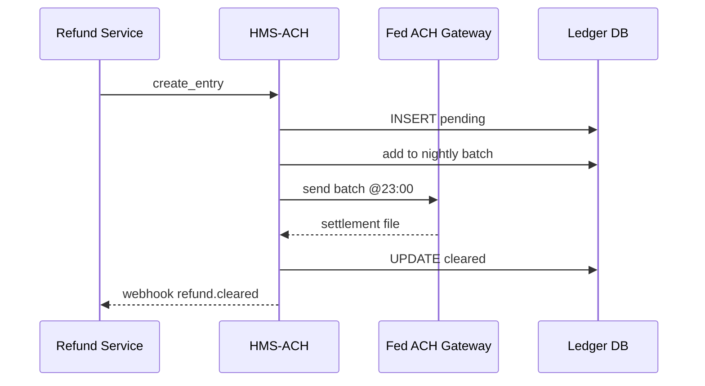

# Chapter 11: Financial Transaction & Clearinghouse (HMS-ACH)

[← Back to Chapter 10: External System Integrations & Real-Time Sync](10_external_system_integrations___real_time_sync_.md)

---

## 1. Why Do We Need a “Digital Federal Reserve”?

Imagine the **Internal Revenue Service (IRS)** must push **10 000 tax-refunds** tonight—each directly into a citizen’s bank account.  
If one penny is lost or an account is hit twice, the Treasury Inspector General will call at 6 a.m. 🥴

HMS-ACH is our **in-house Federal Reserve**:

* Moves money (ACH, wires, intra-agency journals)  
* Reconciles every ledger in real time  
* Audits **every** cent and flags weird patterns for anti-fraud agents

One API, one ledger, zero spreadsheet juggling.

---

## 2. Five Key Concepts (Sticker-Note Simple)

| Concept            | Government Analogy                 | One-Line Meaning |
|--------------------|-------------------------------------|------------------|
| Settlement Account | Treasury’s Cash Drawer             | Holds actual dollars at a partner bank or Fed. |
| Ledger Entry       | “Official Receipt”                 | Immutable record: who, what, when, how much. |
| Batch              | Nightly bag of checks              | Group of entries settled together for lower fees. |
| Compliance Rule    | GAO Audit Checklist                | SQL or code that must stay true (e.g., no duplicate payees). |
| Alert              | OIG Ping                           | Auto-message when a rule is violated. |

Keep these five in mind—the rest is plumbing.

---

## 3. Walk-Through Use Case: Issuing a \$100 Tax-Refund

### 3.1 High-Level Steps

1. Refund service calls HMS-ACH: “Send \$100 to Alice, routing 0210…”.  
2. HMS-ACH writes a **pending Ledger Entry** with a unique ID.  
3. Entry is added to tonight’s **Batch**.  
4. At 11 p.m. the batch is sent to the Fed ACH network.  
5. On settlement, HMS-ACH flips status → **cleared** and publishes `refund.cleared` for dashboards.

### 3.2 Public API (18 lines)

```python
# file: svc/refund.py
from hms_ach import Client     # pip install hms-ach

ach = Client(base_url="http://ach")

refund = {
    "payee":   "Alice Smith",
    "amount":  100_00,               # cents
    "routing": "021000021",
    "account": "987654321",
    "purpose": "TAX_REFUND_2024"
}

entry_id = ach.create_entry(refund)
print(entry_id)                     # "ledg_9ab1..."
```

**What happened?**

* `create_entry()` validates routing/account, stores a **Ledger Entry**, and returns an ID.  
* No money moves yet—it waits for the nightly Batch.

### 3.3 Querying Status (6 lines)

```python
status = ach.get_status(entry_id)
print(status)      # {"state":"cleared", "settled_at":"2024-04-15T02:01Z"}
```

---

## 4. What Happens Under the Hood?



Only four actors—easy to follow.

---

## 5. Peeking Inside the Engine Room

### 5.1 Ledger Table (8 lines)

```sql
CREATE TABLE ledger (
  id          TEXT PRIMARY KEY,
  payee       TEXT,
  amount_cents INT,
  routing     TEXT,
  account     TEXT,
  state       TEXT,        -- pending | cleared | failed
  created_at  TIMESTAMP,
  settled_at  TIMESTAMP
);
```

*Immutable*: updates only change `state/settled_at`, never amount.

### 5.2 Batch Builder (15 lines)

```python
# file: hms_ach/batch.py
def nightly_batch():
    rows = db.fetch("SELECT * FROM ledger WHERE state='pending'")
    ach_file = generate_nacha(rows)      # create NACHA text
    resp = fed_gateway.send(ach_file)    # SFTP or API
    if resp.ok:
        for r in rows:
            db.update("ledger", r.id, state="cleared",
                      settled_at=utcnow())
```

• `generate_nacha()` returns a standard NACHA file—<50 lines of helper code, not shown.  
• One loop marks every entry cleared after bank ACK.

### 5.3 Compliance Rule Example (12 lines)

```python
# file: hms_ach/compliance.py
DUP_RULE = """
SELECT payee, count(*) c
FROM ledger
WHERE created_at::date = CURRENT_DATE
GROUP BY payee HAVING count(*) > 1;
"""

def check_duplicates():
    rows = db.fetch(DUP_RULE)
    if rows:
        ach.alert("dup_payout", rows)   # sends to Governance Layer
```

Runs hourly; auditors see live alerts in the HITL console  
([Governance Layer & HITL](03_governance_layer___human_in_the_loop__hitl__.md)).

---

## 6. Handling Failures & Reversals

```python
# reverse.py (17 lines)
from hms_ach import Client

ach = Client("http://ach")
entry = ach.get(entry_id)

if entry["state"] != "cleared":
    raise ValueError("Not settled yet")

rev_id = ach.reverse(entry_id, reason="Wrong account")
print(rev_id)          # new ledger entry with negative amount
```

* `reverse()` creates a **negative Ledger Entry** in tonight’s batch.  
* Compliance Rule auto-links reversal → original, so audits are clean.

---

## 7. How HMS-ACH Hooks Into Other Layers

| Layer | Interaction Example |
|-------|---------------------|
| [HMS-OMS / HMS-ACT](07_workflow_orchestration___task_queues__hms_oms___hms_act__.md) | Workflow step `charge_fee` posts to HMS-ACH instead of Stripe. |
| [HMS-DTA](05_data___privacy_management_hub__hms_dta__.md) | Bank-account fields are tagged **restricted**; DTA ticket required before viewing raw ledger rows. |
| [HMS-A2A](09_inter_agency_communication_bus__hms_a2a__.md) | Another agency can query `entry_status` via an A2A channel without DB access. |
| [HMS-ESQ](04_compliance___legal_reasoning_engine__hms_esq__.md) | Before creating an entry, HMS-ACH can ask ESQ: “Is paying \$10 000 cash advance legal?” |

Everything still respects the **three-floor** pattern from [Chapter 1](01_multi_layered_system_architecture_.md).

---

## 8. Hands-On Lab (90 Seconds)

```bash
git clone hms-utl
cd hms-utl/demo
docker compose up ach fed_mock     # Postgres + fake Fed gateway

# 1. Create a refund
python examples/create_refund.py   # wraps code from §3.2

# 2. Run nightly batch (manually for demo)
python hms_ach/batch.py

# 3. Watch cleared event
tail -f logs/ach_events.log        # shows refund.cleared
```

You just moved “money” in three commands!

---

## 9. Recap & What’s Next

You learned:

✓ Why HMS-ACH is our **in-house settlement bank**  
✓ Five core concepts: Settlement Account, Ledger Entry, Batch, Compliance Rule, Alert  
✓ How to create payments, track status, and auto-reverse errors  
✓ What happens inside: ledger row → batch → Fed gateway → cleared  
✓ How compliance rules surface anomalies to the Governance team

Ready to build citizen-facing screens that show “Refund Sent ✅” in real time?  
Head over to [Chapter 12: Micro-Frontend Interface Library (HMS-MFE)](12_micro_frontend_interface_library__hms_mfe__.md).

---

---

Generated by [AI Codebase Knowledge Builder](https://github.com/The-Pocket/Tutorial-Codebase-Knowledge)