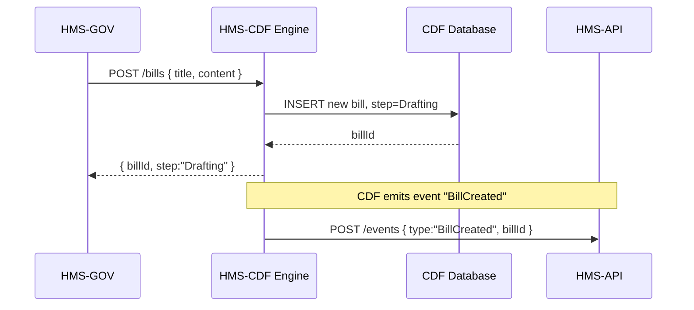

# Chapter 11: HMS-CDF (Legislative Engine)

Welcome back! In [Chapter 10: HMS-GOV (Admin Frontend)](10_hms_gov__admin_frontend__.md) we saw how administrators draft and publish policies. Now we’ll meet **HMS-CDF**, our Rust-based “high-speed parliamentary clerk” that codifies laws and policies in real time, enforcing the full 10-step legislative workflow.

---

## 1. Motivation: Why a Legislative Engine?

Every law goes through many formal stages—drafting, committee reviews, votes, reconciliation, and final implementation. Traditionally this takes months or years, with stacks of paper moving between offices. HMS-CDF automates and tracks each of these 10 steps instantly, ensuring:

- Complete audit trails (who did what, when)  
- Enforcement of procedural rules (no skipping steps)  
- Real-time status updates in HMS-GOV and other domains  

**Central Use Case**  
A policy-maker writes an “Emergency Housing Subsidy” bill in HMS-GOV. When they click **Submit Draft**, HMS-CDF:
1. Saves the draft  
2. Notifies committee agents  
3. Collects votes  
4. Runs reconciliation if votes conflict  
5. Marks the bill as **Implemented** and tells citizen portals to update forms  

This all happens without manual file-shuffling—just a few API calls.

---

## 2. Key Concepts

### 2.1 The 10-Step Legislative Workflow

HMS-CDF enforces these standard steps:

1. Drafting  
2. Committee Review  
3. First Vote  
4. Amendment Phase  
5. Second Vote  
6. Reconciliation  
7. Final Vote  
8. Executive Sign-off  
9. Implementation Planning  
10. Deployment  

Think of these like ten checkpoints on a relay race track. HMS-CDF makes sure no team jumps ahead before the baton arrives.

### 2.2 The CDF Engine

- A **Rust** service compiled to a single binary.  
- Provides an HTTP API (using Rocket or Actix).  
- Maintains an internal database of **Bill** records and their current step.  

### 2.3 Integration Points

- **HMS-GOV**: front-end calls HMS-CDF to advance steps or query status.  
- **HMS-API**: other services can fetch bill metadata or subscribe to events.  
- **Notifications**: committee agents and citizen portals receive real-time updates.

---

## 3. Using HMS-CDF to Advance a Bill

Below is a minimal example showing how HMS-GOV calls HMS-CDF when an admin submits a draft.

### 3.1 Submit a Draft

```js
// hms-gov/services/legislativeApi.js
import axios from 'axios';

export function submitDraft(billData) {
  return axios.post('https://cdf.gov-ai.co/bills', billData)
    .then(res => res.data); // returns { billId, step: "Drafting" }
}
```

*This call creates a new bill record in the CDF engine and returns its initial status.*

### 3.2 Cast a Vote

```js
// After committee review, cast a vote
export function castVote(billId, vote) {
  return axios.post(`https://cdf.gov-ai.co/bills/${billId}/vote`, { vote })
    .then(res => res.data); // returns updated step or reconciliation info
}
```

*Each call moves the bill through the workflow or triggers reconciliation if needed.*

---

## 4. What Happens Under the Hood?



1. HMS-GOV POSTs a new bill.  
2. CDF stores it with step **Drafting**.  
3. CDF returns the bill ID and step.  
4. CDF notifies HMS-API about the new bill for other domains to react.

---

## 5. Inside HMS-CDF: Core Rust Modules

### 5.1 Entry Point (`src/main.rs`)

```rust
// src/main.rs
#[macro_use] extern crate rocket;
mod engine;

#[post("/bills", data = "<bill>")]
fn create_bill(bill: String) -> String {
    engine::create_bill(bill) // simple string for brevity
}

#[post("/bills/<id>/vote", data = "<vote>")]
fn vote(id: u64, vote: String) -> String {
    engine::cast_vote(id, vote)
}

#[launch]
fn rocket() -> _ {
    rocket::build().mount("/", routes![create_bill, vote])
}
```

*We mount two routes: one to create a bill and one to cast a vote.*

### 5.2 Engine Logic (`src/engine.rs`)

```rust
// src/engine.rs
use std::collections::HashMap;
static mut DB: Option<HashMap<u64, String>> = None;

pub fn create_bill(content: String) -> String {
    unsafe {
        let db = DB.get_or_insert(HashMap::new());
        let id = db.len() as u64 + 1;
        db.insert(id, "Drafting".into());
        format!("{{\"billId\":{},\"step\":\"Drafting\"}}", id)
    }
}

pub fn cast_vote(id: u64, vote: String) -> String {
    // Simplified: on any vote, move to "Committee Review"
    unsafe {
        if let Some(step) = &mut DB.as_mut().unwrap().get_mut(&id) {
            *step = "Committee Review".into();
            return format!("{{\"billId\":{},\"step\":\"{}\"}}", id, step);
        }
    }
    "{\"error\":\"Bill not found\"}\"".into()
}
```

- We use a simple in-memory `HashMap` as our “database.”  
- `create_bill` assigns an ID and marks the first step.  
- `cast_vote` updates the step to the next stage.  

In a real setup, you’d use a persistent database and full logic for all 10 steps.

---

## 6. Conclusion

You’ve learned how **HMS-CDF** acts as a real-time legislative engine—a Rust service that codifies laws, enforces every procedural step, and integrates with both [HMS-GOV](10_hms_gov__admin_frontend__.md) and [HMS-API](06_hms_api__backend_api__.md). Next up, we’ll dig into the detailed **Legislative Process Workflow** and see each of the 10 steps in action.  
→ [Chapter 12: Legislative Process Workflow](12_legislative_process_workflow_.md)

---

Generated by [AI Codebase Knowledge Builder](https://github.com/The-Pocket/Tutorial-Codebase-Knowledge)