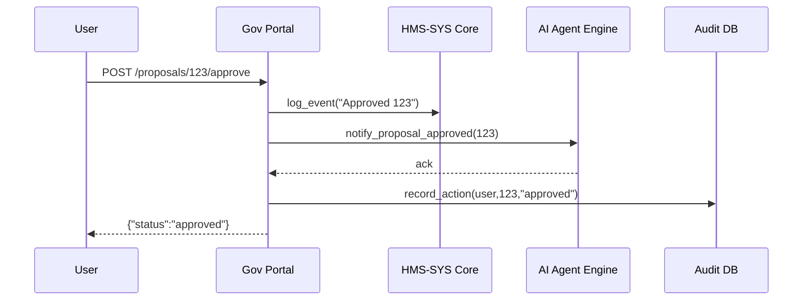

# Chapter 11: HMS-GOV Admin/Gov Portal

In [Chapter 10: HMS-MFE Frontend Interface Library](10_hms_mfe_frontend_interface_library_.md) we saw how to build consistent UIs. Now we’ll create the **HMS-GOV Admin/Gov Portal**—the command center where human decision makers and stakeholders review AI proposals, tweak policies, and approve changes, all with full oversight and accountability.

---

## 1. Motivation: Why an Admin/Gov Portal?

Imagine the Energy Information Administration (EIA) uses AI agents to propose updates to its data‐reporting rules. Without a central portal:

- Officials must chase emails and spreadsheets for AI suggestions  
- It’s hard to see which proposals are pending, approved, or rejected  
- Auditors can’t trace who did what and when  

**HMS-GOV Admin/Gov Portal** solves this by giving a single web app where:

- Officials log in, see a live list of AI proposals  
- They can view details, adjust parameters (e.g. change “max retries” from 3 to 2)  
- They approve or reject, with every action logged for audit purposes  

Think of it like a government command room: one dashboard, clear controls, and complete traceability.

---

## 2. Key Concepts

1. **Authentication & Roles**  
   Officials log in with roles (Reviewer, Approver), managed via [HMS-SYS Core Infrastructure](01_hms_sys_core_infrastructure_.md).

2. **Proposal Queue**  
   A live list of policy or process suggestions generated by AI agents ([Chapter 7](07_hms_a2a_ai_agent_framework_.md)).

3. **Policy Editor**  
   A simple form or slider UI to tweak proposal parameters before final approval.

4. **Audit Log**  
   Every review and action is sent to the central log system for compliance ([Chapter 1](01_hms_sys_core_infrastructure_.md)).

5. **Notification**  
   Email or in‐app alerts when new proposals arrive or decisions are made.

---

## 3. Using the HMS-GOV Portal

Let’s walk through a minimal example: logging in, listing proposals, editing, and approving.

### 3.1 Initialize and Authenticate

```python
# admin_portal.py (Flask app)
from flask import Flask, request, render_template
from hms_sys import CoreClient

app = Flask(__name__)
core = CoreClient(base_url="https://core.gov.example")
```
This sets up Flask and points to HMS-SYS for authentication and logging.

Next, we authenticate when a user visits the portal:

```python
@app.route("/login", methods=["POST"])
def login():
    creds = request.form  # username & password
    user = core.authenticate_user(creds["user"], creds["pass"])
    # Store user info in session (omitted)
    return render_template("dashboard.html", user=user)
```
After login, we have `user.role` (e.g., `reviewer`, `approver`) to control access.

### 3.2 List Pending Proposals

```python
@app.route("/proposals")
def list_proposals():
    # Fetch proposals from AI engine (simplified)
    proposals = fetch_ai_proposals()  
    return render_template("proposals.html", proposals=proposals)
```
*`proposals` is a list of dicts: `{id, title, detail, status}`. We render them with a table component from [HMS-MFE](10_hms_mfe_frontend_interface_library_.md).*

### 3.3 Edit and Approve

```python
@app.route("/proposals/<id>/edit", methods=["POST"])
def edit_proposal(id):
    changes = request.json  # e.g. {"max_retries": 2}
    update_proposal(id, changes)  # saves draft
    core.log_event("gov-portal","INFO",
        f"User edited proposal {id}: {changes}")
    return {"status":"saved"}

@app.route("/proposals/<id>/approve", methods=["POST"])
def approve(id):
    set_status(id, "approved")
    core.log_event("gov-portal","INFO",f"Approved proposal {id}")
    return {"status":"approved"}
```
This gives reviewers a simple JSON API behind the scenes; the UI uses components like `<Form>`, `<Button>`, and `<Table>` from [HMS-MFE](10_hms_mfe_frontend_interface_library_.md).

---

## 4. Internal Workflow

Here’s what happens when an official approves a proposal:



1. **User** clicks “Approve”  
2. **Portal** logs the action in **HMS-SYS Core**  
3. Portal notifies the **AI Agent Engine** so it stops re‐suggesting it  
4. Portal writes a local **Audit DB** record for quick queries  
5. Portal returns status to the user

---

## 5. Under the Hood: Core Code Snippet

Here’s a simplified file structure:
```
hms_gov/
 ├── admin_portal.py    # Main Flask app
 ├── templates/
 │   ├── dashboard.html
 │   └── proposals.html
 └── utils.py           # fetch/update helpers
```

And a peek at `utils.py`:

```python
# utils.py
AI_SERVICE = "hms-a2a-engine"

def fetch_ai_proposals():
    # Discover engine via HMS-SYS
    info = core.discover_service(AI_SERVICE)
    # Simplified HTTP GET call to AI engine
    resp = http_get(host=info["host"], port=info["port"], path="/proposals",
                    token=core.token)
    return resp.json()

def update_proposal(id, changes):
    # send patch to engine or local store (omitted)
    pass

def set_status(id, status):
    # mark as approved/rejected
    pass
```
We rely on service discovery and auth from [HMS-SYS Core Infrastructure](01_hms_sys_core_infrastructure_.md).

---

## 6. Conclusion

In this chapter you learned how to build the **HMS-GOV Admin/Gov Portal**:

- Authenticate officials and enforce roles  
- List, edit, and approve AI proposals in one web app  
- Log every action through [HMS-SYS Core Infrastructure](01_hms_sys_core_infrastructure_.md)  
- Integrate with AI agents and keep a local audit trail  

Next up, we’ll dive into handling payments and financial workflows in:

[Chapter 12: HMS-ACH Payment & Finance](12_hms_ach_payment___finance_.md)

---

Generated by [AI Codebase Knowledge Builder](https://github.com/The-Pocket/Tutorial-Codebase-Knowledge)