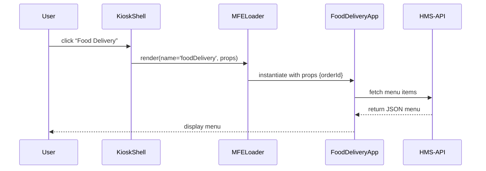
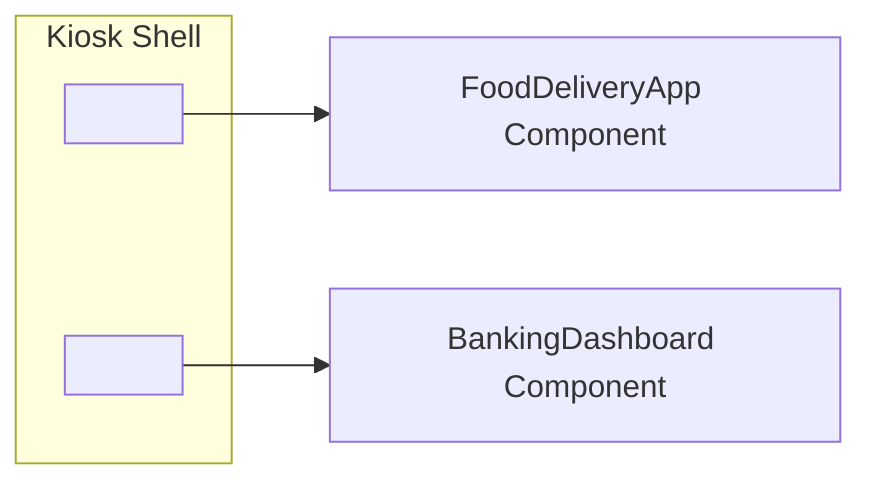

# Chapter 11: HMS-MFE (Micro-Frontends)

In [Chapter 10: HMS-MKT (Public Marketplace Frontend)](10_hms_mkt__public_marketplace_frontend__.md) we built a citizen-facing catalog and enrollment wizard. Now we’ll learn how to break that UI into **embeddable pieces**—**Micro-Frontends**—so different programs (dashboards, wizards, apps) can plug into a common shell, like modules on a self-service kiosk.

---

## 1. Motivation & Central Use Case

Imagine a government **Modular Kiosk** in a city hall lobby. It can host multiple apps:

- A **Food Delivery** interface for cafeteria orders.
- A **Banking Dashboard** for tracking stimulus payments.
- A **Parking Permit Wizard** for residents.

Rather than loading a full Vue app each time, the kiosk shell dynamically **embeds** these specialized components. End users see a smooth interface for each service without ever leaving the kiosk program.

---

## 2. Key Concepts

- **MFE Component**: A standalone Vue component (dashboard, wizard, app).  
- **Host App / Shell**: The main Vue application that embeds MFEs.  
- **Registry**: A lookup table mapping MFE names to code bundles.  
- **Loader**: A small loader that fetches and renders the MFE in the shell.

---

## 3. Using HMS-MFE to Build a Kiosk

### 3.1 Define an MFE Component

Create a folder under `src/mfe/`. Here’s a tiny Food Delivery widget:

```js
// src/mfe/foodDelivery/index.js
export default {
  name: 'FoodDeliveryApp',
  props: ['orderId'],
  template: `
    <div>
      <h3>Order #{{ orderId }}</h3>
      <p>Select items and pay at the counter.</p>
    </div>
  `
}
```
This exports a Vue component that the shell can use.

### 3.2 Register the MFE

In a simple registry file:

```js
// src/mfe/registry.js
import FoodDeliveryApp from './foodDelivery'
// future MFEs: import BankingDashboard from './bankingDashboard'
const registry = { foodDelivery: FoodDeliveryApp }
export function getMFE(name) { return registry[name] }
```
The registry maps names (strings) to component objects.

### 3.3 Build an MFE Loader

A reusable Vue wrapper that renders any MFE:

```html
<!-- src/app/components/MFELoader.vue -->
<template>
  <component :is="mfe" v-bind="props"/>
</template>
<script>
import { getMFE } from '../../mfe/registry'
export default {
  props: ['name', 'props'],
  computed: { mfe() { return getMFE(this.name) }}
}
</script>
```
Pass `name="foodDelivery"` and `:props="{orderId: 42}"` to load that widget.

### 3.4 Embed an MFE in the Shell

In your shell’s template:

```html
<template>
  <div>
    <h2>City Hall Kiosk</h2>
    <MFELoader 
      name="foodDelivery" 
      :props="{ orderId: 42 }"/>
  </div>
</template>
```
The shell stays minimal—simply loads whatever MFE you register.

---

## 4. Under the Hood: Loading Flow

Here’s what happens when a user taps “Food Delivery” on the kiosk:


1. **Shell** tells **MFELoader** which component to render.  
2. **MFELoader** looks up code in the registry.  
3. **FoodDeliveryApp** mounts and calls the backend as needed.

---

## 5. Deeper Dive: Dynamic Imports

To lazy-load MFEs only when needed:

```js
// src/mfe/registry.js
export async function loadMFE(name) {
  const module = await import(`./${name}/index.js`)
  return module.default
}

// src/app/components/MFELoader.vue
<script>
import { loadMFE } from '../../mfe/registry'
export default {
  props: ['name','props'],
  data: () => ({ mfe: null }),
  async created() {
    this.mfe = await loadMFE(this.name)
  }
}
</script>
```
- **Dynamic import** pulls in the code bundle on demand.  
- The shell remains lightweight and fast.

---

## 6. Visualizing Multiple MFEs


Each `<MFELoader>` tag hosts a different Vue component, all coordinated by the same shell.

---

## 7. Conclusion & Next Steps

In this chapter you learned how **HMS-MFE** turns individual Vue components into plug-and-play apps:

- Defined embeddable MFE components.  
- Registered them in a simple **registry**.  
- Built a **loader** to fetch and render MFEs in a shell.  
- Used **dynamic imports** for lazy loading.

Next, we’ll explore how our agents talk to each other in an AI-driven network in [Chapter 12: HMS-A2A (Agent-to-Agent AI System)](12_hms_a2a__agent_to_agent_ai_system__.md).

---

Generated by [AI Codebase Knowledge Builder](https://github.com/The-Pocket/Tutorial-Codebase-Knowledge)