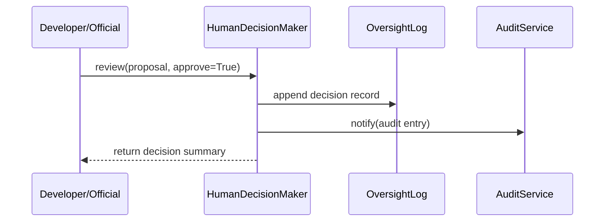

# Chapter 11: Human Decision Maker

In [Chapter 10: Policy Engine](10_policy_engine_.md), we automated rules and policies. But some proposals—like changing mortgage insurance guidelines—need a **human sign-off**. In this chapter, we introduce the **Human Decision Maker**: a designated official who reviews AI-generated proposals, exercises oversight, and approves or rejects changes to ensure accountability and compliance.

---

## 1. Why a Human Decision Maker?

Imagine the Federal Housing Administration (FHA) uses AI to suggest updates to mortgage insurance rates. Those AI proposals must be reviewed by the Department Head before going live:

1. AI proposes “lower premium by 0.1%.”  
2. A **Human Decision Maker** reads the proposal.  
3. They either **approve**, **reject**, or **modify** it.  
4. Every decision is logged for legal and audit purposes.

Without this step, policy changes would lack human accountability and could violate regulations.

---

## 2. Key Concepts

- **Proposal**  
  An AI-generated change request (e.g., adjust insurance rate).  
- **Reviewer (Decision Maker)**  
  A person (official/manager) who reviews proposals.  
- **Review**  
  The act of approving or rejecting a proposal.  
- **Oversight Log**  
  Record of all human decisions for audit and compliance.

---

## 3. Using the Human Decision Maker

Below is a minimal example showing how an official reviews a proposal:

```python
# File: app.py
from hms_ach.human_decision_maker import HumanDecisionMaker, Proposal

# 1. Create a decision maker
hdm = HumanDecisionMaker(name="FHA Department Head")

# 2. AI generates a proposal
proposal = Proposal(
    id="P-001",
    title="Adjust mortgage insurance rate",
    details="Lower premium from 0.5% to 0.4%"
)

# 3. Reviewer approves the proposal
decision = hdm.review(proposal, approve=True)

print(decision)
# Outputs:
# {
#   "proposal_id": "P-001",
#   "approved": True,
#   "reviewer": "FHA Department Head"
# }
```

Explanation:  
- We instantiate `HumanDecisionMaker` with a name.  
- We wrap AI output in a `Proposal`.  
- Calling `review()` records the decision and returns a summary.

---

## 4. Under the Hood: How Review Works



1. **Review Call**: Official invokes `review()`.  
2. **Log Decision**: DecisionMaker adds an entry to its `log`.  
3. **Audit Notification**: Optionally send the decision to a central audit system.  
4. **Return**: A summary of the review is returned to the caller.

---

## 5. Peek at the Implementation

### 5.1 Proposal Class

```python
# File: hms_ach/human_decision_maker.py

class Proposal:
    def __init__(self, id, title, details):
        self.id = id
        self.title = title
        self.details = details
```

This simple class holds an AI proposal’s metadata.

### 5.2 HumanDecisionMaker Class

```python
# continue in human_decision_maker.py

class HumanDecisionMaker:
    def __init__(self, name):
        self.name = name
        self.log = []  # Stores all decisions

    def review(self, proposal, approve):
        decision = {
            "proposal_id": proposal.id,
            "approved": approve,
            "reviewer": self.name
        }
        # 1. Record the decision
        self.log.append(decision)
        # 2. (Optional) send to an audit service
        # audit_service.record(decision)
        return decision
```

- The constructor sets the reviewer’s name and initializes an empty log.  
- `review()` builds a decision record, appends it to `self.log`, and returns it.

---

## 6. Conclusion

You’ve learned how the **Human Decision Maker**:

- Wraps AI proposals in a `Proposal` object.  
- Lets a named official review and approve or reject changes.  
- Logs every decision for accountability and audit.

Next, you’ll see how to keep data in sync with outside systems in [External System Synchronization](12_external_system_synchronization_.md).

---

Generated by [AI Codebase Knowledge Builder](https://github.com/The-Pocket/Tutorial-Codebase-Knowledge)