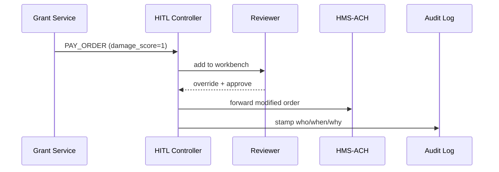

# Chapter 11: Human-in-the-Loop (HITL) Control

*(If you just finished reading  
[Compliance & Legal Reasoner (HMS-ESQ)](10_compliance___legal_reasoner__hms_esq__.md) you saw how software checks the **law** in milliseconds.  
But some situations still demand a breathing, coffee-drinking human.  
That “red phone” is what we plug in now.)*  

---

## 1. Why Do We Need HITL?

### Story – “Disaster Grants Gone Wrong”

1. After a tornado, FEMA agents—powered by HMS-ACT—auto-approve \$5,000 grants for damaged homes.  
2. HMS-ESQ clears each payment legally.  
3. Suddenly Twitter shows photos of a **perfectly intact mansion** that also got \$5,000.  
4. Congress phones FEMA: *“Pause payments **now**, review the rules, and don’t lose your audit trail.”*

HITL Control is that emergency brake.  
It lets a **real person**:

* Pause or cancel any AI decision.  
* Edit the decision (“Pay \$1,000, not \$5,000”).  
* Attach a reason and digital signature.  
* Resume the queue once confidence returns.

For newcomers it’s reassurance the system won’t run amok; for experts it offers fine-grained “approve with modifications” plus iron-clad audit stamps.

---

## 2. Key Concepts (Plain English)

| Term | What It Does | Quick Analogy |
|------|--------------|---------------|
| **Trigger** | Event that forces human review (`amount>10k`, `fraud_alert`) | Metal detector beeping |
| **Pause** | Freeze pending actions while humans decide | Hitting “STOP” on an assembly line |
| **Workbench** | Web UI where reviewers see, edit, approve | Judge’s bench |
| **Override** | Human changes the auto decision | Hand-written correction on a form |
| **Audit Stamp** | Signed record of who changed what & why | Notary seal |

Remember these five words—90 % of HITL is just wiring them together.

---

## 3. First Walk-Through  
### Use Case: Pause & Edit a Tornado Grant

We will:

1. Auto-create a \$5,000 payment order.  
2. HITL sees `damage_score=1` (low), so it **pauses** the order.  
3. A manager lowers the amount to \$1,000 and approves.

#### 3.1 Service Submits the Order (same as ACH)

```python
# file: create_order.py
from hms_ach import AchClient
order = { "pay_to":"Mansion LLC", "amount":5000, "damage_score":1 }
AchClient().create_order(order)           # ➜ returns ORDER-123
```

#### 3.2 HITL Trigger Rule (YAML, 6 lines)

```yaml
# file: hitl_rules.yml
when: action == "PAY_ORDER" and damage_score < 3
then: pause   # send to human workbench
```

Load it once:

```bash
hitl import hitl_rules.yml
```

#### 3.3 Reviewer Workbench (Python CLI Demo)

```python
# file: review.py
from hms_hitl import Workbench
wb = Workbench(token="MANAGER_BADGE")

ticket = wb.next()                # pulls ORDER-123
ticket.update(amount=1000)        # override
ticket.approve(note="Minor roof fix only")
```

Output:

```
✅ ORDER-123 → APPROVED ($1,000)   stamped by manager@fema.gov
```

*Explanation*  
1. `next()` fetches the oldest paused item.  
2. `update()` edits any allowed field.  
3. `approve()` releases the item; HMS-ACH continues clearing.

---

## 4. What Happens Under the Hood?



Only five actors; the reviewer is in the critical path **once**.

---

## 5. Peeking Inside the Source Tree

```
hms-hitl/
├── api/
│   ├── hook.py        # receives triggers
│   └── workbench.py   # REST for UI/CLI
├── core/
│   ├── queue.py       # pause/resume lists
│   ├── rules.py       # trigger matcher
│   └── audit.py       # stamp writer
└── ui/                # tiny React + MFE blocks
```

### 5.1 Trigger Matcher (`rules.py`, 12 lines)

```python
def should_pause(action):
    for r in RULES:                         # loaded from YAML
        if eval(r["when"], {}, action):
            return r["then"] == "pause"
    return False
```

Simple loop; **eval** is safe—only whitelisted fields allowed.

### 5.2 Pause Queue (`queue.py`, 15 lines)

```python
from collections import deque
Q = deque()

def pause(item):
    Q.append(item)
    item["status"] = "PAUSED"

def next_for(human_id):
    item = Q.popleft()
    item["reviewer"] = human_id
    return item
```

A real build would persist to Redis/Postgres; here we keep it readable.

### 5.3 Audit Stamp (`audit.py`, 10 lines)

```python
def stamp(item, reviewer, note):
    record = {
        "id": item["id"],
        "by": reviewer,
        "note": note,
        "ts": time.time(),
        "before": item["original"],
        "after":  item["current"]
    }
    save_to_datalake(record)               # HMS-DTA helper
```

Every change is immutable, searchable, and linked by the MCP `trace_id`.

---

## 6. How HITL Ties Into Other Layers

Layer | Interaction
------|------------
[HMS-ACT](03_action_orchestrator__hms_act__.md) | Adds `pause_if` hook before dispatching an action.
[HMS-ESQ](10_compliance___legal_reasoner__hms_esq__.md) | Can recommend “Needs Human Review” verdict ➜ passes item to HITL.
[HMS-ACH](09_financial_transaction_engine__hms_ach__.md) | Waits for HITL approval before clearing high-risk payments.
[HMS-MCP](05_model_context_protocol__hms_mcp__.md) | Each paused item retains its `trace_id`.
[HMS-OPS](12_activity___operations_monitoring__hms_ops___hms_oms__.md) | Shows real-time “Paused / Approved / Rejected” metrics.

---

## 7. Try It Yourself (5-Minute Lab)

```bash
git clone https://github.com/hms-example/hms-hitl
cd hms-hitl/examples
# 1. Start the controller
docker compose up hitl
# 2. Submit the bad order
python create_order.py
# 3. Review and approve
python review.py
# 4. Check audit trail
dta cat hitl_audit.csv | grep ORDER-123
```

You should see a CSV row with **before** \$5,000 → **after** \$1,000, reviewer e-mail, and timestamp.

---

## 8. Common Patterns Out-of-the-Box

Pattern | One-Line Rule
--------|---------------
4-Eye Principle (two people must sign) | `then: pause_twice`
Escalate to Senior Officer after 24 h | `then: pause escalate_after=86400`
Mask PII before showing to reviewers | `then: pause redact=["ssn"]`
Force “cool-down” on irreversible deletes | `then: pause delay=3600`

Drop these YAML snippets into **hitl_rules.yml**—no code change needed.

---

## 9. Recap & What’s Next

You learned:

✓ HITL adds a **human safety valve**—pause, edit, or override any AI decision.  
✓ A tiny YAML rule decides **when** to pause; a **workbench** shows **what** to fix.  
✓ Every action is stamped and sent back to the pipeline, keeping traceability intact.  

Now that humans and machines both act, we need clear dashboards to see **how the whole system behaves in real time**.  
Let’s wire up the gauges in  
[Activity & Operations Monitoring (HMS-OPS / HMS-OMS)](12_activity___operations_monitoring__hms_ops___hms_oms__.md).

---

Generated by [AI Codebase Knowledge Builder](https://github.com/The-Pocket/Tutorial-Codebase-Knowledge)