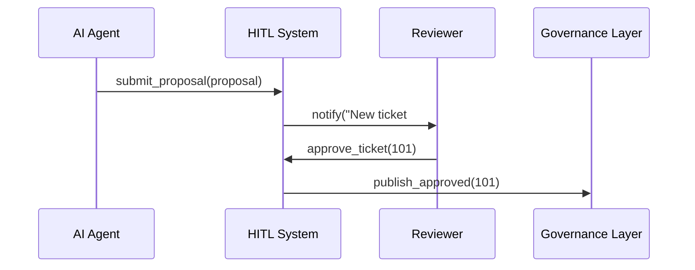
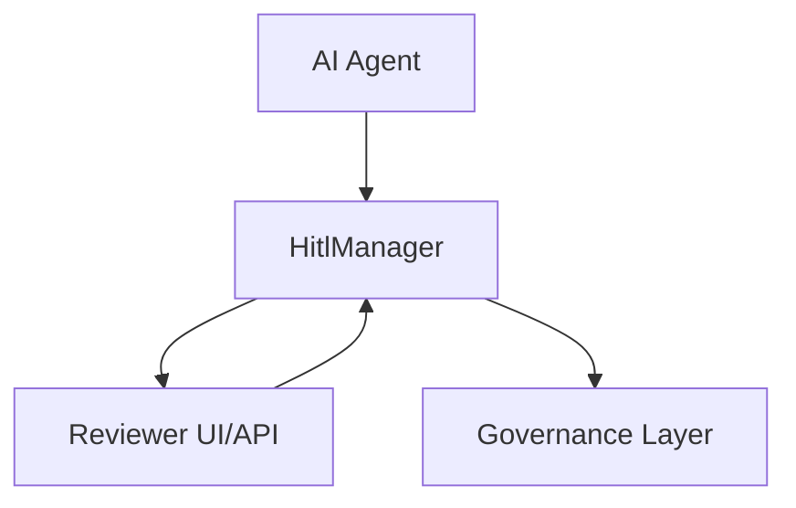

# Chapter 11: Human-in-the-Loop (HITL) Mechanism

In [Chapter 10: AI Representative Agent](10_ai_representative_agent_.md), we built an automated advisor that proposes policy tweaks. But before any change goes live, **real human experts** need to review, adjust, and approve those AI suggestions. That’s where the **Human-in-the-Loop (HITL) Mechanism** comes in—a workflow like a board meeting that vets algorithmic recommendations before they become policy.

---

## Why Do We Need HITL?

Imagine the **Legal Services Corporation** uses our AI Agent to analyze court-case feedback and propose updates to pro bono procedures. We don’t want to blindly trust AI:  
1. Lawyers must read each recommendation.  
2. They might tweak the wording or add context.  
3. Finally, they formally approve or reject it.

HITL ensures **accountability**, **transparency**, and **quality**—key in government settings.

---

## Key Concepts

1. **Review Queue**  
   - A list of AI-generated proposals waiting for human attention.

2. **Review Ticket**  
   - A structured record containing the proposal, metadata, and status (`Pending`, `Approved`, `Rejected`).

3. **Adjustment Interface**  
   - A simple UI or API where experts can modify proposal text or add comments.

4. **Approval Workflow**  
   - Rules about who can approve (see [Governance Layer](02_governance_layer_.md)) and how many sign-offs are needed.

5. **Notifications**  
   - Email or dashboard alerts when new tickets arrive or change status.

---

## How to Use HITL to Solve the Use Case

Here’s a minimal Rust-style example: AI generates a proposal, we submit it for review, a human approves it, and finally we publish it.

```rust
// 1. AI Agent creates a proposal
let proposal = Proposal { id: 101, text: "Extend deadline by 2 weeks".into() };

// 2. Send it to the HITL system
let hitl = HitlManager::new();
let ticket = hitl.submit_proposal(proposal);
// ticket.status == "Pending"

// 3. A human reviewer fetches it and approves
hitl.fetch_review_queue()        // returns vec![ticket]
    .iter()
    .for_each(|t| hitl.approve(t.id));

// 4. Now the approved proposal moves on
assert_eq!(hitl.get_ticket(101).status, "Approved");
```

Explanation:  
- `submit_proposal` wraps an AI suggestion into a review ticket.  
- `fetch_review_queue` lists all pending tickets.  
- `approve` marks it as approved.  

---

## Step-by-Step Sequence



1. **AI Agent** sends a proposal to **HITL System**.  
2. **HITL** notifies human **Reviewer** (email or dashboard).  
3. **Reviewer** approves (or rejects) the ticket.  
4. **HITL** forwards approved proposals to the [Governance Layer](02_governance_layer_.md) for final logging and publication.

---

## Inside the HITL System

### 1. Ticket Definition (`src/hitl/ticket.rs`)

```rust
pub struct ReviewTicket {
    pub id: u64,
    pub proposal_text: String,
    pub status: String,   // "Pending", "Approved", "Rejected"
    pub reviewer: Option<String>,
}
```

> A simple struct capturing the proposal and its review status.

### 2. Manager (`src/hitl/manager.rs`)

```rust
pub struct HitlManager { tickets: Vec<ReviewTicket> }

impl HitlManager {
    pub fn new() -> Self { HitlManager { tickets: vec![] } }

    pub fn submit_proposal(&mut self, p: Proposal) -> &ReviewTicket {
        let ticket = ReviewTicket { id: p.id, proposal_text: p.text, status: "Pending".into(), reviewer: None };
        self.tickets.push(ticket);
        self.tickets.last().unwrap()
    }

    pub fn fetch_review_queue(&self) -> Vec<&ReviewTicket> {
        self.tickets.iter().filter(|t| t.status == "Pending").collect()
    }

    pub fn approve(&mut self, id: u64) {
        if let Some(t) = self.tickets.iter_mut().find(|t| t.id == id) {
            t.status = "Approved".into();
        }
    }
}
```

> `HitlManager` holds all tickets, lets AI submit, humans fetch, and approve.

---

## Visualizing HITL Internals



- **HitlManager** is the core.  
- It interfaces with both AI and human reviewers.  
- Approved tickets go to the **Governance Layer** for policy enforcement.

---

## Conclusion

In this chapter, you learned how the **Human-in-the-Loop Mechanism**:

- Wraps AI proposals in review tickets  
- Builds a simple queue for human experts  
- Provides basic APIs to fetch, adjust, and approve  
- Integrates approved changes back into our policy workflow

This ensures expert oversight before any automated recommendation becomes policy.  

Next, we’ll monitor how well the whole system is performing in [Chapter 12: Monitoring and Metrics Framework](12_monitoring_and_metrics_framework_.md).

---

Generated by [AI Codebase Knowledge Builder](https://github.com/The-Pocket/Tutorial-Codebase-Knowledge)