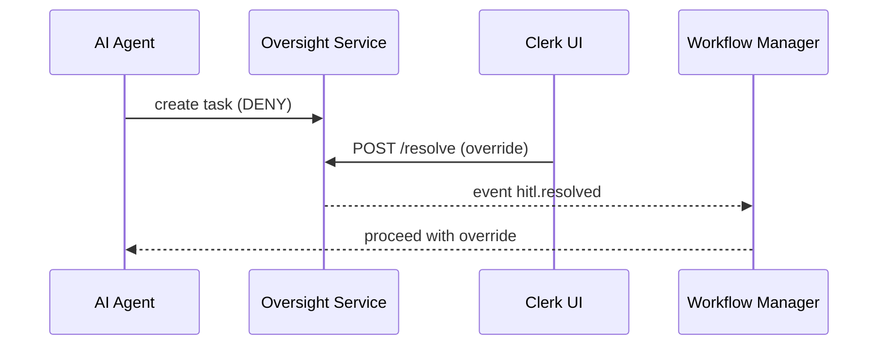

# Chapter 11: Human-in-the-Loop Oversight (HITL) 👩‍⚖️🤖

*(Just finished [Legislative Process Engine (HMS-CDF)](10_legislative_process_engine__hms_cdf__.md)?  
Great! Laws can now flow through the system.  
But who stops a robot from rubber-stamping the wrong law or sending the wrong refund?  
That safety net is **HITL**.)*

---

## 0. Why Do We Need a “Human Brake Pedal”?

Imagine the **Social Security Administration (SSA)** uses an AI agent to pre-screen disability claims:

1. **Agent** spots missing medical records ➜ wants to deny the claim.  
2. ***If auto-denied***, a citizen may lose months of payments.  
3. A **Medical Examiner** must *review* and, if needed, *override* the AI.

HITL guarantees that *every* critical AI or workflow step pauses for a qualified human before final action—very much like a **seasoned judge editing a clerk’s draft opinion**.

---

## 1. Key Concepts (Plain English)

| Term | Beginner Meaning |
|------|------------------|
| Oversight Queue | Inbox of tasks waiting for a human eye. |
| Approval Task | One item in the queue (“Claim #88 – AI suggests DENY”). |
| Override | Human changes the AI’s suggested action. |
| Audit Comment | Short note explaining the decision (“MRI arrived late – approve”). |
| SLA Clock | Countdown (e.g., 3 days) before automatic escalation. |
| Escalation | Re-routing to a supervisor when the clock expires. |

---

## 2. Five-Minute Walk-Through — Review a Disability Claim

We’ll:

1. Let the AI agent suggest **DENY**.  
2. Show it popping into the **Oversight Queue**.  
3. Approve it with a tweak (“grant temporary approval”).  

### 2.1 AI Suggests Denial (already happens inside [HMS-ACT](07_agent_orchestrated_workflow_manager__hms_act__.md))

No code needed here—the agent emits:

```json
{
  "ticket": "T-2201",
  "step":   "ai_prescreen",
  "suggestedAction": "DENY",
  "payload": { claimId: 88 }
}
```

### 2.2 HITL Writes the Task (Backend, 14 lines)

```js
// File: hitl/routes/ingest.js
router.post('/hitl/tasks', auth('write:hitl'), async (req, res) => {
  const t = {
    id: crypto.randomUUID(),
    ticket: req.body.ticket,
    action: req.body.suggestedAction,
    payload: req.body.payload,
    status: 'pending',
    expires: Date.now() + 3*24*60*60*1000   // 3-day SLA
  }
  db.insert('tasks', t)      // simple SQLite helper
  res.status(201).json(t)
})
```

*Explanation*:  
Receives the suggestion, stores a **pending** task, and sets a 3-day deadline.

### 2.3 Clerk Reviews in the UI (Vue, 19 lines)

```vue
<!-- components/OversightTask.vue -->
<template>
  <div>
    <h3>Claim {{ task.payload.claimId }}</h3>
    <p>AI wants: <strong>{{ task.action }}</strong></p>
    <textarea v-model="comment" placeholder="Why?"></textarea>
    <button @click="approve">Approve</button>
    <button @click="override">Grant Temp Approval</button>
  </div>
</template>

<script setup>
import { ref } from 'vue'
const props = defineProps({ task: Object })
const comment = ref('')

function approve()  { decide('approve') }
function override() { decide('override') }

async function decide(choice){
  await fetch(`/api/hitl/tasks/${props.task.id}/resolve`, {
    method:'POST',
    body: JSON.stringify({ choice, comment: comment.value }),
    headers:{'Content-Type':'application/json'}
  })
}
</script>
```

*Beginner view*: Two buttons call the backend with the clerk’s choice and comment.

### 2.4 Backend Resolves & Signals ACT (Node, 18 lines)

```js
// File: hitl/routes/resolve.js
router.post('/hitl/tasks/:id/resolve', auth('write:hitl'), async (req,res)=>{
  const task = db.get('tasks', req.params.id)
  if(task.status !== 'pending') return res.status(409).end()

  task.status   = 'done'
  task.decision = req.body.choice   // approve / override / reject
  task.comment  = req.body.comment
  task.user     = req.user.email
  task.when     = Date.now()
  db.update('tasks', task)

  bus.emit('hitl.resolved', task)    // wakes HMS-ACT
  res.json({ ok:true })
})
```

### 2.5 ACT Continues the Workflow

Inside **HMS-ACT** the paused step listens for `hitl.resolved`:

```js
// File: act/listeners/hitl.js  (11 lines)
bus.on('hitl.resolved', t => {
  const ticket = act.get(t.ticket)
  if(t.decision === 'approve')   ticket.resume()
  else if(t.decision === 'override') {
    ticket.payload.status = 'TEMP_APPROVE'
    ticket.resume()
  }
  else ticket.fail('Human rejected AI suggestion')
})
```

Workflow unfreezes with the human-chosen path.

---

## 3. What Happens Step-by-Step?



Only **after** the Clerk’s decision does ACT continue—ensuring democratic accountability.

---

## 4. SLA & Escalation (No Code, Logic Only)

1. **Cron job** scans `tasks` every hour.  
2. If `Date.now() > expires` and `status == 'pending'`  
   • set `status = 'escalated'`  
   • email supervisor (`Escalation Template #3`).  
3. Supervisor’s task looks identical in the Oversight Queue.

---

## 5. Relationship to Other Chapters

* AI drafts come from [AI Representative Agent](04_ai_representative_agent__hms_agt___hms_agx__.md).  
* Workflow pauses via **guard: needsApproval** flag in [HMS-ACT](07_agent_orchestrated_workflow_manager__hms_act__.md).  
* All REST calls carry Zero-Trust tokens from [Security Layer](09_security___authorization_layer__hms_sys__zero_trust__.md).  
* Decisions are logged to the same Ledger used by [Legislative Engine](10_legislative_process_engine__hms_cdf__.md).  
* Metrics (`pending`, `escalated`, `avg-decision-time`) stream to [Metrics & Monitoring](14_metrics___monitoring__hms_ops___hms_act_telemetry__.md).

---

## 6. Quick FAQ

**Q: Can HITL force a full stop?**  
A: Yes—returning decision `reject` marks the ACT ticket **failed**; no further steps execute.

**Q: How many queues can we have?**  
A: Unlimited. Each task has a `queue` field (`medical`, `legal`, `ops`) so agencies route to the right staff.

**Q: Is the queue UI mandatory?**  
A: No—you can pull tasks via REST or SSE and plug them into your existing case-management system.

---

## 7. Summary & Next Steps

You learned:

1. What Human-in-the-Loop Oversight is and **why** government needs it.  
2. How an AI suggestion becomes a **task** that a clerk can approve, override, or reject.  
3. The minimal code to create, display, and resolve oversight tasks.  
4. How HITL ties into agents, workflows, security, and logging.

Now that humans can safely veto or tweak AI actions, the next challenge is **syncing these vetted decisions with legacy systems like COBOL mainframes or county databases**.

➡️ Continue to [External System Synchronization (HMS-GOV Connectors)](12_external_system_synchronization__hms_gov_connectors__.md) to see how!

---

Generated by [AI Codebase Knowledge Builder](https://github.com/The-Pocket/Tutorial-Codebase-Knowledge)