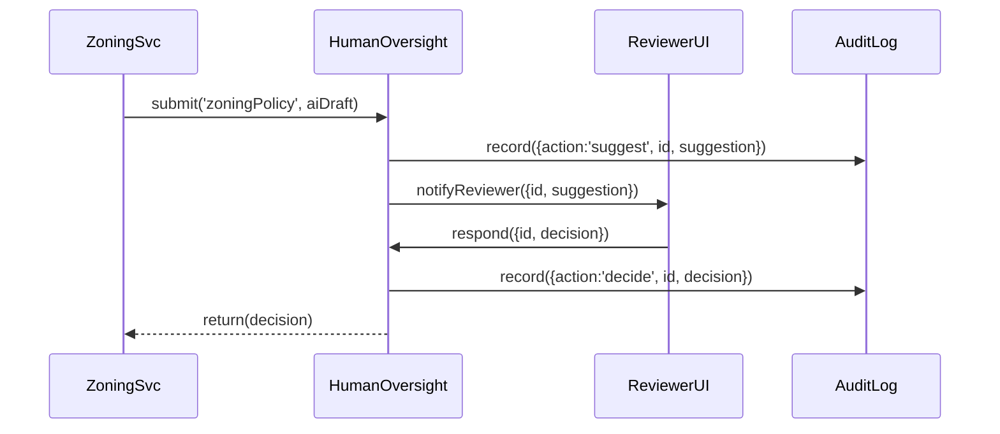

# Chapter 11: Human-in-the-Loop Oversight

In the previous chapter we built a unified cockpit for administrators with the [Government Admin Portal (HMS-GOV)](10_government_admin_portal__hms_gov__.md). Now we’ll add a “planning commission” that vets AI-generated proposals before they become law. This is **Human-in-the-Loop Oversight**.

## 1. Motivation & Use Case

Imagine a City Planning Agency that uses an AI to draft new zoning rules:

1. The AI suggests changing parking requirements in the Downtown district.
2. A human reviewer (the “planning commission”) needs to see the draft, tweak it, or reject it.
3. Every suggestion and decision must be logged so we can trace who approved what—and when.

Without oversight, AI changes could slip through unchecked. With **Human-in-the-Loop**, we surface AI drafts for human review, allow adjustments, and keep an unbroken audit trail from suggestion to implementation.

## 2. Key Concepts

1. **Suggestion Queue**  
   AI recommendations land here for human review.  
2. **Review Handler**  
   Code that pushes suggestions into a UI or console for reviewers.  
3. **Decision Response**  
   Humans can approve, modify, or reject the suggestion.  
4. **Audit Trail**  
   Every suggestion and every decision is recorded immutably.  
5. **Accountability**  
   A clear record of “AI suggested X → Human approved/revised Y.”

## 3. How to Use Human-in-the-Loop

Below is a minimal example showing how a service can submit an AI draft for review.

```javascript
// file: zoning-service/index.js
const htl = require('hms-htl').init({ serviceName: 'ZoningPolicySvc' })
const ai  = require('city-ai').init()

async function proposeZoning() {
  // 1) Ask the AI to draft a rule
  const aiDraft = await ai.generatePolicy({ area: 'Downtown' })

  // 2) Submit the draft for human review
  const review = await htl.submit('zoningPolicy', aiDraft)
  console.log(`AI draft queued for review (ID=${review.id})`)
}

proposeZoning()
```

Explanation:
- `htl.submit(type, data)` queues the AI draft under a review “type” (e.g., `zoningPolicy`).
- It returns a review ID you can track or log.

Next, register a **review handler** that delivers suggestions to humans and captures their decision:

```javascript
// still in zoning-service/index.js
htl.onReview('zoningPolicy', async ({ id, suggestion }) => {
  // Imagine this shows a web form to the planning commission
  const decision = await showReviewForm(suggestion)
  // decision = { approved: true, finalPolicy: {...} }
  return htl.respond(id, decision)
})
```

- `onReview(type, handler)` listens for new suggestions of that type.
- Your `handler` should return the final human decision.
- `htl.respond(id, decision)` completes the review and hands results back to your service.

## 4. Under the Hood: Step-by-Step Workflow

Here’s what happens when you call `htl.submit` and then a human responds:



1. **submit** stores the draft and logs it.  
2. **notifyReviewer** pushes it to a UI or inbox.  
3. Reviewer calls **respond**, passing structured feedback.  
4. The system logs the decision and returns it to the service.

## 5. Inside `hms-htl`: Core Implementation

Below is a simplified peek at how `hms-htl` hooks into our [Core Infrastructure (HMS-SYS)](01_core_infrastructure__hms_sys__.md) for messaging and logging.

```javascript
// file: hms-htl/core.js
const { init: coreInit } = require('hms-sys')
module.exports.init = ({ serviceName }) => {
  const core = coreInit({ serviceName })
  const reviews = {}

  return {
    submit: async (type, suggestion) => {
      const id = Date.now().toString()
      reviews[id] = { type, suggestion }
      // 1) Audit the suggestion
      await core.log.write({ action:'suggest', id, suggestion })
      // 2) Publish to the review queue
      await core.bus.publish(`${type}.review`, { id, suggestion })
      return { id }
    },

    onReview: (type, handler) => {
      core.bus.subscribe(`${type}.review`, async ({ id, suggestion }) => {
        const decision = await handler({ id, suggestion })
        await this.respond(id, decision)
      })
    },

    respond: async (id, decision) => {
      // 1) Audit the human decision
      await core.log.write({ action:'decide', id, decision })
      return decision
    }
  }
}
```

Explanation:
- `core.log` and `core.bus` come from **HMS-SYS** for immutable logging and reliable messaging.
- We keep an in-memory `reviews` map to tie suggestion IDs to their type.
- Every `submit` and `respond` call writes an audit entry.

## 6. Summary

In this chapter you learned how **Human-in-the-Loop Oversight**:

- Queues AI suggestions for human review.
- Lets you register handlers to deliver suggestions to a UI or console.
- Captures human decisions—approve, adjust, or reject.
- Logs every step in an immutable audit trail.

Next, we’ll build custom end-user interfaces on top of these APIs in the [Interface Layer](12_interface_layer_.md).

---

Generated by [AI Codebase Knowledge Builder](https://github.com/The-Pocket/Tutorial-Codebase-Knowledge)